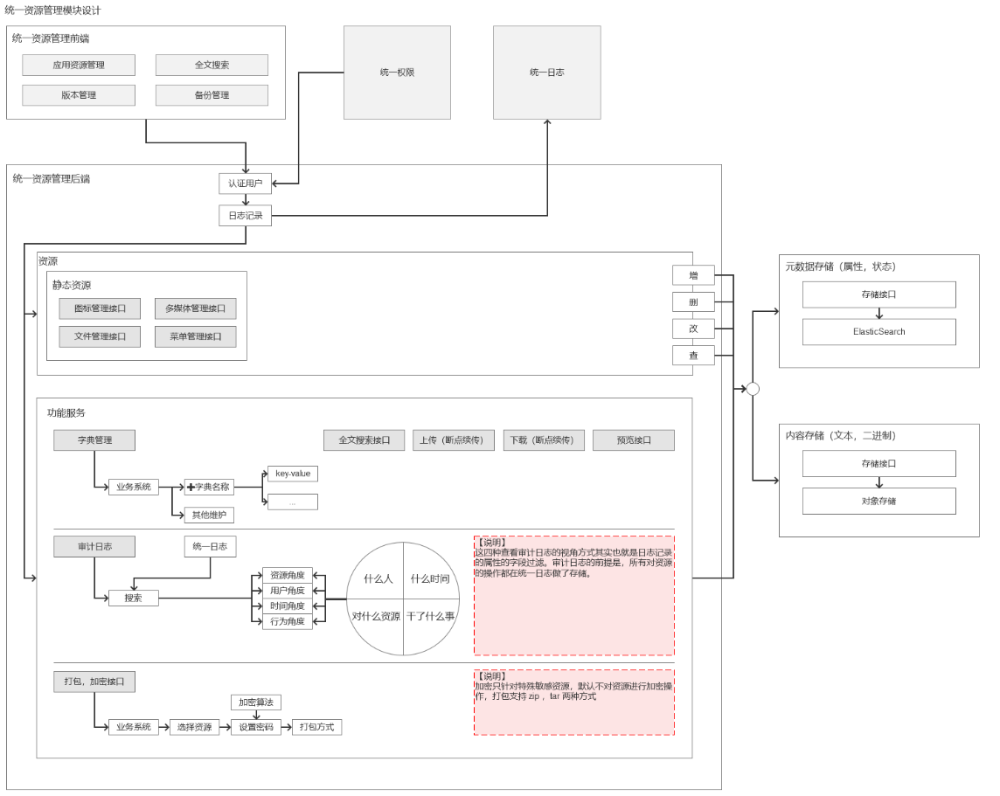
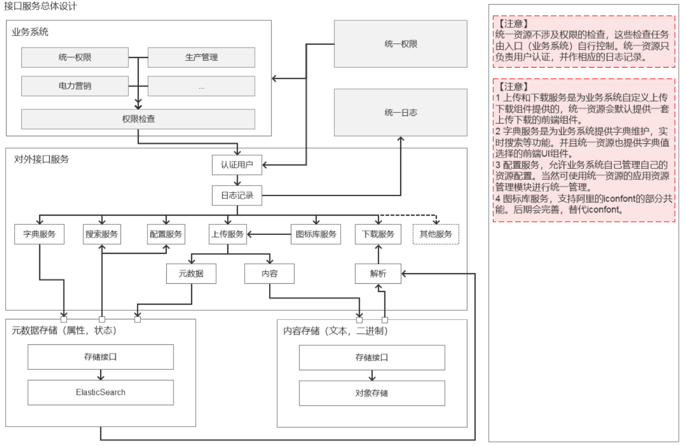
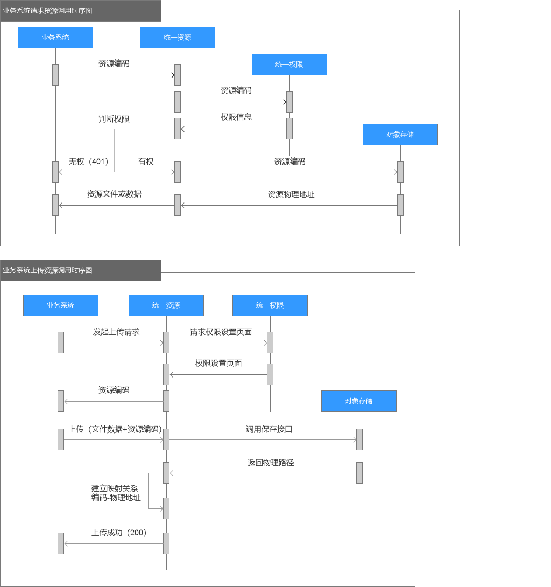
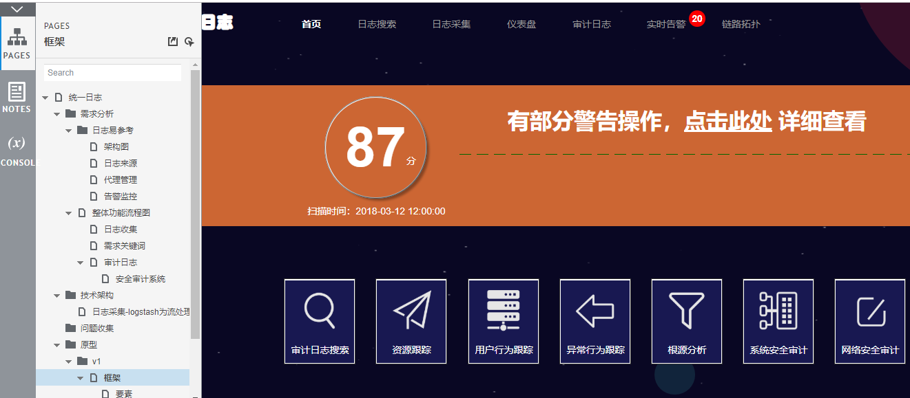
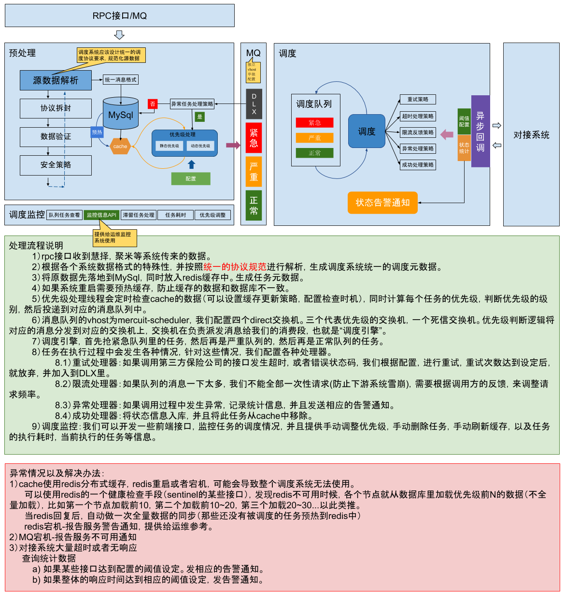

<!-- TOC -->

- [1. 主要框架设计样例](#1-主要框架设计样例)
    - [1.1. 1](#11-1)
    - [1.2. 2](#12-2)
- [2. 主要流程设计样例](#2-主要流程设计样例)
- [3. 原型设计](#3-原型设计)
- [4. 中间件设计](#4-中间件设计)
- [5. 技术方案设计](#5-技术方案设计)

<!-- /TOC -->

----
> 以下是我工作中的一些原型设计和架构设计，贴在此处的目的是供参考，以及多一个角度来评估个人价值。  
仅部分截图-因为本人没有将原工作内容拷贝带走的习惯，这些都是让我前同事传了一部分给我。都是一个人独立设计完成。

# 1. 主要框架设计样例

## 1.1. 1

## 1.2. 2

# 2. 主要流程设计样例

# 3. 原型设计

# 4. 中间件设计

# 5. 技术方案设计

