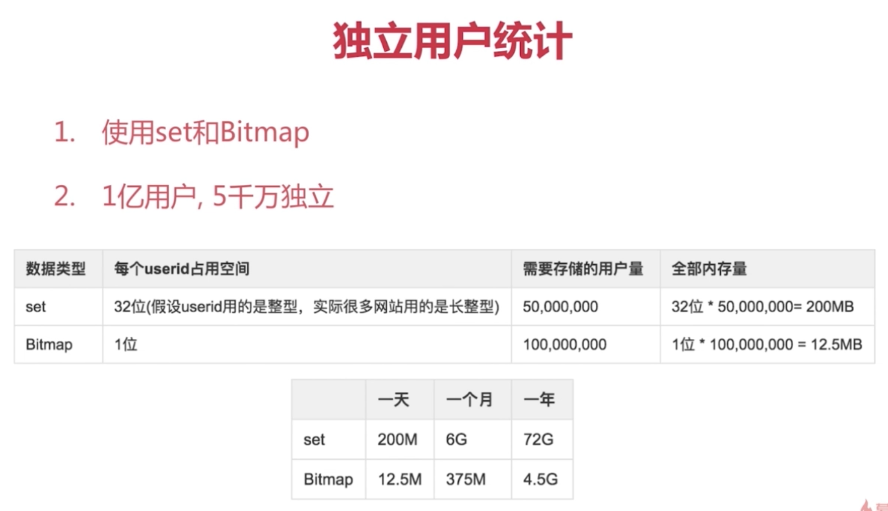

# bitmap
```shell
# 给位图指定索引设置值
setbit key offset value
# 获取指定位置的值
getbit key offset
# 统计个数
bitcount key [start end]
```

## bitop
> 做多个bitmap的交集 and ，并集 or ，异或 xor，非 not，然后把操作结果保存在destkey中  
命令格式 bitop op destkey key [key ...]
```sh
bitop and keyname key1 key2
```

## bitpos
> 计算位图的哥偏移量等于 targetbit 的位置  
命令格式 bitpos key targetBit [start end]

## 使用场景
> 独立用户访问次数统计，这样可用节省很多的空间



# 持久化
持久化的方式
+ 快照 
> Mysql Dump 和 redis的RDB
+ 写日志
> Mysql的binglog , Hbase的Hlog 和 redis的AOF

## RDB
二进制文件，存储在磁盘中，redis启动载入（复制媒介）
触发redis生成RDB文件的机制
+ save 同步的方式
+ bgsave 异步方式
+ 自动方式

### save方式
执行一个save命令就可了，它会阻塞。如果有老的文件需要新老替换
```sequence
title: redis save命令执行流程
participant 客户端
participant Reis服务器
participant 磁盘RDB文件

note left of 客户端: 调用save命令
note left of Reis服务器: 阻塞生成RDB文件
note right of 磁盘RDB文件: redis启动后自动恢复

客户端->Reis服务器
Reis服务器->磁盘RDB文件
磁盘RDB文件-->Reis服务器
```

bgsave不会阻塞，但是会fork新的进程

+ save配置
save seconds changes
表示 多少秒内，发生多少次change后自动创建RDB
比如：  
    save 60 1000
一般不配置自动写入rdb，所以这个
    
+ 其他配置
dbfilename xxx.rdb # 指定db文件名称
dir ./ 指定db文件存放路径
stop-writes-on-bgsave-error yes 表示发生错误后是否停止写入
rdbcompression yes 是否压缩格式
rdbchecksum yes 校验和

+ 最佳配置
```
dbfilename dump-${port}.rdb 因为可能存在多个节点
stop-writes-on-bgsave-error yes
rdbcompression yes
rdbchecksum yes
dir /大磁盘目录
```

## 触发机制
1 全量复制 会生成rdb文件
2 debug reload
3 shutdown

# redis.conf
```conf
daemonize yes 后台运行
```

## 常用命令
dbsize
info memory
save
redis-cli shutdown


# AOF
RDB的问题？
耗时，耗性能，需要把所有的数据进行dump,fork会消耗内存，还有磁盘IO的消耗。不可控，可能会丢失数据

多次执行满足bgsave的条件后，但是宕机了，就会造成数据丢失

## 什么是AOF
> 日志的原理，每一个操作都会有相应的日志记录，恢复的时候，只需要把AOF载入既可以

### always
redis写命令刷新到缓冲区，然后把每条命令fsync道硬盘中，alwasy是每一条命令都会刷新到硬盘，不丢失数据，IO开销大
### everysec
是配置每秒刷新到硬盘的策略，丢1s数据
### no
操作系统来决定，数据可靠性不可控

## AOF重写
将多条命令合并。重复的命令，过期的命令进行精简
优点：  
    加快恢复速度  
    减少磁盘IO
重写两种方式  
    bgrewriteaof 发起这个命令后，redis会fork一个子进程，进行AOF重写
    
### AOF重写配置
+ auto-aof-rewrite-min-size AOF文件重写需要的触发尺寸
+ auto-aof-rewrite-percentage 根据AOF文件的增长率
+ aof_current_size AOF文件当前的大小
+ aof_base_size AOF上次启动和重写的尺寸

### AOF的配置
首先需要打开 appendonly yes这个配置
appendfilename "appendonly-${port}.aof" 文件名
appendfsync 配置刷盘策略
dir everysec /大磁盘目录
no-appendfync-on-rewrite yes 表示在同步磁盘的时候，是否还要做append操作（可能会丢失数据）
auto-aof-rewrite-min-size 64mb

# 缓存的更新策略
+ LRU/LFU/FIFO 例如maxmemory-policy最大内存策略 一致性很差，维护成本低
+ 超时剔除，例如设置expire 一致性较差，不知道多少的过期时间比较合理
+ 主动更新：开发控制生命周期 维护成本高

## 怎么选择更新策略
+ 低一致性要求的：最大内存淘汰策略
+ 高一致性要求：超时或者主动更新结合，最大内存淘汰策略保底

# 缓存粒度控制
> 我们需要缓存多少信息合适

缓存力度的选择，我们通常考虑下面三个要素
+ 通用性：全量属性最好
+ 占用空间 部分属性更好
+ 代码维护

# 缓存穿透问题
> 大量的请求命不中缓存

## 产生的原因
+ 业务代码逻辑问题
+ 恶意攻击或者爬虫
> 想要隐藏URL的真实路径，用户恶意访问，触发了接口调用，但是这个url根本就没有做缓存，这样就会导致缓存失效  
> 爬虫就是恶意的去请求一个并不存在的数据，导致存储层和缓存都没有

## 如何发现这些问题
1 业务的相对时间
> 业务的量是可以预期和评估的

2 业务本身问题

3 相关指标：总调用次数，缓存层命中数，存储层命中数

## 常见问题解决方案
### 缓存空对象
> 就是对那些确实不存在的数据，就缓存在缓存中，下一次就可以命中空对象了。可以对空对象设置一个过期时间

存在的问题  
+ 需要更多的键
+ 缓存层和存储层“短期”不一致

### 增加过滤器过滤非法请求


config get appendonly //获取某一配置的配置值
config rewrite //应用更改
config set appendonly yes //修改某一配置的值
bgrewriteaof //后台执行些aof

## 问题场景
怎么做数据的持久化
使用aof，因为它的可靠性很好，同时对性能影响也不大

## RDB和AOF的对比
RDB 占用体积小，数据恢复速度快，但是它是一个IO和CPU都密集的操作，同时容易丢失数据
AOF 占用体积大，数据恢复缓慢，但是它是一个相对轻量级的操作，而且数据的丢失可以做到很可靠

RDB使用的最佳策略
    关闭RDB功能，但是redis的主从复制是需要bgsave
    集中管理 如果按天或者按周来进行管理的话，RDB是一个不错的选择
 
AOF使用的最佳策略
    开：缓存和存储，如果程序对缓存失效有处理，并且缓存失效和缓存雪崩的现象对程序性能没有什么影响，就可以关闭AOF的功能
    AOF重写集中管理
    使用刷盘策略 everysec
    
总体最佳策略
    小分片
    缓存或者存储
    监控（硬盘，内存，负载和网络）
    
## redis开发运维常见问题
+ fork操作
```text
    同步操作
    与内存量息息相关，内存越大，耗时越长
    info:latest_fork_usec 获取上一次执行fork操作用时
    
    如何改善fork
        优先使用物理机或者高效支持fork操作的虚拟化技术
        控制redis实例的最大可用内存：maxmemory
        合理配置linux内存分配策略：vm.overcommit_memory=1
        降低fork频率：例如放宽AOF重写自动触发机制，不必要的全量复制
```

+ 进程外开销
    CPU开销  
        RDB和AOF文件的生成  
        不和CPU密集型的其他应用一起部署，不做CPU绑定  
    内存开销
        copy-on-write
    磁盘开销
        不要和其他对硬盘要求高的服务部署在一起，比如存储服务，消息队列服务等
        no-appendfsync-on-rewrite=yes 在写AOF的时候不要追加，减少内存的消耗
        根据写入量决定磁盘类型，考虑是否使用ssd
        单机多实例持久化文件目录可以考虑分盘
+ AOF追加阻塞
    
+ 单机多实例部署
```text
首先主线程将AOF写入到AOF缓冲区，同时同步线程会根据刷盘策略定时的刷盘，并且记录最近一次的刷盘时间
主线程同时会对比当前时间和上一次刷盘时间，如果小于2秒则AOF不阻塞，本次写入操作完成，如果大于2秒
则阻塞，直到刷盘完成，才执行下一次AOF写入操作

AOF阻塞怎么定位？
    1 通过Redis日志
    Asychronous AOF fsync is taking too long(disk is busy?). writing the aof buffer without waiting for fsync to complete
this may slow down Redis(fsync花费的太多的时间)
    2 通过 info persistence 来查看上一次持久化用时（但是它是一个累加结果，需要自己单独收集做计算，查看每次的结果多少）
    3 也可以通过查看硬盘的使用率，是否发生硬盘高负荷使用
```