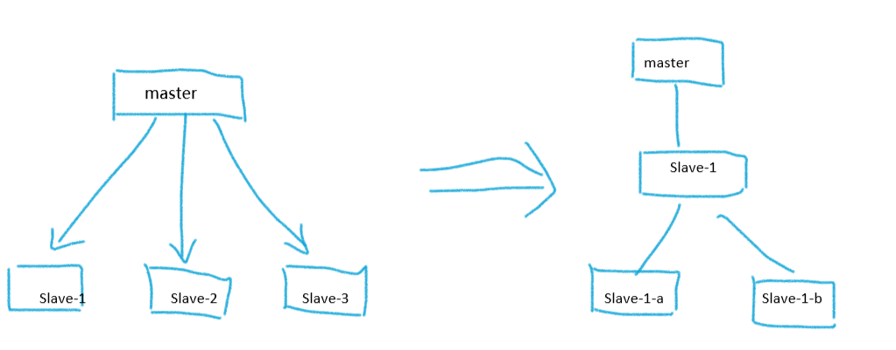
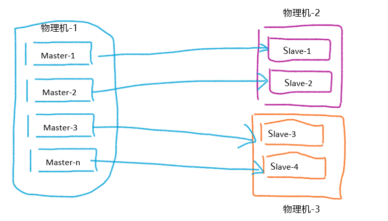

# 主从复制
```text
1 单机有什么问题？
    单机宕机有单点故障
    容量超过单机的配置容量，不好扩容（内存，磁盘）
    QPS瓶颈（高并发的性能要求）
2 主从复制的作用
    解决单点故障问题，提高高可用的功能
    除了一主一从，还有一主多从
    数据有多个副本，可以提高redis读的性能
3 特点
    一个master可以有多个slave
    一个slave只能有一个master
    数据流向是单向的，master到slave
```

## 主从复制的配置
```text
比如我们现在有这样一个需求：
    127.0.0.1:6380 想要成为 127.0.0.1:6379 的从节点
1 我们在6380（slave角色的）执行
    slaveof 127.0.0.1 6379
    复制的命令是异步的
2 在6379上执行（master角色）- 取消复制
    slaveof no none

注意
    如果切换新的主（先slaveof no one 再 slaveof some_other_master），从节点之前的数据会清空，新的主节点的数据会复制到该
节点上。

如果想要从节点只做读的操作
    slave-read-only yes
```
### 案例 - 在同一台机器上部署多实例
```text
主节点 6379 从节点 6380
1 复制一个配置文件，将里边的端口改成6380
2 启动两个实例
3 进入6379
    3.1 输入 info replication 查看分片
    ---
    127.0.0.1:6379> info replication
    # Replication
    role:master 所有的默认都是master
    connected_slaves:0 没有从节点
    master_replid:28500b40be80ba143a4a0fcadaaa4a60bf69d8a7
    master_replid2:0000000000000000000000000000000000000000
    master_repl_offset:0
    second_repl_offset:-1
    repl_backlog_active:0
    repl_backlog_size:1048576
    repl_backlog_first_byte_offset:0
    repl_backlog_histlen:0
    ---
4 进入6380
    redis-cli -p 6380
    4.1 输入 info replication
        ---
        127.0.0.1:6380> info replication
        # Replication
        role:master
        connected_slaves:0
        master_replid:c2a5c1ce29c4565e4570ac8f2da4b58697554078
        master_replid2:0000000000000000000000000000000000000000
        master_repl_offset:0
        second_repl_offset:-1
        repl_backlog_active:0
        repl_backlog_size:1048576
        repl_backlog_first_byte_offset:0
        repl_backlog_histlen:0
        ---
        发现它也是主节点
    4.2 配置从节点
        打开redis-6380.conf
        修改配置
        ---
        replicaof 127.0.0.1 6379
        replica-read-only yes # 从节点不需要写数据
        masterauth <master-password> # 这个是配置master的密码，我们这里不需要配置（master没有密码）
        ---
    4.3 重启redis-server -p 6380
    4.4 查看集群信息
        > info replication
        ---
        127.0.0.1:6380> info replication
        # Replication
        role:slave
        master_host:127.0.0.1
        master_port:6379
        master_link_status:up
        master_last_io_seconds_ago:9
        master_sync_in_progress:0
        slave_repl_offset:14
        slave_priority:100
        slave_read_only:1
        connected_slaves:0
        master_replid:149009c0840a738ef1a834e8de96ef2eeb4bf568
        master_replid2:0000000000000000000000000000000000000000
        master_repl_offset:14
        second_repl_offset:-1
        repl_backlog_active:1
        repl_backlog_size:1048576
        repl_backlog_first_byte_offset:1
        repl_backlog_histlen:14
        ---
5 验证集群运行
    5.1 6379 里输入
        set name xiefq
    5.2 6380 查看
        get name
        "xiefq"
    5.3 我们也可以查看日志发现这一点
        查看6379.log
        ===
        20688:M 21 Aug 2019 20:22:16.899 * Synchronization with replica 127.0.0.1:6380 succeeded
        ===
        查看6380.log
        ===
        35798:S 21 Aug 2019 20:22:17.081 * Residual parent diff successfully flushed to the rewritten AOF (0.00 MB)
        35798:S 21 Aug 2019 20:22:17.081 * Background AOF rewrite finished successfully
        ===
6 同时我们也观察到 从节点第一次会进行一次全量复制
    ===
    35798:S 21 Aug 2019 20:22:16.796 * Full resync from master: 149009c0840a738ef1a834e8de96ef2eeb4bf568:0
    35798:S 21 Aug 2019 20:22:16.897 * MASTER <-> REPLICA sync: receiving 496891 bytes from master
    35798:S 21 Aug 2019 20:22:16.903 * MASTER <-> REPLICA sync: Flushing old data
    35798:S 21 Aug 2019 20:22:16.903 * MASTER <-> REPLICA sync: Loading DB in memory
    35798:S 21 Aug 2019 20:22:16.932 * MASTER <-> REPLICA sync: Finished with success
    ===
```
### 取消主从关系
```text
1 进入6380
    replicaof no one
2 查看集群信息
    info replication
    ===
    127.0.0.1:6380> info replication
    # Replication
    role:master
    connected_slaves:0
    master_replid:53be1f6d76342fadecc6971f8f799236ec34d904
    master_replid2:149009c0840a738ef1a834e8de96ef2eeb4bf568
    master_repl_offset:1457
    second_repl_offset:1458
    repl_backlog_active:1
    repl_backlog_size:1048576
    repl_backlog_first_byte_offset:1
    repl_backlog_histlen:1457
    ===
    发现变回来了master
```

## 全量复制和部分复制
```text
1 什么是run_id
    redis实例启动的时候分配的，作用是一个标识
    redis-cli -p port info server | grep run_id 就可以查看
2 偏移量的概念
    数据当前同步的位置，主从偏移量相等就说明已经同步了，主节点可以查看从节点当前的偏移量多少
    redis-cli -p port info replication | grep offset 来查看偏移量位置
3 从节点发送 psync master_run_id offset 
    3.1 第一次发送的时候不知道主节点的run_id和偏移量，所以 pysync ? -1
    3.2 master会返回run_id和偏移量给从节点
    3.3 从节点保存master节点的信息
    3.4 主节点发送RDB给从节点
    3.5 master后续的命令写入到buffer里，
    3.6 master将buffer的数据发送给从节点
    3.7 从节点清空原先的老数据
    3.8 从节点加载RDB，完成全量复制
```
### 全量复制的开销
```text
1 时间开销
    1.1 bgsave的时间
        子进程，内存，IO，CPU
    1.2 RDB文件的网络传输
    1.3 从节点清空数据的时间
    1.4 从节点价值RDB的时间
    1.5 可能AOF的重写时间
2 全量复制的问题
    slave在同步期间，master的新数据可能会丢失
```
### 部分复制
```text
1 如果同步的过程中从节点的连接发生了丢失
2 主节点会将数据写入到buffer里
3 当从节点再次建立连接后 发送一条命令叫 pysnc runid offset
4 如果偏移量在master的buffer之内的（如果相差太多就失败，进行全量复制）就继续部分复制
```
## 故障处理
```text
故障是不可避免的
    1 无故障转移的问题？
    2 自动故障转移

主从复制故障处理
1 slave宕机
    数据是不会丢失，需要让客户端修改连接到正常的节点上
2 master宕机
    无法提供写服务
    2.1 再找一个客户端或者新启动一个实例，replicaof no one成为主节点
    2.2 其他的client： relicaof new master 切换到新master

主从复制没有真的实现故障转移
```

## 开发运维的问题
### 读写分离
```text
1 读写分离：读流量分摊到从节点
2 问题
    2.1 复制数据的延迟
    2.2 读到过期的数据
    2.3 从节点故障
```

### 主从配置不一致
```text
配置不一致会带来哪些问题？
    1 maxmemory配置不一致，会导致主从节点的过期数据淘汰时机不一致。如果从节点的maxmemory的设置小于主节点的配置，那么从节点过期了，主节
点还没有过期
    2 数据结构的优化，主节点做了，从节点没有做
```
### 规避全量复制
```text
规避第一次全量复制的时机
    1 第一次不可避免
    2 主节点数据量小的时候，用户请求量低峰的时候
规避节点运行ID不匹配
    1 主节点重启后（run_id发生变化，从节点拿到的老的run_id，就做一次全量复制）
    2 故障转移的方法处理。
复制缓冲区不足
    1 默认值是1M，导致从节点更大概率的offset被认为是缓冲区之外的，认为从节点落后的太多，从节点就需要进行全量复制
    2 网络撞断，部分不知无法满足
```
### 复制风暴
```text
问题描述
    主节点重启，多个从节点复制
解决办法
    更换复制拓扑
```


```text
单机器复制风暴的问题
    一个物理机器上，运行的都是master节点，物理机宕机重启后，就会有大量的全量复制
```
