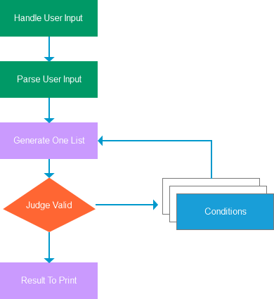
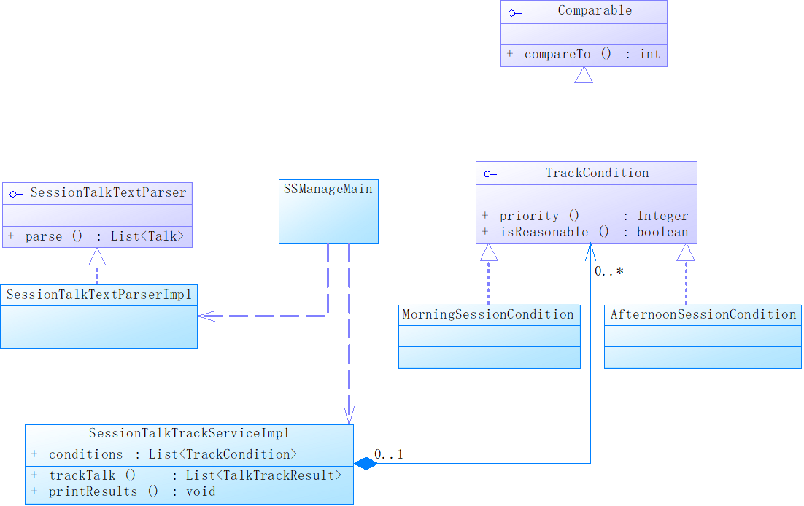
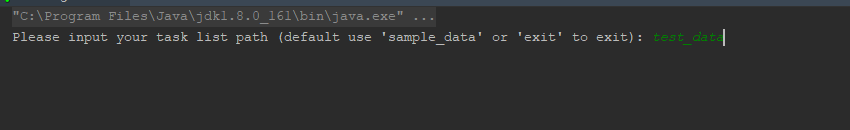
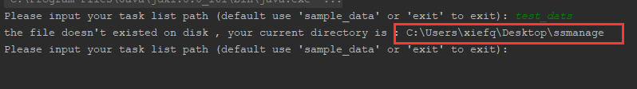
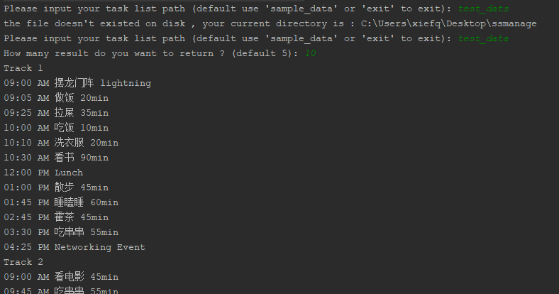

<!-- TOC -->

- [1. before coding](#1-before-coding)
- [2. the design ideas](#2-the-design-ideas)
    - [2.1. workflow diagram](#21-workflow-diagram)
    - [2.2. class diagram](#22-class-diagram)
- [3. test](#3-test)
- [4. how to run](#4-how-to-run)

<!-- /TOC -->

> runtime requirement，Java8+

# 1. before coding
+ input is text , so I need parse it.
+ module the problem domain, design proper data structure；
+ I must full arrange the problem , but it's a very huge computation
+ compute every possible arrangement
+ make the requirement more flexible, so I can use strategy design mode to accomplish this problem 
+ the strategy should have priority , because some condition can filter arrangement very fast.
+ format the result , and print it to console

# 2. the design ideas
## 2.1. workflow diagram
> I use axure to draw this diagram



## 2.2. class diagram



# 3. test
> I use the sample data from problem description that I received in my mail box

I get the right answer, so I think I solved this problem

```text
Track 1
09:00 AM User Interface CSS in Rails Apps 30min
09:30 AM Ruby vs. Clojure for Back-End Development 30min
10:00 AM Communicating Over Distance 60min
11:00 AM Ruby on Rails: Why We Should Move On 60min
12:00 PM Lunch
01:00 PM A World Without HackerNews 30min
01:30 PM Overdoing it in Python 45min
02:15 PM Ruby Errors from Mismatched Gem Versions 45min
03:00 PM Accounting-Driven Development 45min
03:45 PM Lua for the Masses 30min
04:15 PM Programming in the Boondocks of Seattle 30min
04:45 PM Networking Event

Track 2
09:00 AM Ruby vs. Clojure for Back-End Development 30min
09:30 AM Pair Programming vs Noise 45min
10:15 AM Ruby Errors from Mismatched Gem Versions 45min
11:00 AM Rails Magic 60min
12:00 PM Lunch
01:00 PM Rails for Python Developers lightning
01:05 PM Sit Down and Write 30min
01:35 PM Lua for the Masses 30min
02:05 PM User Interface CSS in Rails Apps 30min
02:35 PM A World Without HackerNews 30min
03:05 PM Programming in the Boondocks of Seattle 30min
03:35 PM Writing Fast Tests Against Enterprise Rails 60min
04:35 PM Networking Event
```

# 4. how to run 
+ download my code
+ open SSMainageMain.java
+ run as java app
+ you will get some tips :
    + the path file that you want to test
    > you should put your test file in my home directory
    
    
    + maybe you will get some problem , please check your path
    
    
    + then it asks you to input how many result do you want to return, input number please. then press enter button. you will
    get the result
    
    
> Thanks for your test and review my code.