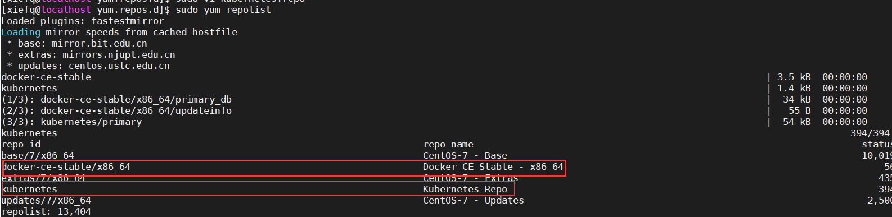
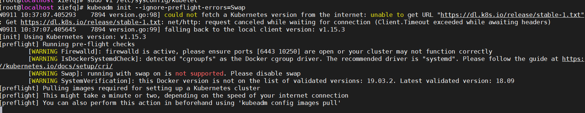
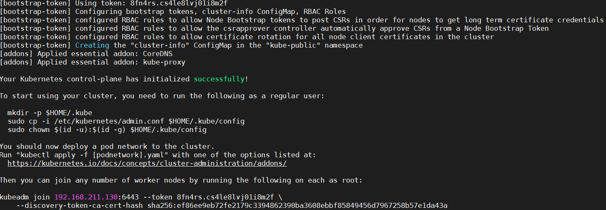

# 准备工作
## 配置yum repos
+ docker的仓库-阿里云的
```sh
cd /etc/yum.repos.d
wget https://mirrors.aliyun.com/docker-ce/linux/centos/docker-ce.repo
```
+ kubernetes仓库
1) 首先准备校验用的yum-key
```sh
# 导入
rpm --import https://mirrors.aliyun.com/kubernetes/yum/doc/yum-key.gpg
rpm --import https://mirrors.aliyun.com/kubernetes/yum/doc/rpm-package-key.gpg
```

2) kubernetes.repo
```sh
[kubernetes]
name=Kubernetes Repo
baseurl=https://mirrors.aliyun.com/kubernetes/yum/repos/kubernetes-el7-x86_64/
gpgcheck=1
gpgkey=https://mirrors.aliyun.com/kubernetes/yum/doc/yum-key.gpg
enabled=1
```
+ 检查一下
```sh
yum repolist
```


+ 将docker-ce.repo和kubernetes.repo拷贝到其他机器上
```sh
scp docker-ce.repo kubernetes.repo root@192.168.120.110:/etc/yum.repos.d
```

## 安装
```sh
yum install -y docker-ce kubelet kubeadm kubectl
```

## docker修改镜像源
```bash
sudo mkdir -p /etc/docker
sudo tee /etc/docker/daemon.json <<-'EOF'
{
  "registry-mirrors": ["https://yourcode.mirror.aliyuncs.com"]
}
EOF
sudo systemctl daemon-reload
sudo systemctl restart docker
```

## 检查
1）查看kuberntes安装了那些东西
```sh
[xiefq@localhost ~]$ sudo rpm -ql kubelet
/etc/kubernetes/manifests # 清单
/etc/sysconfig/kubelet # 配置
/usr/bin/kubelet # 主程序
/usr/lib/systemd/system/kubelet.service # 启动服务
```
 
# 启动
## 启动docker
> 因为国内网络封锁，很多镜像下载不下来

1) 怎么定义环境变量
> 如果有vpn不存在的
编辑/usr/lib/systemd/system/docker.service  
定义一个环境变量
```sh
Environment="HTTPS_PROXY=http://www.ik8s.io:10080"
Environment="NO_PROXY=127.0.0.0/8,192.168.0.0/16,172.16.0.0/16"
```
2）生效配置
```sh
systemctl daemon-reload
```
3) 启动
```
sytemctl start docker
docker info
```
4) 安装的最后
```
sudo groupadd docker
sudo usermod -aG docker $USER
```
## 查看此时的iptables规则为1
> 之后会生成很多的规则,支持网络桥接功能
```sh
cat /proc/sys/net/bridge/bridge-nf-call-iptables
```

## 启动kubernetes
0. 一定一定要关闭防火墙
1. 启用kubelet服务
```
[xiefq@localhost ~]$ sudo systemctl enable kubelet
Created symlink from /etc/systemd/system/multi-user.target.wants/kubelet.service to /usr/lib/systemd/system/kubelet.service.
```
2. kubeadm init
> 初始化
```text
--apiserver-advertise-address apiserver监听的地址
--apiserver-bind-port 监听的端口
--ignore-preflight-errors 忽略哪些错误
--pod-network-cidr pod网络ip地址范围
--service-cidr service网络IP地址范围
--kubernetes-version controller plane的版本
```
例如
```sh
kubeadm init --kubernetes-version=v1.11.1
```
3. 如果出现启动报swap错误，我们可以禁用，也可以在配置中指定忽略
vi /etc/sysconfig/kubelet
```
KUBELET_EXTRA_ARGS="--fail-swap-on=false"
```
然后在kubeadm启动的时候加
```
kubeadm init --kubernetes-version=v1.15.3 --ignore-preflight-errors=Swap
```


4. 国内不能使用k8s.gcr.io拉去镜像，我们替换为
```sh
images=("kube-apiserver:v1.15.3" "kube-controller-manager:v1.15.3" "kube-scheduler:v1.15.3" "kube-proxy:v1.15.3" "coredns:1.3.1")
for image in ${images[@]}
do
    docker pull googlecontainer/$image
    docker tag googlecontainer/$image k8s.gcr.io/$image
done

docker pull thejosan20/pause:3.1
docker tag thejosan20/pause:3.1 k8s.gcr.io/pause:3.1

docker pull 1017746640/etcd:3.3.10
docker tag 1017746640/etcd:3.3.10 k8s.gcr.io/etcd:3.3.10
```

+ 自动加载了两个插件 CoreDNS和kube-proxy
+ CoreDNS 支持资源的动态生成，配置文件的动态加载
+ kube-proxy 负责生成service的iptables规则
+ 使用集群需要
```
To start using your cluster, you need to run the following as a regular user:
  mkdir -p $HOME/.kube
  sudo cp -i /etc/kubernetes/admin.conf $HOME/.kube/config
  sudo chown $(id -u):$(id -g) $HOME/.kube/config
```
+ 其他节点可以加入k8s集群
```
kubeadm join 192.168.211.130:6443 --token uyisrn.qklue4c1zpr2flz3 \
    --discovery-token-ca-cert-hash sha256:f76e2975585bdefe0430156931ddbebfab1d3d8398ea5076aebd84cbce523b8d

```
5. admin.conf
k8s同api-server的认证信息配置

6. 此时查看nodes
```
[xiefq@localhost ~]$ kubectl get nodes
NAME                    STATUS     ROLES    AGE   VERSION
localhost.localdomain   NotReady   master   23m   v1.15.3
```
发现状态是“NotReady”，因为需要配置网络插件，我们部署flanel

7. 部署flannel
访问 https://github.com/coreos/flannel 
```sh
kubectl apply -f https://raw.githubusercontent.com/coreos/flannel/master/Documentation/kube-flannel.yml
podsecuritypolicy.policy/psp.flannel.unprivileged created
clusterrole.rbac.authorization.k8s.io/flannel created
clusterrolebinding.rbac.authorization.k8s.io/flannel created
serviceaccount/flannel created
configmap/kube-flannel-cfg created
daemonset.apps/kube-flannel-ds-amd64 created
daemonset.apps/kube-flannel-ds-arm64 created
daemonset.apps/kube-flannel-ds-arm created
daemonset.apps/kube-flannel-ds-ppc64le created
daemonset.apps/kube-flannel-ds-s390x created
```
要flannel的pod处于启动状态才表示部署成功的

确保flannel已经部署好了
```sh
docker images | grep flannel
quay.io/coreos/flannel                    v0.11.0-amd64       ff281650a721        7 months ago        52.6MB
```
然后查看pod(kube-system)
```
[xiefq@localhost ~]$ kubectl get pods -n kube-system
NAME                                            READY   STATUS              RESTARTS   AGE
coredns-5c98db65d4-2k82r                        0/1     ContainerCreating   0          3d11h
coredns-5c98db65d4-kjln8                        0/1     ContainerCreating   0          3d11h
etcd-localhost.localdomain                      1/1     Running             1          3d11h
kube-apiserver-localhost.localdomain            1/1     Running             1          3d11h
kube-controller-manager-localhost.localdomain   1/1     Running             1          3d11h
kube-flannel-ds-amd64-rvbd4                     0/1     CrashLoopBackOff    6          3d10h
kube-proxy-bdj8r                                1/1     Running             1          3d11h
kube-scheduler-localhost.localdomain            1/1     Running             1          3d11h
```
发现flannel已经启动好了

## 设置代理
```
export http_proxy=192.168.211.1:1080
export https_proxy=192.168.211.1:1080
export no_proxy="127.0.0.1, localhost, 172.26.*, 172.25.6.66, 192.168.*"
```

# FAQ
## 初始化错误
```sh
[root@master01 xiefq]# kubectl get pods
The connection to the server localhost:8080 was refused - did you specify the right host or port?
```
## 关闭swap
```
sudo sed -i '/ swap / s/^\(.*\)$/#\1/g' /etc/fstab
sudo swapoff -a 
```

## 网络参考
[网络问题参考](https://blog.csdn.net/qq_34857250/article/details/82562514)