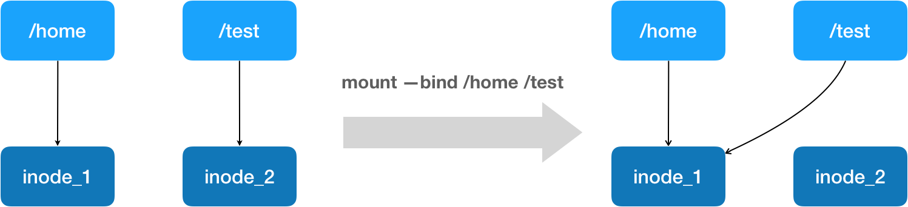

<!-- TOC -->

- [1. docker发展](#1-docker发展)
    - [1.1. 容器市场](#11-容器市场)
    - [1.2. kubernetes收割残血](#12-kubernetes收割残血)
- [2. Docker怎么实现容器化](#2-docker怎么实现容器化)
    - [2.1. 怎么实现隔离和资源限制](#21-怎么实现隔离和资源限制)
        - [2.1.1. Namespace隔离的问题与挑战](#211-namespace隔离的问题与挑战)
        - [2.1.2. 容器资源限制](#212-容器资源限制)
            - [2.1.2.1. Cgroups](#2121-cgroups)
- [3. 深入理解容器镜像](#3-深入理解容器镜像)
    - [3.1. 容器的进程怎么挂载文件系统](#31-容器的进程怎么挂载文件系统)
    - [3.2. rootfs的强一致性是怎么体现的？](#32-rootfs的强一致性是怎么体现的)
- [4. 重新认识docker容器](#4-重新认识docker容器)
    - [4.1. 查看容器的IP地址](#41-查看容器的ip地址)
    - [4.2. 上传镜像](#42-上传镜像)
    - [4.3. docker exec的工作原理](#43-docker-exec的工作原理)
    - [4.4. docker commit](#44-docker-commit)
    - [4.5. docker volume](#45-docker-volume)
    - [4.6. 容器初始化进程 VS 容器应用进程](#46-容器初始化进程-vs-容器应用进程)
    - [4.7. linux绑定挂载机制](#47-linux绑定挂载机制)

<!-- /TOC -->

# 1. docker发展
Pass时代，AWS和OpenStack以及开源的Clound Foundry项目。Pass项目提供了“应用托管”的概念。但是他们是需要写脚本手工部署。

缺点：
+ 用户需要为每种语言，每种框架，甚至每个版本的应用维护一个打好的包。
+ 需要不断试错，没有经验可借鉴。

Docker公司原名dotCloud，也是解决了应用打包的问题。但是它提出了“镜像”的概念。他们的原理都是调用操作系统Cgroups和Namespace机制
为每一个应用单独创建一个称为“沙盒”的隔离环境。这样多个用户的应用就会互不干涉的在虚拟机里批量的，自动的运行起来。

优点：
+ 由完整的操作系统的所有文件和目录构成，跟本地测试用的环境完全一样

容器集群管理工具也就出现，dockers官方的swarm重新定义PaaS.

## 1.1. 容器市场
只有那些为用户提供平台层能力的工具，才能真正成为开发者们关心和愿意付费的产品。

CoreOS定制化操作系统，可以按照分布式集群的方式管理所有安装了这个操作系统的节点，CoreOS可以将docker整合到自己的方案中，为用户提供更高层次的PaaS能力。

CoreOS与2014年和Docker公司合作宣告结束，发布了自己的Rocket容器。而Docker自己也发布了自己的PaaS工具，Swarm。

Docker公司通过并购完善自己的平台层能力。收购Fig后来发展成为Composer项目，它提出了**容器编排**的概念

容器编排
> 用户通过某些工具或者配置来完成一组虚拟机以及关联资源的定义，配置，创建和删除等工作，然后由云计算平台按照这些指定的逻辑完成编排的过程。

老牌集群管理项目Mesos，是大数据火热时最受欢迎的资源管理项目。大数据关注计算密集型离线业务，并没有像Web服务那样进行容器扩容和打包的强烈需求。

Mesosphere公司发布一个Marathon项目，它和已经具有通过了万台节点验证的Mesos项目整合，进化出了一个高度成熟的PaaS项目，同时还能很好的支持大数据业务。

2014年，Google公司也公布了自己的Kubernetes项目，改变了容器市场的格局。


## 1.2. kubernetes收割残血
Docker现在已经有了 Compose, Swarm和Machine三件套，而且，围绕Docker项目的网络，存储，CI/CD，升值UI都纷纷涌现。也涌现了许多像Rancher这类创业公司。

由Docker公司发起，将自己诟病很多的Libcontainer(容器运行时库)捐出，改名为RunC项目，共同和CoreOS,RedHat,Google这些公司指定一套容器镜像标准和规范。
这套标准就是OCI（open container initiative）,但是Docker公司并不推进这个标准，导致OCI效率低下。然后Google和RedHat公司决定发起一个CNCF（Cloud Native Computing Foundation）基金会。以Kubernetes为基础，建立一个由开源基础设施领域厂商主导的，按照独立基金会方式运营的平台级社区。
+ Kubernetes项目必须能够在容器编排领域取得足够大的竞争优势。
+ CNCF社区必须以Kubernetes项目为核心，覆盖足够多的场景。

Kubernetes的很多在容器基础化设施多年来的实践经验的，比如Pod和Sidecar等功能和设计模式。

同时RedHat在开源社区的影响力也保证了kubernetes的优势。

Docker为了孤注一掷，最后将swarm容器编排和集群管理的功能内置到了Docker项目中。Docker彻底走火入魔，反观，kubernetes非常民主的架构，允许开发者通过
代码的方式介入到kubernetes项目的每一个阶段。催生出了大量的，基于k8s API的二次创新工作
+ 微服务治理项目 Istio
+ 有状态应用部署框架Operator
+ Rook这种，通过扩展kubernetes可扩展的接口，将Cephalexin重量级的产品封装成了简单易用的容器存储插件。

Docker孤注一掷失败了，最后放弃了和开源社区 kubernetes 竞争的业务，将原Docker改名为Moby，并保留Docker商标作为商业业务，Moby交给社区维护。

# 2. Docker怎么实现容器化
容器边界的实现手段

容器的核心功能就是通过约束和修改进程的动态表现（程序运行时的数据和状态的总和），从而为其创建一个“边界”。

Cgroups技术是用来制造约束的主要手段，而Namespace技术则是用来修改进程视图的主要方法。

```c
int pid = clone(main_function, stack_size, CLONE_NEWPID | SIGCHLD, NULL); 
```
创建一个新进程，它将会看到一个全新的进程空间，它的PID是1.


## 2.1. 怎么实现隔离和资源限制
### 2.1.1. Namespace隔离的问题与挑战
隔离的技术手段是通过namespace, 用户运行在容器里的进程跟宿主机其他进程一样，都由宿主机操作系统统一管理。Docker的工作就是为这些容器经常设置
Namespace参数或者其他的辅助管理工作。

Docker容器化减少了传统虚拟OS的方式带来的性能损耗。

缺点：
+ 多个容器之间使用的是一个宿主机的内核，从一定程度上隔离度不够。虽然可以通过Mount namespace挂载不同版本操作系统文件，但是共享一个内核是改变不了的事实。
+ linux中有些对象和资源是不能被Namespace的，比如系统时间。
### 2.1.2. 容器资源限制
Namespace这种隔离技术不能限制CPU等系统资源的使用，它和系统其他进程一样，平等竞争。

Linux Cgroups（linux control group）就是linux系统内核用来为进程设置资源限制的一个重要功能.

#### 2.1.2.1. Cgroups
它给用户暴露出来的操作接口是文件系统，即它以文件和目录的方式组织在操作系统的`/sys/fs/cgroup`路径下.
```
[xiefq@master ~]$ mount -t cgroup
cgroup on /sys/fs/cgroup/systemd type cgroup (rw,nosuid,nodev,noexec,relatime,seclabel,xattr,release_agent=/usr/lib/systemd/systemd-cgroups-agent,name=systemd)
cgroup on /sys/fs/cgroup/pids type cgroup (rw,nosuid,nodev,noexec,relatime,seclabel,pids)
cgroup on /sys/fs/cgroup/net_cls,net_prio type cgroup (rw,nosuid,nodev,noexec,relatime,seclabel,net_prio,net_cls)
cgroup on /sys/fs/cgroup/devices type cgroup (rw,nosuid,nodev,noexec,relatime,seclabel,devices)
cgroup on /sys/fs/cgroup/perf_event type cgroup (rw,nosuid,nodev,noexec,relatime,seclabel,perf_event)
cgroup on /sys/fs/cgroup/hugetlb type cgroup (rw,nosuid,nodev,noexec,relatime,seclabel,hugetlb)
cgroup on /sys/fs/cgroup/freezer type cgroup (rw,nosuid,nodev,noexec,relatime,seclabel,freezer)
cgroup on /sys/fs/cgroup/cpuset type cgroup (rw,nosuid,nodev,noexec,relatime,seclabel,cpuset)
cgroup on /sys/fs/cgroup/cpu,cpuacct type cgroup (rw,nosuid,nodev,noexec,relatime,seclabel,cpuacct,cpu)
cgroup on /sys/fs/cgroup/memory type cgroup (rw,nosuid,nodev,noexec,relatime,seclabel,memory)
cgroup on /sys/fs/cgroup/blkio type cgroup (rw,nosuid,nodev,noexec,relatime,seclabel,blkio)
```
`cpu,memory,cpuset`这类目录也叫子系统，就是可以用cgroups进行资源限制的种类。
```
[xiefq@master ~]$ ls /sys/fs/cgroup/cpu
cgroup.clone_children  cgroup.sane_behavior  cpuacct.usage_percpu  cpu.rt_period_us   cpu.stat           release_agent  user.slice
cgroup.event_control   cpuacct.stat          cpu.cfs_period_us     cpu.rt_runtime_us  docker             system.slice
cgroup.procs           cpuacct.usage         cpu.cfs_quota_us      cpu.shares         notify_on_release  tasks
```
可以查看限制的方法`cfs_period 和 cfs_quota`限制在某个间隔时间里，cpu可使用的时间。

+ 怎么使用？
在相应的资源目录里创建一个资源限制组`mkdir container`,然后修改里边的配置。

+ Docker的资源限制
简单的说，Docker为每个容器创建一个控制组（创建一个目录），然后启动容器进程之后，把这个进程PID填写到对应控制组的tasks文件就可以了
```
docker run -it --cpu-period=100 --cpu-quota=20 ubuntu 
```

+ 总结

对于docker来说一个容器其实就是一个启用了`Linux Namespace`的应用进程，并对这个进程设置`Cgroups`，限制资源使用。

容器有一个重要的概念 “容器是一个**单进程**模型”，原则上一个容器无法运行多个进程，除非能找到一个公共的`PID=1`的程序充当不同应用的父进程。

容器应该同应用同生命周期。

Cgroups对资源的限制也有一些问题，比如`/proc`文件系统。此目录记录当前内核运行状态的特殊文件。保存了CPU的进程信息等。在容器里用`top`命令看到的是
整个宿主机的进程运行情况。

# 3. 深入理解容器镜像
## 3.1. 容器的进程怎么挂载文件系统
Mount namespace可以重新挂载不同的目录到`/`下，这样容器就可以看到挂载的这个目录，宿主机是看不到的。
有一个单独的指令`chroot或者pivot_root`可以方便的更改进程根目录。
```
mkdir -p $HOME/test
mkdir chroot $HOME/test /bin/bash
```
表示`/bin/bash`进程的根目录是`#HOME/test`

通过这种手段，我们可以给容器进程挂载一个完整的操作系统文件系统。这种为容器进程提供隔离执行环境的文件系统又叫做*rootfs*根文件系统。

但是`rootfs`只包含了操作系统的躯壳，并没有操作系统的内核，因为操作系统内核和文件配置目录是分开存放的，只有在开机启动的时候才会加载指定的内核镜像。

实际上，同一台机器上的所有容器，都共享宿主操作系统的内核。内核的参数，加载的模块，就像一个`全局变量`一样，牵一发动全身。

## 3.2. rootfs的强一致性是怎么体现的？
rootfs打包的不只是应用，而是整个操作系统的文件和目录。应用依赖的所有东西都封装到了一起。

Docker在镜像设计中，引入了`层`的概念，用户制作的每一步操作，都会生成一个增量`rootfs`层。

+ 联合文件系统 UnionFS
将多个不同位置的目录联合挂载在同一个目录里

docker对于AuFS关键目录在`/var/lib/docker/aufs/diff/<layer_id>`

通过`docker inspect`指令可以看到一个镜像包含的层
```
"RootFS": {
            "Type": "layers",
            "Layers": [
                "sha256:a1aa3da2a80a775df55e880b094a1a8de19b919435ad0c71c29a0983d64e65db",
                "sha256:ef1a1ec5bba9f5efcecf38693111c335cafa27f53669a91bee5d3dc17819180c",
                "sha256:6c3332381368f5c277995c2e1d19dc895b8a870ba7d1ccd8a4dbe4a5c26810bc",
                "sha256:e80c789bc6aca44ee043fb65d06ddff70f644086dd99e6c65b04149cd5787d84"
            ]
        },
```
在使用镜像的时候，就会报这些增量layer联合挂载到`/var/lib/docker/aufs/mnt/<docker_id>`. docker就是通过AuFS将多个rootfs挂载出一个完整的
文件系统。

+ 这些层的结构
    + 只读层（ro+wh) 只读的whiteout(遮挡一些删除的文件或者目录)
    > whiteout 因为每个层都是只读的，docker通过 whiteout的方式在读写层一个`wh.*`的文件，比如删除了一个只读层的foo文件，就有一个`wh.foo`,来
    实现对下层的不可见性。

    + init层
    > Docker单独生成的内部层，用来存放 `/etc/hosts, /etc/resolv.conf`信息

    + 读写层
    > 最上面的一层，没有写入之前是空的，一旦在容器里有了写操作，就会将修改的内容以增量的形式保存在这个层中

# 4. 重新认识docker容器
Dockerfile提供了一种制作rootfs便捷的方式
```sh
# 使用官方提供的 Python 开发镜像作为基础镜像
FROM python:2.7-slim

# 将工作目录切换为 /app
WORKDIR /app

# 将当前目录下的所有内容复制到 /app 下
ADD . /app

# 使用 pip 命令安装这个应用所需要的依赖
RUN pip install --trusted-host pypi.python.org -r requirements.txt

# 允许外界访问容器的 80 端口
EXPOSE 80

# 设置环境变量
ENV NAME World

# 设置容器进程为：python app.py，即：这个 Python 应用的启动命令
CMD ["python", "app.py"]
```
+ 默认`ENTRYPOINT`是`/bin/sh -c`
+ CMD 就是`ENTRYPOINT`后边的参数
+ dockerfile中每个原语执行后，都会生成一个对应的镜像层。即使并没有明显的修改文件的操作。

## 4.1. 查看容器的IP地址
```sh
docker inspect image_id
```
如果没有通过 `-p 宿主机端口:容器内部的端口`，进行映射的话，我们只有拿到容器的IP地址进行访问。做了映射我们就可以直接用`localhost:宿主机端口`
进行访问了。


## 4.2. 上传镜像
+ 给容器打tag
```
docker tag hellowrld geektime/helloworkd:v1
```
geektime是docker hub的账户名称，helloworld:v1是镜像的名称和版本

## 4.3. docker exec的工作原理
+ 容器进程的Namespace信息在宿主机上是存在的
    + `docker inspect --format '{{ .State.Pid }}' 4234dfjksaf`可以查看容器的进程ID
    +  `ls -l /proc/{pid}/ns`第一步拿到的pid查看关联的Namespace文件
    > 一个进程的每种Namespace都对应在/proc/{pid}/ns下又一个对应文件
+ 既然在`/proc/{pid}/ns`下可以拿到容器的namespace信息，那么我们就可以选择的加入到已有的namespace里，从而
达到进入这个容器的目的。
> 在linux中 `setns()`调用就是干的这个事情

## 4.4. docker commit
容器运行起来以后，把最上层 "可读写层"，加上原先容器镜像的只读层，打包组成了一个新的镜像。因为使用了联合文件系统，对镜像rootfs的任何
修改都会被操作系统先复制到这个可读写层，然后再修改。`Copy-on-Write`.

## 4.5. docker volume
允许你将宿主机上指定的目录或者文件，挂载到容器里边进行读取和修改操作。

声明方式
```sh
# 将宿主机的临时目录 /var/lib/docker/volumes/[VOLUME_ID]/_data 挂载到容器的 /test目录里
$ docker run -v /test ... 
# 将宿主机指定的目录，挂载到/test目录里
$ docker run -v /home:/test ...
```
镜像的各个层保存至 `/var/lib/docker/aufs/diff` 目录下，容器启动后，这些层就会被联合挂载到 `/var/lib/docker/aufs/mnt` 中。而通过volume指定
宿主机目录挂载到 `/var/lib/docker/aufs/mnt/[可读写层 ID]/test` 可读写层的目录里。挂载工作就做完了。

挂载事件只在容器里可见，宿主机是看不到这个挂载点的，隔离性没有被volume打破。

## 4.6. 容器初始化进程 VS 容器应用进程
docker在创建容器的时候会由 dockerinit负责根目录的准备，挂载设备和目录，配置hostname等一些列需要在容器内进行的初始化操作。然后
通过 `execv()` 调用，让应用进程（也就是 ENTRYPOINT + CMD）取代自己，成为容器里 PID=1 的进程。

## 4.7. linux绑定挂载机制
允许你将一个目录或者文件，而不是整个设备，挂载到一个指定的目录上。其实绑定挂载实际上是一个 inode 替换的过程。



挂载的目录里的内容是不会被 `docker commit` 一起交打包到容器镜像里，但是在只读层的 `文件目录` 即挂载点的文件夹会被提交。但是始终是
空的。