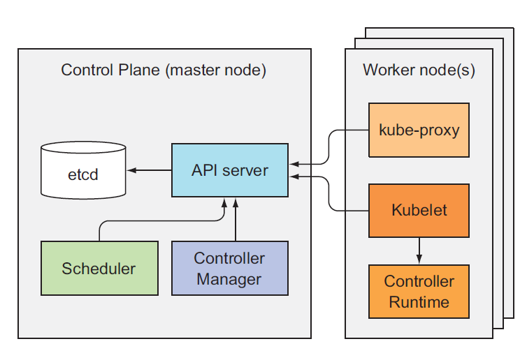
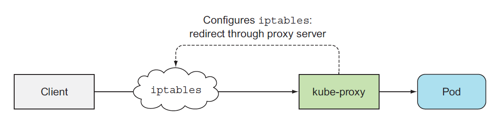
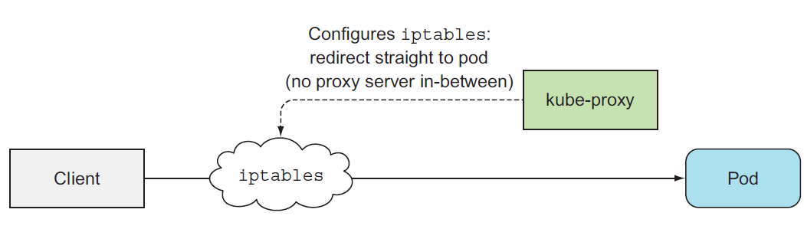

<!-- TOC -->

- [1 理解架构](#1-理解架构)
- [2 kubernetes service proxy 的职责](#2-kubernetes-service-proxy-的职责)
    - [kube-proxy的路由原理图](#kube-proxy的路由原理图)
        - [kube-proxy代理模式](#kube-proxy代理模式)
- [3 k8s的插件](#3-k8s的插件)
    - [插件怎么部署的？](#插件怎么部署的)
    - [DNS的工作原理](#dns的工作原理)
    - [Ingress controller的工作原理](#ingress-controller的工作原理)
- [4 各个组件怎么协调工作](#4-各个组件怎么协调工作)
    - [事件流程](#事件流程)
    - [观察集群时间](#观察集群时间)
- [5 运行中的pod](#5-运行中的pod)
- [6 pod的网络通信](#6-pod的网络通信)
    - [网络需要满足那些条件](#网络需要满足那些条件)
    - [深入理解网络工作原理](#深入理解网络工作原理)
    - [node之间的bridge怎么通信](#node之间的bridge怎么通信)
    - [CNI介绍](#cni介绍)

<!-- /TOC -->
## 1 理解架构
+ 集群组件
  - kubernetes control plane(控制面板)
    - etcd 分布式存储
    - api 服务器
    - 调度器
    - 控制管理器
  - worker nodes(工作节点)
    - kubelet
    - kube-proxy
    - container-runtime (docker)
  - 插件
    - kubernetes DNS 服务器
    - 仪表盘
    - Ingress controller
    - heapster
    - 网络插件

  
  ```
  所有的组件都必须启动，才能使用k8s提供的所有功能
  kubectl get componentstatuses # 此命令可以显示控制面板组件的状态
  ```

+ 组件之间是怎么交互的
> k8s的系统组件只与API server交互，API是唯一和etcd组件交互的组件

一般都是其他组件主动连接APIServer，而在使用kubectl logs，kubectl attach ,kubectl port-forward这些命令的时候
APIServer主动和其他组件建立连接

```
kubectl attach和kubectl exe命令作用大致相同，不同的是，attach是在容器的主进程里运行命令，而exe是单独
开启新的进程
```

work nodes的组件需要在同一个节点上运行，但是 control plane的组件可以跨多个服务器运行，并且同一个
组件可以运行多个实例，以确保高可用性

API server和etcd的实例彼此可以并发执行任务，但是调度器和controller manager一次只能一个
实例运行，其他的都是出于随时待命状态（standby)

+ 组件怎么运行部署

既可以部署在系统层面上，也可以pod的方式运行, kubelet实现了这一目的

kubelets 唯一一个常作为系统进程运行的组件，它可以将其他的组件作为pod运行, 使用kubeadm命令创建

+ k8s怎么使用etcd
> which is a fast, distributed, and consistent key-value store

只有APIServer和etcd交互，并使用乐观锁保证数据的一致性，k8s的所有资源都有一个meta.resourceVersion字段，
当要更资源时候，此字段必须传回到APIServer，

+ 资源在etcd里边是怎么存储的
k8s将etcd的数据存储在/registry目录里，etcdv3不支持目录层次，而是在key上用“/”的方式间接的
表达了目录的概念

可以使用下面的方式查看某一前缀下的子目录，当具体到某一个具体存在的资源时，就会显示此资源
的详细配置
```
etcdctl get /registry/pods --prefix=true
etcdctl get /registry/pods/default/kubia-159041347-wt6ga
```

+ 当etcd集群后，确保一致性
> etcd使用RAFT算法做到这一点


## 2 kubernetes service proxy 的职责
kube-proxy运行于每个work-node, 负责客户端通过kubernetes api访问运行在当前节点的服务，并且负责
相同服务的多个pod间的负载均衡

### kube-proxy的路由原理图

> 这儿有两种proxy-mode，主要区别是  
whether packets pass through the kube-proxy and must be handled in user space, or
whether they’re handled only by the Kernel (in kernel space).  
主要体现在性能的影响上，一个必须在user space上处理，一个只需要内核的参与，而且在负责均衡
的处理方式上也有所不同，userspace是round-robin，而iptables是随机选择

#### kube-proxy代理模式
+ userspace 模式
> It used an actual server process to accept connections and proxy them to the pods  
使用服务器进程拦截所有连接，然后再重定向到pod



+ iptables 模式
> kube-proxy负责根据api-server的指令配置iptables，客户端直接通过iptables访问相应的pod
服务。不再需要单独的服务进程拦截连接



## 3 k8s的插件
> DNS，dashboard等等

### 插件怎么部署的？
> 以pod的形式部署，有的是通过Deployment，有的是通过ReplicationController或者DaemonSet

DNS 以Deployment的方式部署，dashboard和Ingress controller以ReplicationControllers部署

### DNS的工作原理
集群中的所有pod默认都使用当前集群里的DNS服务器，此DNS server以kube-dns（service)的名称提供服务
集群中的所有容器的/etc/resolv.conf都会配置此kube-dns服务的ip地址，kube-dns会监听集群中所有的
Service，Endpoints的变动，并及时更新DNS信息。

### Ingress controller的工作原理
有不同的ingress controller的实现，它的任务是反向代理服务，它通过监听Ingress,Service,Endpoints
的配置变化从而来配置自己。ingreess controller会直接将流量forward到pod，而不是service

【ingress的一些问题】 [参考](https://www.cnadn.net/post/2470.htm)

+ 还不能支持较为复杂的LB特性，例如会话保持，nginx controller扩展了ingress可以做会话保持但必须使用nginx plus。

+ 业务规则发生变化，会导致频繁修改ingress配置，且所变化都会引起nginx reload配置，这在大并发，复杂系统环境下可能会产生较大问题

+ 外部访问的入口依赖使用controller所在node的宿主IP，且端口暴露在node IP上，对于多个应用需要同时使用相同端口时候会导致端口冲突

+ 外部访问入口分散在多个node IP上，使得外部统一访问变得困难，且存在潜在的单点故障，一个node失败，客户端只有重新发起到新的node节点的访问（虽然可以使用dns来轮询这些IP），因此有必要为这些入口访问点构建统一的虚拟IP（漂移IP），这可以通过在k8s环境外部使用其它高级LB来实现，比如F5。或者将多个提供访问的node节点构建为一个集群（比如使用keepalived），可参考 https://jimmysong.io/kubernetes-handbook/practice/edge-node-configuration.html

+ 所以基本上ingress的方案还得需要一个外部LB来做统一的高容量请求入口，ingress只能作为k8s内部的二级LB（且功能有限）。与其这样，不如直接通过将pod暴露给外部LB来直接做负载均衡，可参考：https://www.myf5.net/post/2334.htm

其它缺点：
+ nginx无图形界面统一管理，nginx plus有 但是是商业版本。
+ ingress没有业务监控检查功能
+ 只支持http L7
+ 不能混合支持L4/L7 LB
+ 不支持TLS的SNI，以及SSL re-encrypt

## 4 各个组件怎么协调工作


### 事件流程


### 观察集群时间
+ 观察指定资源的事件
```
kubectl describe
```

+ 直接获取事件, 可以添加参数 --watch来实时观察集群的事件
```
kubectl get events
```

## 5 运行中的pod

除了我们要运行的容器外，还有一个pause容器在运行，此容器就是pod的基础架构容器，它负责管理当前
pod的所有其他容器，让他们能够共享pause容器的network和linux namespace，并且在容器重新启动后也能
确保使用重启之前的linux namespace，pause容器的生命周期和pod一致，当你手动杀死pause容器后，
pod会自动重建一个，并且重新启动此pod的其他容器。


## 6 pod的网络通信
kubernetes pod的网络通信并不是k8s自己负责，而是由系统管理员设置或者通过容器的网络接口CNI插件

### 网络需要满足那些条件
+ pod能够相互通信
+ 每个pod看到的别个pod的ip地址都是一样的，之间没有NAT转换
+ 当pod需要访问internet或者其他非集群内部的资源时，就需要进行NAT转换，将pod的IP地址转换为
服务节点（主机）的IP地址

### 深入理解网络工作原理


>同一个node里的所有pod的网络通过虚拟以太网卡连接到同一个网桥

在基础架构容器启动之前（其他的容器也没启动），虚拟网卡就已经为容器分配好了，他们都连接到
node的网桥上

【同一个node，不同pod容器建通信示例】
+ pod-A想要发送信息给pod-B
+ pod-A首先将数据包通过自己看到的网卡（eth0)发送出去
+ eth0实际上就是node分配的veth123，它直接同bridge相连
+ bridge将数据包转发给veth234，veth234就是pod-B的eth0
+ pod-B收到pod-A的数据包

### node之间的bridge怎么通信

首先，整个集群中pod的IP地址必须是唯一的，所有node能够分配的地址空间必须不能重叠。为了让
两台不同的物理节点能够通信，需要将node的物理网卡通网桥相连，每个节点在IPtables里配置怎样
到底其他节点的路由信息。比如node-A的iptables就需要配置，所有目的地址为10.1.2.0/24的数据包
转发到nodeB的网卡去。如图所示


+ 注意，这种配置要求所有的node需要连接到同一个网络交换机上，因为ip地址都是私有的，网络包
就会直接被路由器丢弃掉
> 解决上述问题可以使用软件定义的网络（SDN）而不依赖于具体的物理网络拓扑

### CNI介绍
容器网络接口（CNI）负责容器的网络通信，这些插件可以简化容器的网络配置
+ Flannel
+ Weave Net
+ ...等等

安装只需要发布(DaemonSet的yaml）
