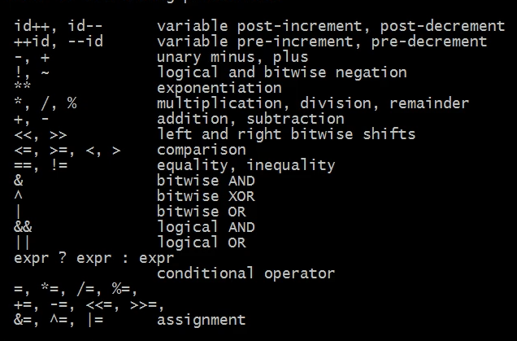
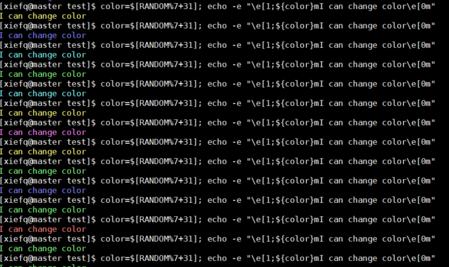
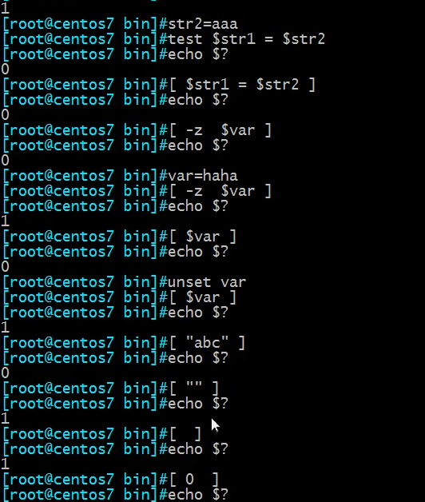

# 参数
## 位置参数
+ args.sh
```sh
#!/bin/bash
echo "1st arg is $1" #第一个参数
echo "2st arg is $2" #第二个参数
echo "3st arg is $3"
echo "9st arg is $9"
echo "all args are $@"  #所有参数
echo "the args number is $#" # 参数个数
```
执行 bash args.sh a b c d e f 输出结果如下
```sh
[xiefq@master test]$ bash args.sh a b c d e f
1st arg is a
2st arg is b
3st arg is c
9st arg is
all args are a b c d e f
the args number is 6
```

## 使用shit移动参数位置
**args.sh**
```sh
#!/bin/bash
echo "1st arg is $1"
echo "2st arg is $2"
echo "3st arg is $3"
echo "9st arg is $9"
echo "all args are $@"
echo "the args number is $#"
shift
echo "1st arg is $1"
echo "2st arg is $2"
echo "3st arg is $3"
echo "9st arg is $9"
echo "all args are $@"
echo "the args number is $#"
shift 2
echo "1st arg is $1"
echo "2st arg is $2"
echo "3st arg is $3"
echo "9st arg is $9"
echo "all args are $@"
echo "the args number is $#"
```
执行 bash args.sh a b c d e f 输出结果如下cat a
```sh
[xiefq@master test]$ bash args.sh a b c d e f
1st arg is a
2st arg is b
3st arg is c
9st arg is
all args are a b c d e f
the args number is 6
1st arg is b
2st arg is c
3st arg is d
9st arg is
all args are b c d e f
the args number is 5
1st arg is c
2st arg is d
3st arg is e
9st arg is
all args are c d e f
the args number is 4
```

# 退出状态
> 0 代表成功, 1-255代表失败，$? 存储最近一次的执行状态。用来检查命令是否执行成功。

## 检查是否ping通
```sh
ping -c1 wwww.wocao.com &> /dev/null
echo $?
```

## 脚本控制返回结果
```sh
exit 10
```

# 算术运算
shell里默认把所有的当成字符串执行，要想执行算术运算，需要专门的指令

+ let



```sh
x=10
y=20
let z=x+y
echo $z
```

+ []里边
```sh
x=1
y=2
z=$[x+y]
echo $z
```

## 随机颜色
```sh
color=$[RANDOM%7+31]; echo -e "\e[1;${color}mI can change color\e[0m"
```

执行结果



+ 两个小括号
```sh
a=$((1+2))
```

+ expr表达式
> 必须分开

```sh
a=expr 1 + 2
```

+ declare -i 也可以
```sh
declare -i x=1
declare -i y=2
declare -i b=x+y
```

## 逻辑表达式
+ && 与
> 00=0 01=0 10=0 11=1

+ || 或
> 00=0 01=1 10=1 11=1

+ ^  异或
> 00=0 01=1 10=1 11=0

a^b=c b^c=a a^c=b

### 利用异或交换值
```sh
a=1
b=2
a=$[a^b];b=$[a^b];a=$[a^b]
echo $a
echo $b
```

# 条件测试
+ test 表达式
文件相关测试
```
-a FILE        True if file exists.
-b FILE        True if file is block special.
-c FILE        True if file is character special.
-d FILE        True if file is a directory.
-e FILE        True if file exists.
-f FILE        True if file exists and is a regular file.
-g FILE        True if file is set-group-id.
-h FILE        True if file is a symbolic link.
-L FILE        True if file is a symbolic link.
-k FILE        True if file has its `sticky' bit set.
-p FILE        True if file is a named pipe.
-r FILE        True if file is readable by you.
-s FILE        True if file exists and is not empty.
-S FILE        True if file is a socket.
-t FD          True if FD is opened on a terminal.
-u FILE        True if the file is set-user-id.
-w FILE        True if the file is writable by you.
-x FILE        True if the file is executable by you.
-O FILE        True if the file is effectively owned by you.
-G FILE        True if the file is effectively owned by your group.
-N FILE        True if the file has been modified since it was last read.
```

字符串相关
```
-z STRING      True if string is empty.

-n STRING
    STRING      True if string is not empty.

STRING1 = STRING2
                True if the strings are equal.
STRING1 != STRING2
                True if the strings are not equal.
STRING1 < STRING2
                True if STRING1 sorts before STRING2 lexicographically.
STRING1 > STRING2
                True if STRING1 sorts after STRING2 lexicographically.
```

数字测试
```
arg1 OP arg2   Arithmetic tests.  OP is one of -eq, -ne,
                     -lt, -le, -gt, or -ge.
```

[例子]
```sh
[xiefq@master test]$ test $str1 != $str2; echo $?
0
[xiefq@master test]$ test $str1 = $str2; echo $?
1
```

+ [ 表达式 ]
> 用法同test

```
[xiefq@master test]$  [ -z $var ]; echo $?
0
[xiefq@master test]$ var=bbb
[xiefq@master test]$  [ -z $var ]; echo $?
1
```

其他例子



## 逻辑与和非的断路器应用

```bash
x=a
y=b
[ x = y ] && echo 'x=y' || echo 'x!=y'
```

如果是数字需要使用 -lt -le -gt -ge -eq -ne 

## 判断是否为数字

```sh
[xiefq@master test]$ [[ "$n" =~ ^[[:digit:]]+$ ]] && echo 是数字 || echo 不是数字
不是数字
[xiefq@master test]$ n=22
[xiefq@master test]$ [[ "$n" =~ ^[[:digit:]]+$ ]] && echo 是数字 || echo 不是数字
是数字
```