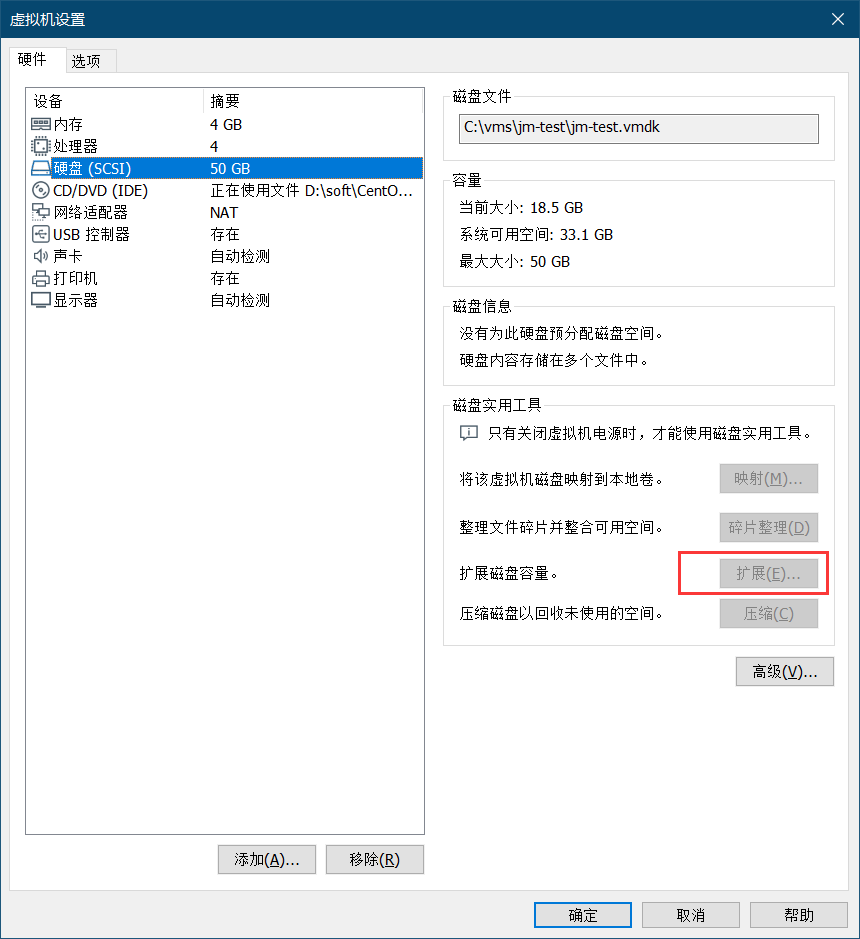

## 关机虚拟机，扩展磁盘容量


## 检查一下服务器的空磁盘
```sh
[xiefq@localhost elasticsearch]$ df -Th
Filesystem              Type      Size  Used Avail Use% Mounted on
/dev/mapper/centos-root xfs        17G   17G   20K 100% /
devtmpfs                devtmpfs  1.9G     0  1.9G   0% /dev
tmpfs                   tmpfs     1.9G  8.0K  1.9G   1% /dev/shm
tmpfs                   tmpfs     1.9G  8.7M  1.9G   1% /run
tmpfs                   tmpfs     1.9G     0  1.9G   0% /sys/fs/cgroup
/dev/sda1               xfs      1014M  143M  872M  15% /boot
tmpfs                   tmpfs     378M     0  378M   0% /run/user/1000
```
没有找到空的xfs磁盘

## 检查scsi设备
```
[xiefq@localhost elasticsearch]$ sudo ls /sys/class/scsi_device/
1:0:0:0  2:0:0:0
```

## rescan设备
> 必须要用root用户才能执行，sudo不行

```
[root@localhost ~]# echo 1 > /sys/class/scsi_device/1\:0\:0\:0/device/rescan
[root@localhost ~]# echo 1 > /sys/class/scsi_device/2\:0\:0\:0/device/rescan
```

## 查找空闲分区
```
[root@master soft]# fdisk -l

Disk /dev/sda: 107.4 GB, 107374182400 bytes, 209715200 sectors
Units = sectors of 1 * 512 = 512 bytes
Sector size (logical/physical): 512 bytes / 512 bytes
I/O size (minimum/optimal): 512 bytes / 512 bytes
Disk label type: dos
Disk identifier: 0x000a50d4

   Device Boot      Start         End      Blocks   Id  System
/dev/sda1   *        2048     2099199     1048576   83  Linux
/dev/sda2         2099200    41943039    19921920   8e  Linux LVM

Disk /dev/mapper/centos-root: 18.2 GB, 18249416704 bytes, 35643392 sectors
Units = sectors of 1 * 512 = 512 bytes
Sector size (logical/physical): 512 bytes / 512 bytes
I/O size (minimum/optimal): 512 bytes / 512 bytes


Disk /dev/mapper/centos-swap: 2147 MB, 2147483648 bytes, 4194304 sectors
Units = sectors of 1 * 512 = 512 bytes
Sector size (logical/physical): 512 bytes / 512 bytes
I/O size (minimum/optimal): 512 bytes / 512 bytes
```
发现/dev/sda确实增加了100G

## 扩展分区
[参考这里](https://blog.csdn.net/TongxinV/article/details/77600522)

* `fdisk /dev/sda`进行硬盘操作
```
1 p 查看当前分区，不要修和删除原有分区信息
2 n 新建分区
3 p 新建主分区
4 选择分区号，基本都是默认的就对了
5 开始位置(默认，回车)
6 结束位置（默认，回车）
7 t 选择分区类型
8 选择分区号
9 8e LVM类型
10 w 保存退出
然后输入 partprobe
```

## 格式化 `mkfs.xfs /dev/sda3`
```
[root@master ~]# mkfs.xfs /dev/sda3
meta-data=/dev/sda3              isize=512    agcount=4, agsize=5242880 blks
         =                       sectsz=512   attr=2, projid32bit=1
         =                       crc=1        finobt=0, sparse=0
data     =                       bsize=4096   blocks=20971520, imaxpct=25
         =                       sunit=0      swidth=0 blks
naming   =version 2              bsize=4096   ascii-ci=0 ftype=1
log      =internal log           bsize=4096   blocks=10240, version=2
         =                       sectsz=512   sunit=0 blks, lazy-count=1
realtime =none                   extsz=4096   blocks=0, rtextents=0
```

## 添加新LVM到已有的LVM组，实现扩容
```
lvm
pvcreate /dev/sda3
vgextend centos /dev/sda3
lvextend -L +79G /dev/centos/root
```

## 文件系统扩容 `xfs_growfs /dev/mapper/centos-root`
```
[root@master ~]# xfs_growfs /dev/mapper/centos-root
meta-data=/dev/mapper/centos-root isize=512    agcount=4, agsize=1113856 blks
         =                       sectsz=512   attr=2, projid32bit=1
         =                       crc=1        finobt=0 spinodes=0
data     =                       bsize=4096   blocks=4455424, imaxpct=25
         =                       sunit=0      swidth=0 blks
naming   =version 2              bsize=4096   ascii-ci=0 ftype=1
log      =internal               bsize=4096   blocks=2560, version=2
         =                       sectsz=512   sunit=0 blks, lazy-count=1
realtime =none                   extsz=4096   blocks=0, rtextents=0
```

## 扩容成功
```
[root@master ~]# df -h
Filesystem               Size  Used Avail Use% Mounted on
/dev/mapper/centos-root   96G  6.4G   90G   7% /
devtmpfs                 901M     0  901M   0% /dev
tmpfs                    912M     0  912M   0% /dev/shm
tmpfs                    912M  8.7M  904M   1% /run
tmpfs                    912M     0  912M   0% /sys/fs/cgroup
/dev/sda1               1014M  143M  872M  15% /boot
tmpfs                    183M     0  183M   0% /run/user/0
```