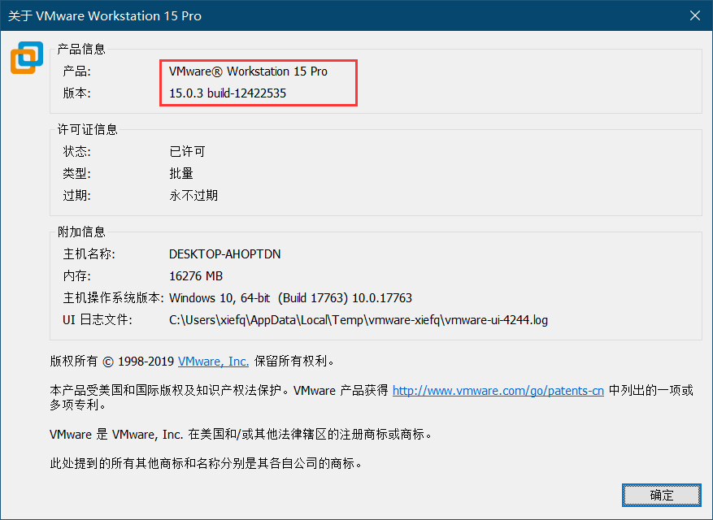
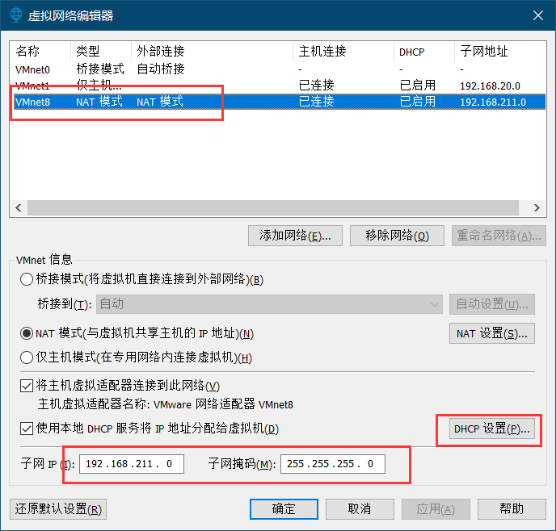
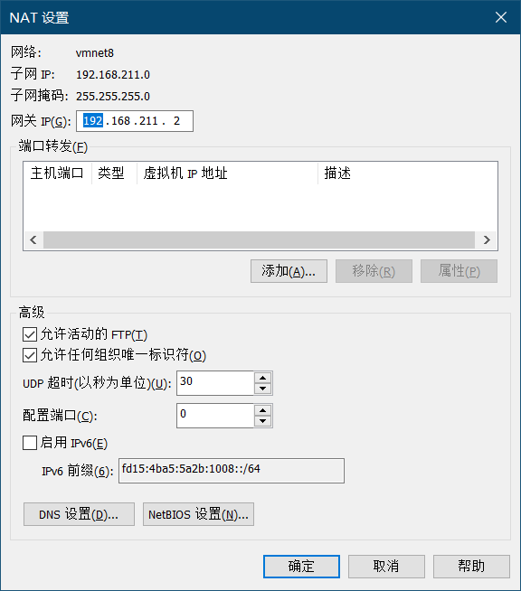
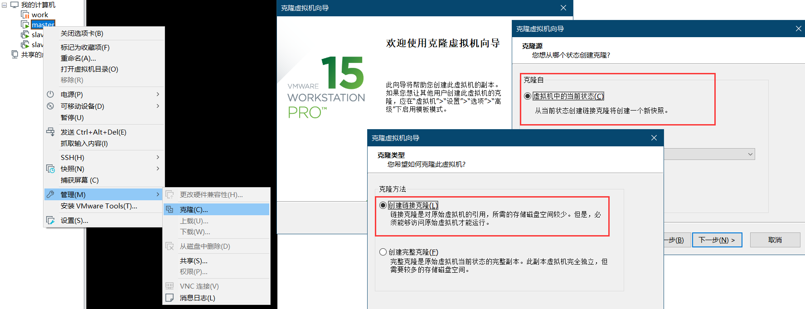

# 准备阶段
+ 安装vmware



+ 配置NAT
> 留意红色部分，安装vmware后会默认分配一个NAT网段，如果不是需要的，可以点击“DHCP配置”进行修改



+ 记录配置信息



比如，我的NAT配置关键信息：网段为192.168.211.0/24，网关为192.168.211.2

+ 虚拟机里安装centos 7
> 安装一个就可以了，其他两个slave可以通过下面方式进行复制，这样可以节省很多磁盘空间



# 配置网络
我们的计划是

|IP地址|hostname|
| :----: | :----: |
|192.168.211.130|master|
|192.168.211.131|slave01|
|192.168.211.132|slave02|

+ master网卡配置
```bash
[xiefq@master ~]$ sudo vi /etc/sysconfig/network-scripts/ifcfg-ens33

TYPE=Ethernet
PROXY_METHOD=none
BROWSER_ONLY=no
BOOTPROTO=static
IPADDR=192.168.211.130
NETMASK=255.255.255.0
GATEWAY=192.168.211.2
DNS1=8.8.8.8
DEFROUTE=yes
IPV4_FAILURE_FATAL=no
IPV6INIT=yes
IPV6_AUTOCONF=yes
IPV6_DEFROUTE=yes
IPV6_FAILURE_FATAL=no
IPV6_ADDR_GEN_MODE=stable-privacy
NAME=ens33
UUID=f5440ad0-8670-4375-abbb-185e719de6f1
DEVICE=ens33
ONBOOT=yes
```

+ master hostname配置
```bash
[xiefq@master ~]$ sudo vi /etc/hostname

master
```

+ 重启
```bash
sudo reboot
```

