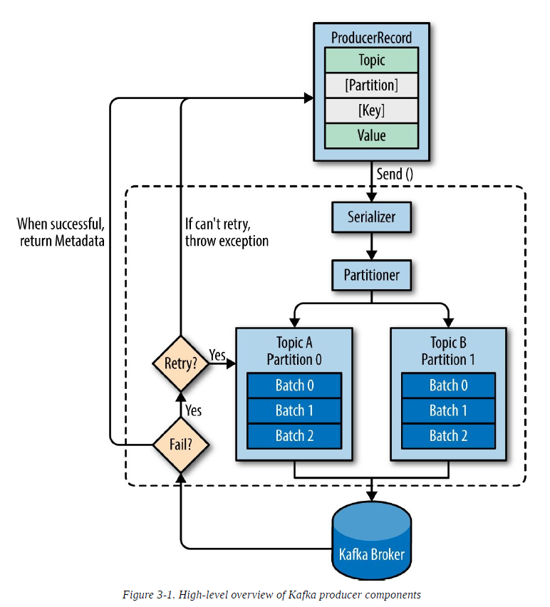
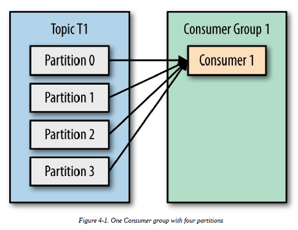
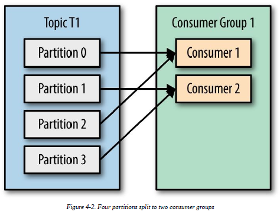
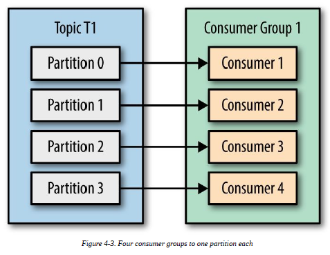
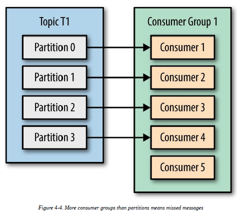
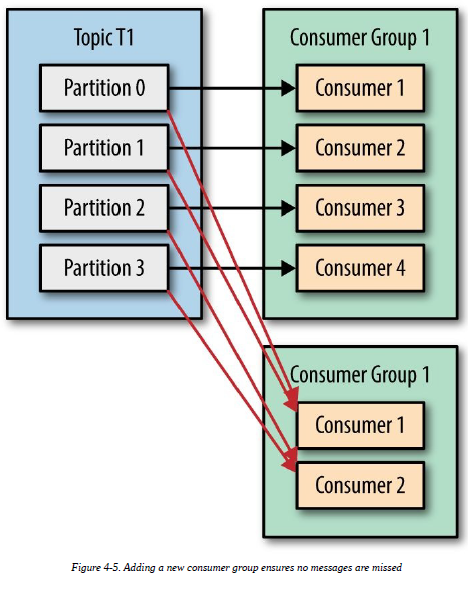
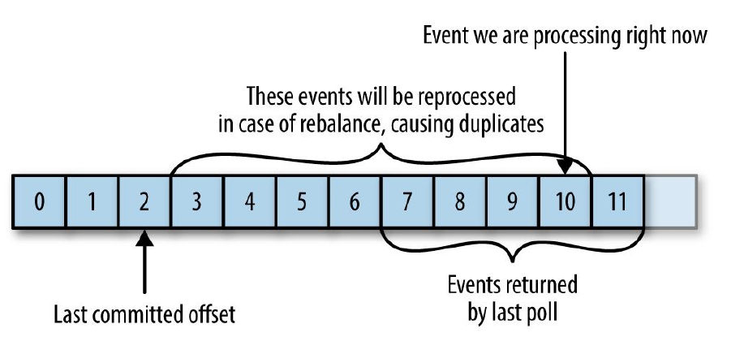
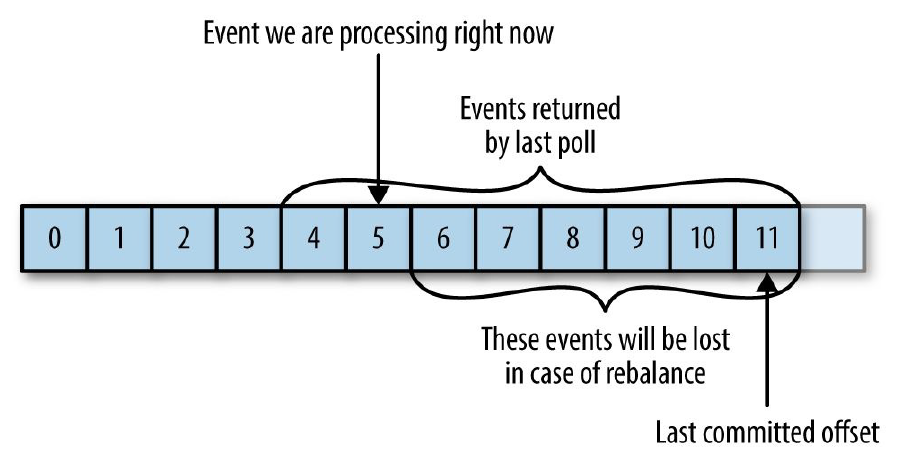

<!-- TOC -->

- [1. 生产者](#1-生产者)
    - [1.1. 简单生产者配置](#11-简单生产者配置)
    - [1.2. 消息发送方式](#12-消息发送方式)
    - [1.3. 消息发送代码](#13-消息发送代码)
        - [1.3.1. 无回调同步方式](#131-无回调同步方式)
        - [1.3.2. 异步方式](#132-异步方式)
    - [1.4. 生产者配置参数](#14-生产者配置参数)
    - [1.5. 消息顺序注意事项](#15-消息顺序注意事项)
    - [1.6. 自定义Serializers](#16-自定义serializers)
    - [1.7. key的作用](#17-key的作用)
    - [1.8. 实现自定义分区策略](#18-实现自定义分区策略)
- [2. 生产者](#2-生产者)
    - [2.1. 组的概念以及组的消息分发机制](#21-组的概念以及组的消息分发机制)
    - [2.2. 配置代码](#22-配置代码)
    - [2.3. 订阅](#23-订阅)
    - [2.4. poll消费消息](#24-poll消费消息)
    - [2.5. 消费者参数配置](#25-消费者参数配置)
    - [2.6. offset设置带来的问题](#26-offset设置带来的问题)
    - [2.7. kafka管理offset](#27-kafka管理offset)
    - [2.8. rebanlance监听](#28-rebanlance监听)
    - [2.9. 反序列化](#29-反序列化)
    - [2.10. 自定义监听partion和topic，无group](#210-自定义监听partion和topic无group)

<!-- /TOC -->
# 1. 生产者

  
__生产者总体架构图__

## 1.1. 简单生产者配置
```java
private Properties kafkaProps = new Properties();
kafkaProps.put("bootstrap.servers", "broker1:9092,broker2:9092");
kafkaProps.put("key.serializer",
    "org.apache.kafka.common.serialization.StringSerializer");
kafkaProps.put("value.serializer",
    "org.apache.kafka.common.serialization.StringSerializer");
producer = new KafkaProducer<String, String>(kafkaProps);
```

## 1.2. 消息发送方式
+ Fire-and-forget
+ Synchronous send
+ Asynchronous send

## 1.3. 消息发送代码

### 1.3.1. 无回调同步方式
```java
ProducerRecord<String, String> record =
                new ProducerRecord<>("CustomerCountry", "Precision Products", "France");
try {
    Future<RecordMetadata> metaresult = producer.send(record);
    //metaresult里可以查看消息发送是否成功
    //调用get方法就阻塞，变成同步了
    metaresult.get();
} catch (Exception e) {
    //可抛出SerializationException和TimeoutException两种异常
    e.printStackTrace();
}
```
### 1.3.2. 异步方式
+ 回调实现
```java
private class DemoProducerCallback implements Callback {
	@Override
	public void onCompletion(RecordMetadata recordMetadata, Exception e) {
		if (e != null) {
			e.printStackTrace();
		}
	}
}
```

+ 注册监听器
```java
ProducerRecord<String, String> record =
				new ProducerRecord<>("CustomerCountry", "Biomedical Materials", "USA");
producer.send(record, new DemoProducerCallback());
```

## 1.4. 生产者配置参数
+ acks 
> how many partition replicas must receive the record before the producer can consider the write successful
```
- 0 the producer will not wait for a reply from the broker before assuming the message was sent successfully  
- 1 the producer will receive a success response from the broker the moment the leader replica received the message  
- all the producer will receive a success response from the broker once all in-sync replicas received the message.
```

+ buffer.memory
> the amount of memory the producer will use to buffer messages waiting to be sent to brokers.

+ compression.type
> snappy, gzip, or lz4

+ retries
+ batch.size
> multiple records are sent to the same partition, the producer will batch
them together. This parameter controls the amount of memory in bytes (not
messages!) that will be used for each batch.

+ linger.ms
> the amount of time to wait for additional messages before
sending the current batch.

+ client.id
+ max.in.flight.requests.per.connection
> how many messages the producer will send to the server without
receiving responses.

+ timeout.ms, request.timeout.ms, and metadata.fetch.timeout.ms
+ max.block.ms
> how long the producer will block when calling send()

+ max.request.size
> the size of a produce request sent by the producer.

+ receive.buffer.bytes and send.buffer.bytes
> the TCP send and receive buffers used by the sockets
when writing and reading data. If these are set to -1, the OS defaults will be
used.

## 1.5. 消息顺序注意事项
Apache Kafka preserves the order of messages within a partition.

## 1.6. 自定义Serializers
实现 Serializer 接口，并实现 serialize方法里边的逻辑

## 1.7. key的作用
> Keys serve
two goals: they are additional information that gets stored with the message, and
they are also used to decide which one of the topic partitions the message will be
written to.
keykey是空值，空值的消息使用kafka默认的负载策略，决定消息往哪个partion

## 1.8. 实现自定义分区策略
实现 Partitioner 接口 并实现partition方法的逻辑

# 2. 生产者
## 2.1. 组的概念以及组的消息分发机制
> 看下面几张图完全说明







leader consumer 保有全部其他consumer的信息
>The way consumers maintain membership in a consumer group and ownership
of the partitions assigned to them is by sending heartbeats to a Kafka broker
designated as the group coordinator.  
If the consumer stops sending heartbeats for long enough, its session will time
out and the group coordinator will consider it dead and trigger a rebalance.

## 2.2. 配置代码
```java
Properties props = new Properties();
props.put("bootstrap.servers", "broker1:9092,broker2:9092");
props.put("group.id", "CountryCounter");
props.put("key.deserializer",
    "org.apache.kafka.common.serialization.StringDeserializer");
props.put("value.deserializer",
    "org.apache.kafka.common.serialization.StringDeserializer");
KafkaConsumer<String, String> consumer = new KafkaConsumer<String, String>(props);
```

## 2.3. 订阅
```java
//可以是一个列表
consumer.subscribe(Collections.singletonList("topic1"));
//是一个通配符
consumer.subscribe("test.*");
```

## 2.4. poll消费消息
```java
try {
    //一直循环
	while (true) {
		//拉取数据，参数100是指等待的时间，为0的话立即返回
        //首次调用poll会 ： responsible for finding the GroupCoordinator
        //joining the consumer group, and receiving a partition assignment
		ConsumerRecords<String, String> records = consumer.poll(100);
		for (ConsumerRecord<String, String> record : records){
			log.debug("topic = %s, partition = %s, offset = %d, customer = %s, country = %s\n",
				record.topic(), 
				record.partition(), 
				record.offset(),
				record.key(), 
				record.value());
			int updatedCount = 1;
			if (custCountryMap.countainsValue(record.value())) {
				updatedCount = custCountryMap.get(record.value()) + 1;
			}
			custCountryMap.put(record.value(), updatedCount);
			JSONObject json = new JSONObject(custCountryMap);
			System.out.println(json.toString(4));
		}
	}
} finally {
    //关闭网络连接和套接字，also trigger a rebalance
	consumer.close();
}
```

## 2.5. 消费者参数配置
| 参数 | 说明 |
|:--|:--|
|fetch.min.bytes| allows a consumer to specify the minimum amount of data that it wants to receive from the broker when fetching records.|
|fetch.max.wait.ms|wait until it has enough data to send before responding to the consumer.|
|max.partition.fetch.bytes|the maximum number of bytes the server will return per partition.|
|session.timeout.ms|a consumer can be out of contact with the brokers while still considered alive defaults to 3 seconds.|
|auto.offset.reset|the behavior of the consumer when it starts reading a partition for which it doesn’t have a committed offset or if the committed offset it has is invalid |
|enable.auto.commit|commit offsets automatically|
|partition.assignment.strategy|decides which partitions will be assigned to which consumer . (Range, RoundRobin)|
|client.id|used by the brokers to identify messages sent from the client|
|max.poll.records|the maximum number of records that a single call to poll() will return.|
|receive.buffer.bytes and send.buffer.bytes | TCP send and receive buffers used by the sockets when writing and reading data. If these are set to -1, the OS defaults will be used.|

## 2.6. offset设置带来的问题
> If the committed offset is smaller than the offset of the last message the client
processed, the messages between the last processed offset and the committed
offset will be processed twice. 



> If the committed offset is larger than the offset of the last message the client
actually processed, all messages between the last processed offset and the
committed offset will be missed by the consumer group.



## 2.7. kafka管理offset
+ Automatic Commit
> enable.auto.commit=true 开启这个功能 auto.commit.interval.ms 控制多少时间自动同步一次

+ 手动控制
```java
while (true) {
	ConsumerRecords<String, String> records = consumer.poll(100);
	for (ConsumerRecord<String, String> record : records){
		System.out.printf("topic = %s, partition = %s, offset = %d, customer = %s, country = %s\n",
			record.topic(), 
			record.partition(),
			record.offset(), 
			record.key(), 
			record.value());
	}
	try {
		//这里自动提交当前的偏移量，这里会阻塞
		consumer.commitSync();
        //这里不会阻塞
        consumer.commitAsync();
        //这里可以注册回调
        consumer.commitAsync(new OffsetCommitCallback() {
            public void onComplete(Map<TopicPartition,OffsetAndMetadata> offsets, Exception exception) {
                //可判断有没有异常发生，有异常就可以重试
                if (e != null){
                    log.error("Commit failed for offsets {}", offsets, e);
                }
            }
        });
        //指定特定的offset
        consumer.commitAsync(100, null);
	} catch (CommitFailedException e) {
		log.error("commit failed", e)
	}
}
```

## 2.8. rebanlance监听
```java
consumer.subscribe(topics, new ConsumerRebalanceListener(){
    public void onPartitionsAssigned(Collection<TopicPartition> partitions) {}
    public void onPartitionsRevoked(Collection<TopicPartition> partitions) {
        System.out.println("Lost partitions in rebalance. Committing current offsets:" + currentOffsets);
        consumer.commitSync(currentOffsets);
    }
});
```

## 2.9. 反序列化
实现 Deserializer

## 2.10. 自定义监听partion和topic，无group
```java
List<PartitionInfo> partitionInfos = null;
partitionInfos = consumer.partitionsFor("topic");
if (partitionInfos != null) {
	for (PartitionInfo partition : partitionInfos){
		partitions.add(new TopicPartition(partition.topic(), partition.partition()));
		//指定分区
		consumer.assign(partitions);
		while (true) {
			ConsumerRecords<String, String> records = consumer.poll(1000);
			for (ConsumerRecord<String, String> record: records) {
				System.out.printf("topic = %s, partition = %s, offset = %d, customer = %s, country = %s\n",
					record.topic(), 
					record.partition(), 
					record.offset(),
					record.key(), 
					record.value());
			}
			consumer.commitSync();
		}
	}
}
```