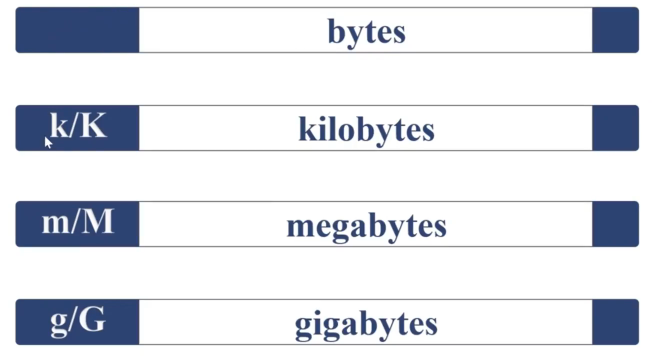
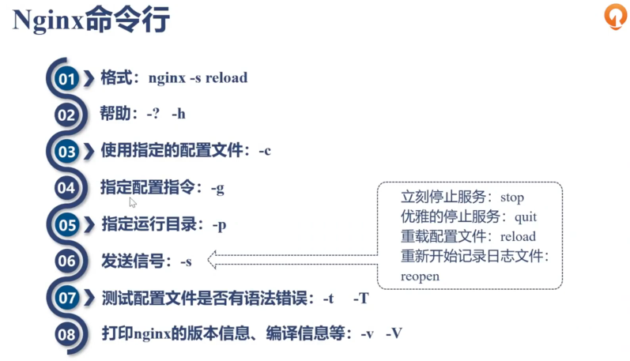
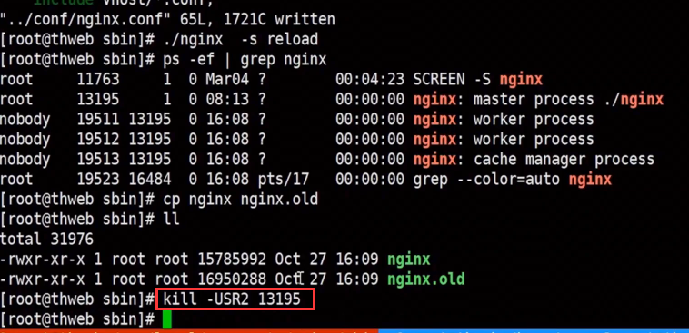
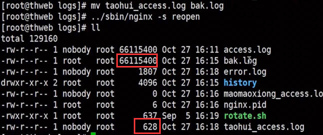

# nginx 配置
## 通用语法
### 时间单位

### 空间单位

### 配置语法概述

### 命令行

### 命令FAQ
#### 热部署命令
> 热部署会让老的继续完成正在处理的请求，新的请求全部发送到新的服务上，最后全部逐步替换

#### 日志切割
> 将老日志拷贝走，然后执行nginx -s repopen，就会自动产生新的日志文件，可以用定时任务进行自动化处理。

