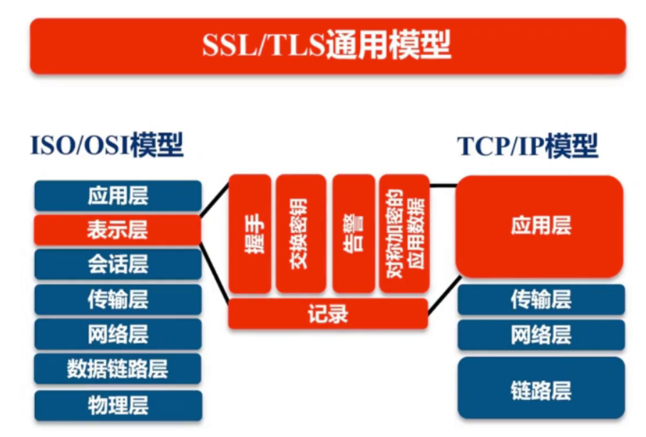
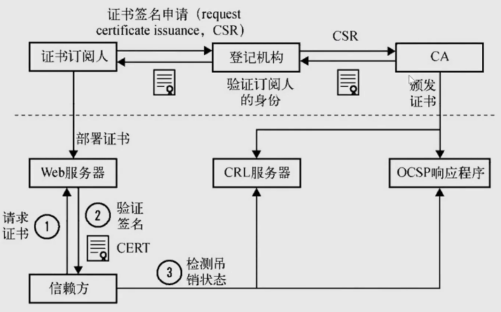
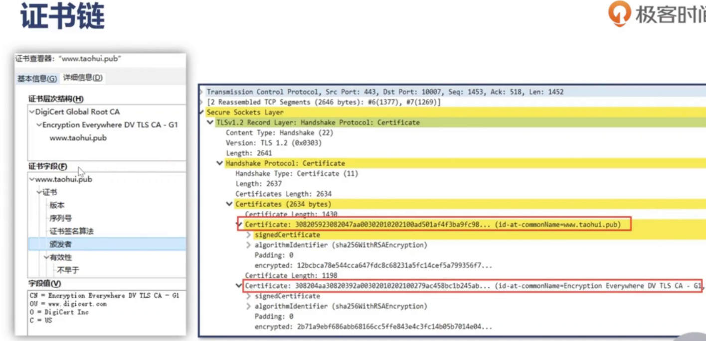

<!-- TOC -->

- [1. nginx 配置](#1-nginx-配置)
    - [1.1. 通用语法](#11-通用语法)
        - [1.1.1. 时间单位](#111-时间单位)
        - [1.1.2. 空间单位](#112-空间单位)
        - [1.1.3. 配置语法概述](#113-配置语法概述)
        - [1.1.4. 命令行](#114-命令行)
        - [1.1.5. 命令FAQ](#115-命令faq)
            - [1.1.5.1. 热部署命令](#1151-热部署命令)
            - [1.1.5.2. 日志切割](#1152-日志切割)
    - [1.2. 搭建一个静态页面服务器](#12-搭建一个静态页面服务器)
        - [1.2.1. 静态资源目录设置](#121-静态资源目录设置)
        - [1.2.2. 静态页面的压缩控制](#122-静态页面的压缩控制)
        - [1.2.3. 日志格式](#123-日志格式)
    - [1.3. 代理服务器配置](#13-代理服务器配置)
        - [1.3.1. 配置nginx的某个后端服务只能本机访问](#131-配置nginx的某个后端服务只能本机访问)
        - [1.3.2. 配置上游服务](#132-配置上游服务)
        - [1.3.3. 配置缓存](#133-配置缓存)
- [2. 日志处理](#2-日志处理)
    - [2.1. 使用goAccess对nginx的日志进行处理](#21-使用goaccess对nginx的日志进行处理)
        - [2.1.1. 安装goAccess](#211-安装goaccess)
        - [2.1.2. docker 镜像中安装](#212-docker-镜像中安装)
- [证书配置](#证书配置)
    - [TLS/SSL](#tlsssl)
    - [TLS安全密码套件格式解读](#tls安全密码套件格式解读)
    - [PKI公钥基础摄视](#pki公钥基础摄视)
        - [证书的类型](#证书的类型)
        - [证书链](#证书链)

<!-- /TOC -->

# 1. nginx 配置
## 1.1. 通用语法
### 1.1.1. 时间单位
| 表达式 |说明|
|:---|:---|
|ms|毫秒|
|d|天
|s|秒
|w|周
|m|分
|M|月，30天
|h|小时
|y|年，365天


### 1.1.2. 空间单位
|表达式|说明|
|:---|:---|
||字节（默认）
|k/K|千字节|
|m/M|兆字节|
|g/G|G字节|

### 1.1.3. 配置语法概述
+ 配置文件有指令和指令块组成
+ 每条指令以“;”结尾，指令与参数之间用空格分隔
+ 指令以“{}”大括号将多条指令组织在一起
+ include语句允许组合多个配置文件，以提高维护性
+ 使用“#”添加注释
+ 使用“$”使用变量
+ 部分指令支持正则表达式

### 1.1.4. 命令行


### 1.1.5. 命令FAQ
#### 1.1.5.1. 热部署命令
> 热部署会让老的继续完成正在处理的请求，新的请求全部发送到新的服务上，最后全部逐步替换


#### 1.1.5.2. 日志切割
> 将老日志拷贝走，然后执行nginx -s repopen，就会自动产生新的日志文件，可以用定时任务进行自动化处理。


## 1.2. 搭建一个静态页面服务器
### 1.2.1. 静态资源目录设置
> alias可以将url一一对应
```conf
...
location / {
    alias root_dir/; #根路径地址，相对于conf配置文件的位置
    autoindex on; #表示自动将静态资源以文件目录的方式共享出去
    set $limit_rate 1K; #表示，浏览器每秒钟发送的流量控制
    index index.html; # 指定首页页面
}
...
```

### 1.2.2. 静态页面的压缩控制
[官方文档参考](http://nginx.org/en/docs/http/ngx_http_gzip_module.html)
```conf
gzip            on; #表示开启gzip压缩
gzip_min_length 1000; # 小于这个大小的就不压缩
gzip_comp_level 1; # 压缩比例
gzip_types      text/plain application/xml text/css application/x-javascript text/javascript image/jpeg image/gif image/png application/json; # 压缩文件类型
```

### 1.2.3. 日志格式
> 可以使用变量
[官方文档参考](http://nginx.org/en/docs/http/ngx_http_log_module.html)
```conf
# 定义 
log_format compression '$remote_addr - $remote_user [$time_local] '
                       '"$request" $status $bytes_sent '
                       '"$http_referer" "$http_user_agent" "$gzip_ratio"';
                       
# 使用的时候
access_log /spool/logs/nginx-access.log compression buffer=32k;
```

## 1.3. 代理服务器配置
> [反向代理配置-参考](http://nginx.org/en/docs/http/ngx_http_proxy_module.html) 
### 1.3.1. 配置nginx的某个后端服务只能本机访问
```conf
server {
    listen 127.0.0.1:8080; #只需要将端口和IP地址进行绑定即可
}
```

### 1.3.2. 配置上游服务
> 配置多个服务器，可选择使用哪一个负载均衡算法
```conf
upstream some_name {
    server 127.0.0.1:8080; #还可配置多个
}

server {
    ...
    location / {
        proxy_set_header Host $host;#配置请求头
        ... ; #其他请求头配置
        proxy_pass http://some_name;

    }
}
```

### 1.3.3. 配置缓存
> nginx可以将上游服务的某些请求结果进行缓存，可以配置缓存的时间，提高访问速度

+ 首先配置缓存存放路径
>可以设置存放位置，混村时间大小等

```conf
...
http {
    ...
    proxy_cache_path /tmp/nginxcache levels=1:2 keys_zone=mycache:10m max_size=10g inactive=60m use_temp_path=off;
}
...
```
+ 在某个服务节点下使用
```conf
...
server {
    ...
    location / {
        ...
        proxy_cache mycache; #使用哪一个cache
        proxy_cache_key $host$uri$is_args$args;#配置key的生成规则
        proxy_cache valid 200 304 302 1d;#配置哪些结果缓存，以及缓存时间
    }
}
...
```

# 2. 日志处理
## 2.1. 使用goAccess对nginx的日志进行处理
### 2.1.1. 安装goAccess
[官方网站](https://goaccess.io)

+ 下载，编译和配置
```sh
wget https://tar.goaccess.io/goaccess-1.3.tar.gz
tar -xvfz goaccess-1.3.tar.gz
cd goaccess
autoreconf -fiv
./configure --enable-utf8 --enable-geoip=legacy
make
make install
```
+ ubuntu可以直接下载安装
```sh
apt-get install goaccess
```

### 2.1.2. docker 镜像中安装
+ 官网下载安装包
git clone https://github.com/allinurl/goaccess.git

+ 创建数据目录
mkdir -p /srv/goaccess

+ 创建配置文件
[配置文件链接](https://raw.githubusercontent.com/allinurl/goaccess/master/config/goaccess.conf)

+ 配置
```conf
log-format COMBINED  #内置格式
log-file /srv/logs/access.log #日志文件路径
output /srv/report/index.html #产生页面地址
real-time-html true # 是否实时监控
ws-url ws://example.com:8080 #配置websocket的监控地址
```
如果需要安全证书
```conf
ssl-cert /srv/data/domain.crt
ssl-key /srv/data/domain.key
ws-url wss://example.com:8080
```

# 证书配置
## TLS/SSL


在OSI模型种工作在表示层，是TCP/IP模型种工作在应用层，工作过程
TCP/IP握手，交换密钥，告警，加密的应用数据


## TLS安全密码套件格式解读


## PKI公钥基础摄视



证书订阅人向证书向登记机构申请证书签名，登记机构验证订阅人的身份后，委托CA机构办法证书，CA将证书返回给CSR，CSR再将密钥和公钥返回给订阅人，CA同时将注册人的
公私密钥发布到CRL和OCSR进行客户端的查询验证。证书订阅人将证书部署到自己的服务器上。浏览器下载公钥，并向CRL或者OCSP验证证书的有效性。从而完成证书的校验过程。

### 证书的类型
+ 域名验证 （domain validated , DV)
> 申请容易

+ 组织验证 （organization validated , OV）
+ 扩展验证（extended validation, EV）
> 浏览器有组织信息提示

### 证书链
> 浏览器会自动验证证书链，一般会以操作系统的根证书为基础，客户端只需要向浏览器发送两个证书，一个一级，一个二级



