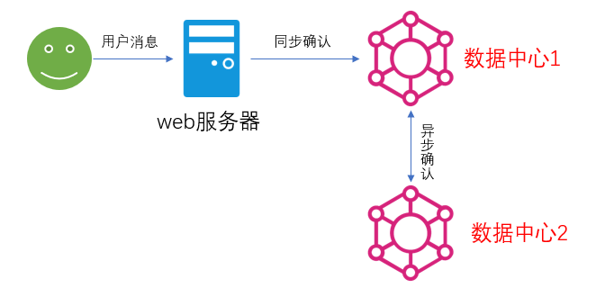

# 集群架构
## 主备模式


> 实现RabbitMQ的高可用集群，一般在并发和数据量不大的情况下，这种模型非常的好用且简单。主备模型也成为 **warren(兔子窝)** 模式。
```
1) 主节点提供读写，备用节点值负责高可用，数据备份的作用。
2) 故障切换
```

+ HaProxy的配置
```sh
listen rabbitmq_cluster
bind 0.0.0.0:5672
mode tcp 
balance roundrobin
server bhz76 192.168.11.76:5672 check inter 5000 rise 2 fall 2
server bhz77 192.168.11.77:5672 backup check inter 5000 rise 2 fall 2 #备用节点
```
集群配置 `inter` 指定每隔5秒对mq的集群做健康检查，如果 `2` 次正确，证明服务可用， `3` 失败证明服务不可用

## 远程模式
> 也称为 **双活** 模式，简称 **Shovel** 模式，所谓shovel就是我们可以把消息进行不同数据中心的复制工作，可以跨地域的让两个mq集群互联。



使用shovel插件后，此模型变为近端同步确认，远端异步确认的方式，大大提高用户消息的确认速度，并且还能保证可靠性。

内部原理：近端产生两个队列，一个正常的消费队列，一个备份队列。在远端的MQ节点，通过备份队列，拿到消息实现同步。

+ 使用方法
    - 启用插件
    ```
    rabbitmq-plugins enable amqp_client
    rabbitmq-plugins enable rabbitmq_shovel
    ```
    - 添加配置 rabbitmq.config
    
    
## 镜像模式
非常经典的集群模式，保证100%数据不丢失，在实际工作中也是用的最多的，别切实现集群非常的简单，一般互联网大厂都会构建这种镜像集群模式。

+ 镜像队列
> 目的是为了保证Rabiitmq数据的高可靠性解决方案，主要就是实现数据的同步，一般2-3个节点实现数据同步。


## 多活模式
也是实现异地数据复制的主流模式。需要依赖rabbitmq的 `federation` 插件，可以实现持续可靠的 AMQP 数据通信，多活模式在实际配置与应用非常简单。

多个数据中心数据的同步


+ federation 插件
它在非cluster上工作，直接在brokers之间传输消息的高性能插件。它可以在brokers之间，brokers与cluser之间传输消息。连接双方可以
使用不同的 users 和 vitrual hosts ，双方也可以使用不同版本的 Rabbit MQ，Federation使用AMQP协议进行通讯，可以接受不连续传输。

