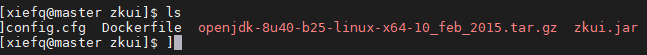

<!-- TOC -->

- [1. zookeeper搭建](#1-zookeeper搭建)
    - [1.1. 要点](#11-要点)
    - [1.2. 服务规划](#12-服务规划)
    - [1.3. 准备配置文件](#13-准备配置文件)
    - [1.4. 准备dockerfile](#14-准备dockerfile)
    - [1.5. 配置详解](#15-配置详解)
    - [1.6. 例子](#16-例子)
    - [1.7. 全部脚本文件](#17-全部脚本文件)
- [2. zkui](#2-zkui)
    - [2.1. 下载zkui镜像 （不可用）](#21-下载zkui镜像-不可用)
    - [2.2. 自己制作镜像-可用](#22-自己制作镜像-可用)

<!-- /TOC -->

# 1. zookeeper搭建
[参考官网](https://hub.docker.com/_/zookeeper)

## 1.1. 要点
+ 数据挂载目录 /data和/datalog
+ 配置文件挂载目录 /conf/zoo.cfg

## 1.2. 服务规划
|服务端口|名称|myid
|:--|:--|:--|
|2181|zoo1|1|
|2182|zoo2|2|
|2183|zoo3|3|

## 1.3. 准备配置文件
+ zoo1.cfg
```cfg
tickTime=2000
initLimit=10
syncLimit=5
dataDir=/data/1
clientPort=2181
server.1=0.0.0.0:2888:3888
server.2=zoo2:2888:3888
server.3=zoo3:2888:3888
```
+ zoo2.cfg
```cfg
tickTime=2000
initLimit=10
syncLimit=5
dataDir=/data/2
clientPort=2182
server.1=zoo1:2888:3888
server.2=0.0.0.0:2888:3888
server.3=zoo3:2888:3888
```
+ zoo3.cfg
```cfg
tickTime=2000
initLimit=10
syncLimit=5
dataDir=/data/3
clientPort=2183
server.1=zoo1:2888:3888
server.2=zoo2:2888:3888
server.3=0.0.0.0:2888:3888
```

## 1.4. 准备dockerfile
+ zoo1.df
```sh
FROM ubuntu:latest
ADD apache-zookeeper-3.5.5.tar.gz /
RUN tee /apache-zookeeper-3.5.5/conf/myid <<EOF
1
EOF
COPY zoo1.cfg /apache-zookeeper-3.5.5/conf/zoo.cfg
```

## 1.5. 配置详解
```text
tickTime： 基本事件单元，以毫秒为单位。这个时间是作为 Zookeeper 服务器之间或客户端与服务器之间维持心跳的时间间隔，也就是每隔 tickTime时间就会发送一个心跳。

dataDir：存储内存中数据库快照的位置，顾名思义就是 Zookeeper 保存数据的目录，默认情况下，Zookeeper将写数据的日志文件也保存在这个目录里。

clientPort： 这个端口就是客户端连接 Zookeeper 服务器的端口，Zookeeper会监听这个端口，接受客户端的访问请求。

initLimit： 这个配置项是用来配置 Zookeeper接受客户端初始化连接时最长能忍受多少个心跳时间间隔数，当已经超过 10 个心跳的时间（也就是 tickTime）长度后 Zookeeper 服务器还没有收到客户端的返回信息，那么表明这个客户端连接失败。总的时间长度就是10*2000=20 秒。

syncLimit： 这个配置项标识 Leader 与 Follower之间发送消息，请求和应答时间长度，最长不能超过多少个 tickTime 的时间长度，总的时间长度就是 5*2000=10 秒

server.A = B:C:D : A表示这个是第几号服务器, B 是这个服务器的 ip 地址；
C 表示的是这个服务器与集群中的 Leader 服务器交换信息的端口；
D 表示的是万一集群中的 Leader 服务器挂了，需要一个端口来重新进行选举，选出一个新的 Leader
```

## 1.6. 例子
+ 准备数据目录
```sh
sudo mkdir -p /data/zookeeper/1
sudo mkdir -p /data/zookeeper/2
sudo mkdir -p /data/zookeeper/3
sudo chmod -R 777 /data/zookeeper
```
+ 准备配置文件
```sh
for i in `seq 1 3`
do
tee zoo1.cfg << EOF
tickTime=2000
initLimit=10
syncLimit=5
dataDir=/data
clientPort=218${i}
server.1=master:2888:3888;2181
server.2=master:2888:3888;2182
server.3=master:2888:3888;2183
EOF
done
```

+ 准备dockerfile文件
```sh
for i in `seq 1 3`
do
sudo echo ${i} > /data/zookeeper/${i}/myid
sudo chmod 777 /data/zookeeper/${i}/myid
tee zoo${i}.df << EOF
    FROM ubuntu:latest
    ADD ./apache-zookeeper-3.5.5-bin.tar.gz /
    ADD ./openjdk-8u40-b25-linux-x64-10_feb_2015.tar.gz /
    ENV JAVA_HOME=/java-se-8u40-ri
    ENV PATH=${PATH}:${JAVA_HOME}/bin
    COPY ./zoo${i}.cfg /apache-zookeeper-3.5.5-bin/conf/zoo.cfg
    ENTRYPOINT ["/apache-zookeeper-3.5.5-bin/bin/zkServer.sh", "start-foreground"]
EOF
done
```

+ 编译
```sh
i=1
for f in `ls | grep df`
do
docker build -t zoo${i}:latest -f ${f} .
let i=i+1
done
```

+ 运行
```sh
for i in `seq 1 3`
do
docker run -d --name=zoo${i} --network=host --hostname=zoo${i} -v /data/zookeeper/${i}:/data zoo${i}:latest
done
```

+ 清除
```sh
docker stop zoo1 zoo2 zoo3
docker rm zoo1 zoo2 zoo3
docker rmi zoo1 zoo2 zoo3
```

## 1.7. 全部脚本文件
cluster.sh
```sh
workdir=`pwd`

echo "安装开始"
echo "清除环境"
docker stop zoo1 zoo2 zoo3
docker rm zoo1 zoo2 zoo3
docker rmi zoo1 zoo2 zoo3

echo "创建数据目录"
sudo mkdir -p /data/zookeeper/1
sudo mkdir -p /data/zookeeper/2
sudo mkdir -p /data/zookeeper/3
sudo chmod -R 777 /data/zookeeper

echo "写入配置文件"
for i in `seq 1 3`
do
tee zoo${i}.cfg << EOF
tickTime=2000
initLimit=10
syncLimit=5
dataDir=/data
clientPort=218${i}
server.1=master:2881:3881
server.2=master:2882:3882
server.3=master:2883:3883
EOF
done

echo "写入dockerfile文件"
for i in `seq 1 3`
do
sudo echo ${i} > /data/zookeeper/${i}/myid
sudo chmod 777 /data/zookeeper/${i}/myid
tee zoo${i}.df << EOF
FROM ubuntu:latest
ADD /apache-zookeeper-3.5.5-bin.tar.gz /
ADD openjdk-8u40-b25-linux-x64-10_feb_2015.tar.gz /
ENV JAVA_HOME=/java-se-8u40-ri
ENV PATH=${PATH}:${JAVA_HOME}/bin
COPY zoo${i}.cfg /apache-zookeeper-3.5.5-bin/conf/zoo.cfg
ENTRYPOINT ["/apache-zookeeper-3.5.5-bin/bin/zkServer.sh", "start-foreground"]
EOF
done

echo "编译镜像"
i=1
for f in `ls | grep df`
do
docker build -t zoo${i}:latest -f ${f} .
let i=i+1
done

sleep 5s

echo "启动容器"
for i in `seq 1 3`
do
docker run -d --name=zoo${i} --network=host --hostname=zoo${i} -v /data/zookeeper/${i}:/data -p 288${i}:2888 -p 388${i}:3888 zoo${i}:latest
done

echo "安装完成"
```

# 2. zkui
## 2.1. 下载zkui镜像 （不可用）
```sh
docker pull qnib/zkui
```
+ 运行
```sh
docker run -d --name=zkui --network=host -e ZKUI_ZK_SERVER=master:2181,master:2182,master:2183 qnib/zkui:latest
```
+ 配置和密码
```text
admin/admin 读写权限 可以通过指定 -e ZKUI_ADMIN_PW=pass来修改密码
user/user 只读权限 可以通过 -e ZKUI_USER_PW=pass 修改密码
端口是 9090
```
## 2.2. 自己制作镜像-可用
+ 下载源码
```
git clone https://github.com/DeemOpen/zkui.git
```
+ 编译
```
mvn clean package -Dmaven.test.skip=true
```
+ 修改配置文件config.cfg
> 注意端口，zookeeper以及管理员的密码配置
```cfg
#Server Port
serverPort=9090
#Comma seperated list of all the zookeeper servers
zkServer=master:2181,master:2182,master:2183
#Http path of the repository. Ignore if you dont intent to upload files from repository.
scmRepo=http://myserver.com/@rev1=
#Path appended to the repo url. Ignore if you dont intent to upload files from repository.
scmRepoPath=//appconfig.txt
#if set to true then userSet is used for authentication, else ldap authentication is used.
ldapAuth=false
ldapDomain=mycompany,mydomain
#ldap authentication url. Ignore if using file based authentication.
ldapUrl=ldap://<ldap_host>:<ldap_port>/dc=mycom,dc=com
#Specific roles for ldap authenticated users. Ignore if using file based authentication.
ldapRoleSet={"users": [{ "username":"domain\\user1" , "role": "ADMIN" }]}
userSet = {"users": [{ "username":"admin" , "password":"manager","role": "ADMIN" },{ "username":"appconfig" , "password":"appconfig","role": "USER" }]}
#Set to prod in production and dev in local. Setting to dev will clear history each time.
env=prod
jdbcClass=org.h2.Driver
jdbcUrl=jdbc:h2:zkui
jdbcUser=root
jdbcPwd=manager
#If you want to use mysql db to store history then comment the h2 db section.
#jdbcClass=com.mysql.jdbc.Driver
#jdbcUrl=jdbc:mysql://localhost:3306/zkui
#jdbcUser=root
#jdbcPwd=manager
loginMessage=Please login using admin/manager or appconfig/appconfig.
#session timeout 5 mins/300 secs.
sessionTimeout=300
#Default 5 seconds to keep short lived zk sessions. If you have large data then the read will take more than 30 seconds so increase this accordingly.
#A bigger zkSessionTimeout means the connection will be held longer and resource consumption will be high.
zkSessionTimeout=5
#Block PWD exposure over rest call.
blockPwdOverRest=false
#ignore rest of the props below if https=false.
https=false
keystoreFile=/home/user/keystore.jks
keystorePwd=password
keystoreManagerPwd=password
# The default ACL to use for all creation of nodes. If left blank, then all nodes will be universally accessible
# Permissions are based on single character flags: c (Create), r (read), w (write), d (delete), a (admin), * (all)
# For example defaultAcl={"acls": [{"scheme":"ip", "id":"192.168.1.192", "perms":"*"}, {"scheme":"ip", id":"192.168.1.0/24", "perms":"r"}]
defaultAcl=
# Set X-Forwarded-For to true if zkui is behind a proxy
X-Forwarded-For=false
```
+ 编写dockerfile
```
FROM ubuntu
COPY zkui.jar /zkui.jar
COPY config.cfg /config.cfg
ADD openjdk-8u40-b25-linux-x64-10_feb_2015.tar.gz /
ENV JAVA_HOME=/java-se-8u40-ri
ENV PATH=$JAVA_HOME/bin:$PATH
ENTRYPOINT ["java", "-jar", "/zkui.jar"]
```
+ 创建一个编译目录，将所需的文件拷贝


+ 编译
```sh
docker build -t zkui:latest .
```

+ 运行
```sh
docker run -d --name=zkui --network=host zkui:latest
```