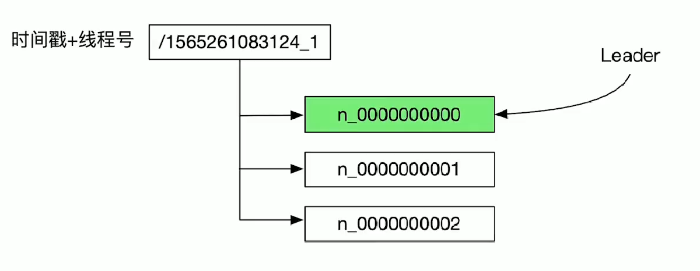

# zookeeper分布式锁
zookeeper有四种节点类型
+ PERSISTENT 可持久化的，即使是宕机重启也不会丢失znode
+ EPHEMERAL 节点是临时性的，节点宕机或者超时都会删除znode
+ 持久顺序的 znode的是持久的，序列号是递增的
+ 临时顺序的 znode的临时的，序列号是递增的

## 利用zkCli创建分布式锁
+ 客户端A执行 `create -e /lock` 表示枷锁成功
+ 客户端B执行 `create -e /lock` 会失败，表示获取锁失败
+ 客户端B执行 `stat -w /lock` 监控锁的状态
+ 客户端A执行 `quit` 释放锁
+ 客户端B收到响应，执行`create -e /lock`加锁成功

## 设计一个master-worker的成员管理系统
> 只能有一个master，master可实时获取系统中workder的情况

+ A `create -e /master "m1:2223"` 证明A成为了master
+ B `create -e /master "m1:2223"` 创建失败 然后监控 `stat -w /master` . B 收到A退出等信息后，再次 `create -e /master "m1:2223"`
+ master节点可以 `ls -w /workers ` workers节点表示存储workers的信息。`-w`选项表示要监听变化
+ worker1 `crate -e /workers/w1 "w1:2224"`创建成功表示，worker节点创建成功

# zookeeper架构
zookeeper集群有两种模式：standlone模式和quorum模式。

+ standlone
只有一个节点

+ quorum
> 多个节点. 一个leader节点，多个follower节点。leader可负责读写，follower负责读请求。follower收到写请求会转发给leader处理。


## session
客户端和集群的某一个节点创建一个session。客户端可以主动关闭session，也会在长久时间没收到客户端的消息的话也会关闭session。如果客户端发现连接到zookeeper有错，会主动切换其他的节点。

## 数据一致性
全局可线性的写入，先打到leader的写请求会被先处理。leader决定请求的处理顺序。保证客户端FIFO顺序，虾米发的请求先处理。

## quorum模式的配置
+ 注意dataDir和clientPort的配置  
+ server.1=127.0.0.1:3333:3334 3333用于quorum通信的端口，3334用于leader选举的端口。每个zookeeper节点创建myid文件，内容分别是1，2，3


## zkServer启动的额外参数
+ zkServer.sh start-foreground是前台运行

## 利用zkCli演示zk的leader选举过程
+ 创建3个节点quorum集群
+ zkCli.sh -server host1:port1,host2:port2,host3:port3
+ 可以从日志看，我们当前跟那个节点建立了链接
+ 退出一个节点，可以看到有监听事件产生，同时，自动切换到了另一个节点。

# zookeeper API 的使用
最重要的就是Zookeeper这个类
```java
Zookeeper(connectString, sessionTimeout, watcher)
```
## 主要方法
+ create
+ delete
+ exists
+ getData
+ setData
+ getChildren
+ sync 将连接节点和leader节点进行同步

> 所有读取数据的API都可以设置一个watch来监控znode的变化。更新有两种版本，一个无条件的version=-1, 有条件的，version>0,必须是znode的版本号相同的才进行获取，删除等操作。  
所有方法都有同步和异步两个版本

## 异常的处理
+ KeeperException表示服务端出错
    + ConnectionException 表示断开了连接。
+ InterruptedExetpiton表示方法被中断了

## watch机制
给客户端获取最新数据的机制，否则的话客户端要不断的沦陷

## zookeeper节点怎么存储数据
+ 本地存储架构
内存存放目录树，在磁盘上存放日志文件，zxid序列存储。日志关联快照文件
+ zxid的格式
+ zk重启就会生成一个快照文件
+ epoch文件，集群quorum的话才有

原理


## 条件更新
+ znode /c 实现一个counter,使用set命令自增1
+ A /c 更新到版本1 自增1
+ B /c 更新到版本2，自增2
+ A不知道B以及更新了，还去用版本1去自增，结果失败。如果是A使用无条件更新，则/C更新为2，没有自增

# zookeeper的应用

## 实现分布式队列
/queue节点下表示队列的元素，节点是按照顺序持久化znode。这些znode名字的后缀数字表示了对应队列元素在队列中的位置。后缀数字越小，对应元素在队列中的位置越靠前。


+ offer方法
在/queue下创建一个顺序znode,因为znode后缀数字是/queue下面现有znode最大后缀数字加1.所以该znode对应的队列元素处于队尾。

## 实现分布式锁
+ znode表示锁的请求，创建最小后缀数字的znode用户成功拿到锁。 
/lock
    x-72000xxx17-00001 //它成功拿到锁
    x-72000xxx18-00002
    x-72000xxx16-00003
+ 避免羊群效应 herd effect
把锁请求者按照后缀数字进行排队，后缀数字小的锁请求者先活得锁。如果所有的请求者都watch锁的持有者，当代表锁请求者的znode被删除后，所有的锁
请求者都会通知到，但是只有一个锁请求者能拿到锁。

为了避免羊群效应，每个锁请求者watch它前面的锁请求者。每次锁被释放，指挥有一个锁请求者会被通知。


## 分布式leader选举
+ 设计
使用临时顺序znode类型的节点来表示选举请求，创建最小后缀数字的znode的选举请求成功。在协同设计上和分布式锁一样的，不同之处在于具体实现。不同于分布式锁，选举的具体实现对选举的各个阶段做了监控。
 

发起选举请求 makeOffer()
```java
1 发布事件，表示我已经开始选举了
zookeeer.create(
    rootNodeName+"/"+"n_",
    hostnameBytes,
    zoodefs.Ids.OPEN_ACL_UNSAFE,
    CeateMode.EPHEMERAL_SEQUENTIAL
)
将所有的节点拉去回来，如果我们的排在第一位，表示选举leader成功
否则，我们就需要等待，如果前面的节点存在，我们就watch, 不存在就重试。
```

## 服务发现
curator-x-discovery 实现 ServiceProvider ServiceDiscovery, ServiceCache接口，ServiceInstance

 

## paxos协议
一致性算法，让分布式环境中各个agent达成一致

一个分布式环境由多个agent组成，agent之间通过传递消息进行通讯
+ agent以任意的速度运行，agent可能失败重启。但是agent不会出Byzantine fault
+ 消息可能丢失，但是不能被篡改。

### paxos算法的agent角色
+ client 请求paxos算法服务
+ proposer: 发送prepare请求和accept请求
+ acceptor: 处理prepare请求和accept请求
+ learner: 获取一个Paxos算法实例决定的结果