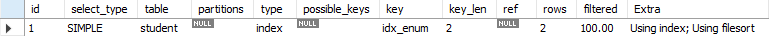

# centos7安装

参考地址 https://www.mysqltutorial.org/install-mysql-centos/

```sh
# 下载repository
rpm -Uvh https://repo.mysql.com/mysql80-community-release-el7-3.noarch.rpm
# disable all repositories in mysql repo file
sed -i 's/enabled=1/enabled=0/' /etc/yum.repos.d/mysql-community.repo
# install MySQL 8
yum --enablerepo=mysql80-community install mysql-community-server
# start mysql service
service mysqld start
# Show the default password for root user
grep "A temporary password" /var/log/mysqld.log
```

分析慢查询的工具

**pt-query-digest** - Analyze MySQL queries from logs, processlist, and tcpdump.

## 使用kubernets部署单节点

```yaml
apiVersion: apps/v1
kind: Deployment
metadata:
  name: mysql
  labels:
    app: mysql
spec:
  replicas: 1
  selector:
    matchLabels:
      app: mysql
  template:
    metadata:
      labels:
        app: mysql
    spec:
      containers:
      - name: mysql
        image: mysql:8.0.19
        imagePullPolicy: IfNotPresent
        env:
        - name: MYSQL_ROOT_PASSWORD
          value: pwd@123!
        volumeMounts:
        - name: mysql-data
          mountPath: /var/lib/mysql
        - name: mysql-conf
          mountPath: /etc/mysql/conf.d
      volumes:
      - name: mysql-data
        hostPath: 
          path: /data/mysql/data
          type: DirectoryOrCreate
      - name: mysql-conf
        hostPath:
          path: /data/mysql/conf
          type: DirectoryOrCreate
```

## 使用profile

首先得开启 `set profiling=1` 之后，所有的查询语句都会测量它的耗费时间。在语句执行期间剖析服务器的具体工作。比如：使用`show profile`查询得到的结果：


使用`show profiles`可以查看概览信息：


包括查询消耗的时间等。

我们可以具体查看某一个查询 比如 `show profile for query 2` 就可以得到第一张图的详细信息。

## 查询 `INFORMATION_SCHEMA`表查询耗时

```sql
select state, sum(duration) from information_schema.profiling where query_id=1 group by state
```

这个表的表结构为：

`show fields from information_schema.profiling;`

```bash
QUERY_ID	int	NO			
SEQ	int	NO			
STATE	varchar(30)	NO			
DURATION	decimal(905,0)	NO			
CPU_USER	decimal(905,0)	YES			
CPU_SYSTEM	decimal(905,0)	YES			
CONTEXT_VOLUNTARY	int	YES			
CONTEXT_INVOLUNTARY	int	YES			
BLOCK_OPS_IN	int	YES			
BLOCK_OPS_OUT	int	YES			
MESSAGES_SENT	int	YES			
MESSAGES_RECEIVED	int	YES			
PAGE_FAULTS_MAJOR	int	YES
PAGE_FAULTS_MINOR	int	YES			
SWAPS	int	YES			
SOURCE_FUNCTION	varchar(30)	YES			
SOURCE_FILE	varchar(20)	YES			
SOURCE_LINE	int	YES			
```

我们就可以进行排序，来分析究竟哪个过程慢。

## show status 计数统计

> 它返回一些计数器，有全局的`global` 也有会话级别的，它可以显示某些索引读取的频繁程度。

show status创建临时表，会导致统计结果的偏差。此命令可以查看实际的测量结果，比如，临时表使用的内存临时表还是磁盘临时表。

比如：`show status where Variable_name like 'Created%';`


我们可以看到，创建临时表的次数，创建磁盘临时表的次数。

## 使用慢日志


# 数据类型优化

## 数值类型

int, flot, double, decimal 这些都是数值类型。他们都有自己的内部长度定义，`int(20)` 这种定义方法并不会影响字段的存储类型，只是对某些console客户端给出列宽的建议。

mysql内部进行数值运算的时候（sum, avg, max）是转换为double进行的。如果需要高精度的计算，请将字段设置为decimal类型.

**优化技巧**

尽量使用整数来表示小数，比如对于财务数据精确到分，我们可以在元数据的基础上乘以100来存储，这样既不丢失精度，而且减少存储空间。

## 字符串类型

### char类型末尾空格被截断

首先我们定义schema


发现char类型被截断末尾空格，而varchar没有截取


**这是在mysql服务层处理的，跟存储引擎无关。**

## 建议和注意

* 每个字符串列可以定义自己的字符集和比较规则
* varchar可用于存储可变长字符串，`varchar(20)` 这种定义规定了最大的存储限制。它是需要多少就用多少存储空间，但是需要以为额外的字节表示字符串的长度。小于255，使用一个字节表示长度，大于255，使用2个字节表示长度。对于InnoDB 存储引擎，`varchar(1000)` 这种会自动的转换成blob类型。
* varchar由于是变长的，在进行数据更新的时候，可能会带来数据页存储不小，页分裂的问题。产生许多的碎片。
* char是存储固定长度的字符串，末尾空格会被截断。它在存储效率和比较上比varchar要好。对于经常变更的字段，char也比varchar好。因为char不易产生碎片。
* char(1)比varchar(1)更少一个字节（varchar需要一个字节表四字符串长度）

## BLOB和TEXT类型

都是为存储很大数据而设计的字符串数据类型，分别采用二进制和字符方式存储。

* TEXT家族 可有排序规则和字符集

  TINYTEXT, smalltext, text, mediumtext, longtext

* BLOB家族

  tinyblob, smallblob, blob, mediumblob, longblob

在存储的时候，行内使用1-4个字节存储一个指针，然后在外部一个单独的空间存储实际的值。

### 排序的处理

每个列的最前 max_sort_length，而不是整个字符串，或者使用`order by substring(column, length)`

### 磁盘临时表和文件排序

​        Memory引擎不支持Blob和Text类型，所以在对Blob和Text类型的表创建临时表的时候，不得不使用MyISAM临时磁盘表，这会导致严重的性能开销。一个技巧是在所有用到BLOB字段的地方，使用`substring(column, length)`将列值转换为字符串。但是要确保截取的字符串不要超过 `max_heap_table_size` 或 `tmp_table_size`的大小。

如果使用`explain` 检查执行计划时候 `extra` 列出现 `using temporary` 就需要注意了。

### 使用`enum`代替字符串

```sql
ALTER TABLE `test`.`student` 
ADD COLUMN `enum_type` ENUM('fish', 'dog') NULL AFTER `varchar_code`;
```

存储的时候


实际上存储的是数字，比如我们使用 `select enum_type + 0, enum_type from test.student` 结果如下

	

**问题**

* 使用枚举进行排序的时候，使用的是枚举代表的整数，而不是字符串值

* 可以使用`field(enum_column, 'fish', 'dog')`来解决排序的问题。但是这样用不到索引。

  ```sql
  explain select `enum_type` from student order by enum_type;
  ```

  

  ```sql
  explain select `enum_type` from student order by field(enum_type, 'dog', 'fish');
  ```

  

  解决这种问题的办法，就是在定义枚举的时候就按照我们想要的顺序先后定义