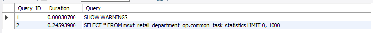
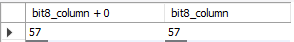

# centos7安装

参考地址 https://www.mysqltutorial.org/install-mysql-centos/

```sh
# 下载repository
rpm -Uvh https://repo.mysql.com/mysql80-community-release-el7-3.noarch.rpm
# disable all repositories in mysql repo file
sed -i 's/enabled=1/enabled=0/' /etc/yum.repos.d/mysql-community.repo
# install MySQL 8
yum --enablerepo=mysql80-community install mysql-community-server
# start mysql service
service mysqld start
# Show the default password for root user
grep "A temporary password" /var/log/mysqld.log
```

分析慢查询的工具

**pt-query-digest** - Analyze MySQL queries from logs, processlist, and tcpdump.

## 使用kubernets部署单节点

```yaml
apiVersion: apps/v1
kind: Deployment
metadata:
  name: mysql
  labels:
    app: mysql
spec:
  replicas: 1
  selector:
    matchLabels:
      app: mysql
  template:
    metadata:
      labels:
        app: mysql
    spec:
      containers:
      - name: mysql
        image: mysql:8.0.19
        imagePullPolicy: IfNotPresent
        env:
        - name: MYSQL_ROOT_PASSWORD
          value: pwd@123!
        volumeMounts:
        - name: mysql-data
          mountPath: /var/lib/mysql
        - name: mysql-conf
          mountPath: /etc/mysql/conf.d
      volumes:
      - name: mysql-data
        hostPath: 
          path: /data/mysql/data
          type: DirectoryOrCreate
      - name: mysql-conf
        hostPath:
          path: /data/mysql/conf
          type: DirectoryOrCreate
```

## 使用profile

首先得开启 `set profiling=1` 之后，所有的查询语句都会测量它的耗费时间。在语句执行期间剖析服务器的具体工作。比如：使用`show profile`查询得到的结果：


使用`show profiles`可以查看概览信息：



包括查询消耗的时间等。

我们可以具体查看某一个查询 比如 `show profile for query 2` 就可以得到第一张图的详细信息。

## 查询 `INFORMATION_SCHEMA`表查询耗时

```sql
select state, sum(duration) from information_schema.profiling where query_id=1 group by state
```

这个表的表结构为：

`show fields from information_schema.profiling;`

```bash
QUERY_ID	int	NO			
SEQ	int	NO			
STATE	varchar(30)	NO			
DURATION	decimal(905,0)	NO			
CPU_USER	decimal(905,0)	YES			
CPU_SYSTEM	decimal(905,0)	YES			
CONTEXT_VOLUNTARY	int	YES			
CONTEXT_INVOLUNTARY	int	YES			
BLOCK_OPS_IN	int	YES			
BLOCK_OPS_OUT	int	YES			
MESSAGES_SENT	int	YES			
MESSAGES_RECEIVED	int	YES			
PAGE_FAULTS_MAJOR	int	YES
PAGE_FAULTS_MINOR	int	YES			
SWAPS	int	YES			
SOURCE_FUNCTION	varchar(30)	YES			
SOURCE_FILE	varchar(20)	YES			
SOURCE_LINE	int	YES			
```

我们就可以进行排序，来分析究竟哪个过程慢。

## show status 计数统计

> 它返回一些计数器，有全局的`global` 也有会话级别的，它可以显示某些索引读取的频繁程度。

show status创建临时表，会导致统计结果的偏差。此命令可以查看实际的测量结果，比如，临时表使用的内存临时表还是磁盘临时表。

比如：`show status where Variable_name like 'Created%';`


我们可以看到，创建临时表的次数，创建磁盘临时表的次数。

## 使用慢日志


# 数据类型优化

## 数值类型

int, flot, double, decimal 这些都是数值类型。他们都有自己的内部长度定义，`int(20)` 这种定义方法并不会影响字段的存储类型，只是对某些console客户端给出列宽的建议。

mysql内部进行数值运算的时候（sum, avg, max）是转换为double进行的。如果需要高精度的计算，请将字段设置为decimal类型.

**优化技巧**

尽量使用整数来表示小数，比如对于财务数据精确到分，我们可以在元数据的基础上乘以100来存储，这样既不丢失精度，而且减少存储空间。

## 字符串类型

### char类型末尾空格被截断

首先我们定义schema


发现char类型被截断末尾空格，而varchar没有截取


**这是在mysql服务层处理的，跟存储引擎无关。**

## 建议和注意

* 每个字符串列可以定义自己的字符集和比较规则
* varchar可用于存储可变长字符串，`varchar(20)` 这种定义规定了最大的存储限制。它是需要多少就用多少存储空间，但是需要以为额外的字节表示字符串的长度。小于255，使用一个字节表示长度，大于255，使用2个字节表示长度。对于InnoDB 存储引擎，`varchar(1000)` 这种会自动的转换成blob类型。
* varchar由于是变长的，在进行数据更新的时候，可能会带来数据页存储不小，页分裂的问题。产生许多的碎片。
* char是存储固定长度的字符串，末尾空格会被截断。它在存储效率和比较上比varchar要好。对于经常变更的字段，char也比varchar好。因为char不易产生碎片。
* char(1)比varchar(1)更少一个字节（varchar需要一个字节表四字符串长度）

## BLOB和TEXT类型

都是为存储很大数据而设计的字符串数据类型，分别采用二进制和字符方式存储。

* TEXT家族 可有排序规则和字符集

  TINYTEXT, smalltext, text, mediumtext, longtext

* BLOB家族

  tinyblob, smallblob, blob, mediumblob, longblob

在存储的时候，行内使用1-4个字节存储一个指针，然后在外部一个单独的空间存储实际的值。

### 排序的处理

每个列的最前 max_sort_length，而不是整个字符串，或者使用`order by substring(column, length)`

### 磁盘临时表和文件排序

​        Memory引擎不支持Blob和Text类型，所以在对Blob和Text类型的表创建临时表的时候，不得不使用MyISAM临时磁盘表，这会导致严重的性能开销。一个技巧是在所有用到BLOB字段的地方，使用`substring(column, length)`将列值转换为字符串。但是要确保截取的字符串不要超过 `max_heap_table_size` 或 `tmp_table_size`的大小。

如果使用`explain` 检查执行计划时候 `extra` 列出现 `using temporary` 就需要注意了。

### 使用`enum`代替字符串

```sql
ALTER TABLE `test`.`student` 
ADD COLUMN `enum_type` ENUM('fish', 'dog') NULL AFTER `varchar_code`;
```

存储的时候


实际上存储的是数字，比如我们使用 `select enum_type + 0, enum_type from test.student` 结果如下

	

**问题**

* 使用枚举进行排序的时候，使用的是枚举代表的整数，而不是字符串值

* 可以使用`field(enum_column, 'fish', 'dog')`来解决排序的问题。但是这样用不到索引。

  ```sql
  explain select `enum_type` from student order by enum_type;
  ```

  

  ```sql
  explain select `enum_type` from student order by field(enum_type, 'dog', 'fish');
  ```

  

  解决这种问题的办法，就是在定义枚举的时候就按照我们想要的顺序先后定义

* 添加字符串最好在末尾添加，如果插入方式添加，mysql会重构整个表。因为是用`alter`的方式修改表结构。

* mysql保存的是整数，所以在进行关联查询的时候特别是` varchar/char`与`枚举`进行关联，要进行转化，浪费性能。还没有直接`varchar/char`与`varchar/char`关联性能高。

## 日期和时间类型

> mysql还不支持微秒级别的粒度，maridb支持。两种格式都只支持秒级别的粒度。

* datetime

  能保存较大范围的时间，从`1001年到9999年`，精度为秒。内部存储为`YYYYMMDDHHMMSS` 格式的整数。与时区无关，使用 8 个字节存储。

* timestamp

  时间范围是 `1970-01-01 00:00:00 ~ 2038`年之间的范围。使用4个字节存储，有时区，默认行为是：如果插入时没有指定第一个timestamp列的值，mysql则设置这个列的值为当前时间。timestamp默认不能为空。

mysql提供了 `from_unixtime`将timestamp转换为日期类型，`unix_timestamp`将日期转换为timestamp

**技巧**

如果mysql提供的时间粒度不够，比如我们想要使用微秒级别的数据，可以存储为bigint。或者使用mariadb

## 位数据类型

mysql都当字符串来处理

* bit

  最多bit(64)，它的实际存储因存储引擎而异，MyISAM会打包存储，而Memory和InnoDB为每个bit位使用一个足够小的整数来存放。

  mysql在检索bit数据类型是有些歧义。当参与数值运算的时候，它将位转换为数字所以建议不要使用这种数据类型。

  比如：

  ```sql
  UPDATE `test`.`student` SET `bit1_column` = b'1', `bit8_column` = b'00111001' WHERE (`id` = '1');
  ```

  

* set

  需要保存很多true/false的时候。它使用有点像枚举，需要定义每个位代表的含义。典型的用法是保存ACL。

  ```sql
  ALTER TABLE `test`.`student` 
  ADD COLUMN `set_column` SET('w', 'r', 'wr', 'd') NULL AFTER `bit8_column`;
  ```

  ```sql
  UPDATE `test`.`student` SET `set_column` = 'w' WHERE (`id` = '1');
  UPDATE `test`.`student` SET `set_column` = 'wr' WHERE (`id` = '2');
  ```

  

  也会有枚举一样的更新问题。

## 选择标识列-主键

  不同类型的列在做比较的时候可能带来隐式转换，导致性能问题。所以在关联表中要使用同样的类型。

  **技巧**

  * 尽量使用整数类型作为主键，避免使用字符串和枚举类型。

    **为什么不能使用字符串作为主键？**
    
    * 存储空间大，会使得主键索引和普通索引变大
    * 某些存储引擎对字符串进行压缩处理，导致性能下降
    * 一些随机性很强的比如散列值(md5, sha1, uuid)，会导致分布空间跨度大，磁盘不能顺序读写。碎片多。也让缓存的局部性原理失效，缓存命中率低。
    * uuid不同于哪些散列函数，uuid还是具有一定的顺序可以使用`unhex`函数将uuid转换位16字节的数字，这样作为主键标识列要好一点，但是还是没有整数好。

## 特殊数据类型

对于IPV4这种数据实际上是整数，mysql内部提供`INET_ATON()`和`INET_NTPA`转换两种格式，比如。

```sql
select inet_aton('192.168.211.130'), inet_ntoa('3232289666')
```


# schema设计陷阱

* mysql在服务器层将存储引擎的行缓存进行解码转换，转换成列。这个代价非常的高，MyISAM的定长表结构和mysql服务器层的行结构正好匹配不需要转换，但是边长表结构是需要转换的。转换的代价同比列的数量。所以要避免表**太多的列**。
* mysql限制了关联操作最多61个表，建议单次查询的关联次数12个以内。
* 避免晦涩的枚举设计。
* 用特殊值替代NULL值有时候也不见得是一个好的设计。mysql会索引null值，oracle不会。

# 范式和反范式

* 范式的有点和缺点

  **优点**

  * 更新操作比反范式快，因为数据冗余少，需要更新的数据少。
  * 表更小，可以放在内存里。
  * 因为冗余少，不需要做distinct等去重操作。

  **缺点**

  * 需要关联表，性能耗损大
  * 不好使用索引，不好优化，还有可能让已有的索引无效。

* 反范式的优点和缺点

  **优点**

  * 不需要关联表，好设计索引

```
全表扫描是顺序IO
```

**技巧**

混用范式和反范式，比如处于排序的需要，缓存衍生值等

# 缓存表和汇总表

保存衍生数据或者汇集几张表的数据到另外一张表有时候会对性能有很大的提高，并且可以减少对原始表的锁占用，提高索引利用率。

**`缓存表`** 可以比较简单，代价很小的从其他表获取数据的表

**`汇总表`** 使用 `groupby` , `sum`, `max` 等聚合数据的表

TIPS

> 可以使用 left(now(), 14) 来获取当前时间最近的小时

* 获取当前时间前10个小时 `concat(left(now(), 14), "00:00") - interval 10 hour`

  

要创建主表中部分列的缓存表，我们可以使用如下技巧：

* 可以使用不同的存储引擎，充分利用各个存储引擎的优点

  比如：主表使用innodb，缓存表使用myisam(更小的索引占用空间，并且可以做全文索引)

* 可以使用不同的数据库

  比如：主表mysql， 缓存表 elasticsearch

> 使用缓存表时可以选择是**定期重建**还是**实时维护**， 定期重建可以保持数据的有序性，减少数据的碎片。可以使用下面的方法进行定期重建表。

* 先创建一个新表 `create table my_table_new like my_table`
* 重命名 `rename table my_table to my_table_old, my_table_new to my_table`进行新旧表切换

## 物化视图

物化视图实际上是预先计算并且存储在磁盘上的表，可以通过各种策略刷新和更新维护视图表。mysql可以通过flexview工具来支持，它可以抓取binlog的变更数据，效率很高。

flexview可以将sql转换成自己的API调用，监控数据的变更，并且物化更新视图的表。应用只需要查询物化视图表就可减少对原表的计算。

## 计数器表

应用中有统计计数的地方，最好单独创建一张表，同时为了提高读写性能（因为，大量的并发更新，因为锁的存在，会串行执行）。可以将同一个计数器分成多行，每次随机更新一行，需要统计结果的时候，进行求和。

```sql
create table number_count (
	slot tinyint unsigned not null primary key,
    cnt int unsigned not null default 0
) engine=InnoDB;

insert into number_count(slot, cnt) values (
	rand() * 100, 1
) on duplicate key update cnt = cnt+1;

# 统计的时候
select sum(cnt) from number_count
```

* 缺点 开发难度

# 加快Alter表的速度

大部分`modify column`的操作会用新的表结构创建以个空表，然后从旧表复制数据到新表，然后删除旧表，这对大表操作来说是个问题。Alter table会导致Mysql服务中断。怎样保证减少服务中断影响。技巧如下：

1. 先在一台不提供服务的机器上执行alter table操作，然后主备互换。
2. `影子拷贝`用新结构创建一个新表，然后通过重命名和删除来交换两张表

不是所有的修改表结构都需要重建，使用alter column而不是modify column操作可以对哪些修改默认值的操作只修改.frm文件，而加快表的修改。

只需要通过修改frm文件就可以达到更新的目的的修改操作有：

* 移除（不是增加）一个列的auto_increment属性
* 增加，移除，添加（末尾）set或者enum厂里。

执行步骤如下：

1. 创建一个相同的表结构，然后修改需要的列
2. 执行flush table with read lock，关闭所有正在使用的表。
3. 交换.frm文件 `frm文件在 /var/mysql/schema里`
4. unlock tables

必要的时候需要 repair以下表 `repair table`

## 怎么快速重建MyISAM表

将重建索引的操作放到表数据加载之后，这样可以通过排序结构创建索引，让索引更加紧凑。碎片更少。但是这种方法只对**非唯一性索引**有效。

步骤：

1. 新结构创建新表，不包括索引

   ```sql
   alter table xxx disable keys
   ```

2. 载入数据

3. 启用索引

   ```sql
   alter table xxx enable keys
   ```

# 索引优化

索引是在存储引擎层实现的，跟引擎相关。

## 索引的类型

### B-Tree索引

**知识点散列**

* NDB集群存储引擎使用的T-Tree这种数据结果，而InnoDB使用的是B+Tree
* MyISAM使用前缀压缩技术使索引很小，InnoDB原格式存储。MyISAM通过数据的物理位置引用索引的行，而InnoDB使用主键引用索引的行。
* B-Tree是一种顺序存储结构，每个叶子节点到根的距离相同。子节点决定每次向下搜索的范围，叶子节点指针指向被索引的数据。
* 树的深度跟表的大小直接相关
* b-tree索引适合 全键值，键前缀，键值范围查找
  * 全值匹配
  * 匹配最左前缀
  * 匹配列前缀（某一列的开头部分）
  * 范围（索引的第一列）
  * 精确匹配某一列和范围匹配另一列
  * 只访问索引的数据 **覆盖索引**

* b-tree支持排序

**B-tree的限制**

* 不能跳过索引中的列
* 如果查询中有个列是范围查询，后边的列都无法使用索引

### Hash索引

* 精确匹配所有列查询才有效

* 选择合适的hash函数
* Memory支持非唯一性hash索引，也支持b-tree索引

**hash索引的限制**

* 索引存储的是hash值，所以它不能避免读取行
* 不是按照索引值排序，所以不支持排序
* 不支持范围查找
* 不支持部分查找
* hash冲突过大的话，维护索引代价比较高

> innodb支持 **自适应性hash索引**。
>
> --- 当innodb发现某些索引值被使用的非常的频繁，它会在内存中基于b-tree之上再创建一个hash索引，用以加快查找速度。可以自己关闭这个功能，运行期间对用户来说是完全透明的。

**hash函数**

* md5() sha1()这些是强加密函数，防止多的hash冲突，但是计算量大
* crc32 计算快，但是hash冲突严重，特别是数据量大的时候

> hash查找的时候注意要把具体的值也要带上，避免hash冲突发生.要这么来查找数据
>
> `select url from table where crccode=crc32('http://wwwbaidu.com') and url='http://www.baidu.com'`

### 空间数据索引（R-tree）

mysql的MyISAM引擎支持空间索引，mbrcontains()函数维护，但是对gis的支持不完整，建议使用es，postgis

### 全文索引

停用词，词干，复数，分词，bool搜索

## 索引的优点

* 减少服务器需要扫描的数据量
* 帮助服务器避免排序和临时表
* 将随机IO变成顺序IO

**三星系统**

1. 将相关的记录放到一起获得一星
2. 索引中的数据顺序和查找中排列顺序一致则获得二星
3. 索引的列包含了查询需要的全部列则活得三星

**使用索引的建议**

1. 小表全表扫描比索引更有效
2. 中表和大表需要建立适当的索引，并且要仔细推敲。
3. 特大型表通过建立数据分区，使用 **`元数据`** 表来记录数据的块，避免一行一行的去匹配。

## 高性能索引策略

* 独立的列

  > 索引列不能是表达式的一部分，也不能是函数的参数

* 前缀索引和索引的选择性

  索引开始部分字符，但是要注意保持索引的**选择性** 不重复的索引值和数据表的记录总数的比值越高选择性越好。对于blob, text或者很长的varchar类型，必须使用前缀索引，mysql不允许索引这些列的完整长度。

  如何决定索引的前缀长度？

  1) 先计算整体字段的选择性

  ```sql
  select count(distinct column)/count(*) from table_name
  ```

  2) 尝试各个前缀长度，直到这个值跟第一步非常接近

  ```sql
  select 
  	count(distinct left(column, 4))/count(*) as sel4,
  	count(distinct left(column, 6))/count(*) as sel6,
  	count(distinct left(column, 5))/count(*) as sel5,
  	...
  from table_name
  ```

  但是这样计算的平均选择性不一定代表实际场景

  5）创建前缀索引

  ```sql
  alter table table_name add key idx_name (column(7))
  ```

  **记住**：mysql无法使用前缀索引做 `order by` 和 `group by`, 也无法做覆盖索引

  **技巧**：有时候正序的前缀索引没有很好的选择性，可以试试逆序，比如身份号码或者手机号码

* 多列索引

  把所有的where字段都建立索引是一种很糟糕的设计，可能造成索引合并，或者使用不上索引。

  比如：student表的 code1和code2都建立了索引，但是下面的查询索引就失效

  ```sql
  explain select code1, code2 from student where code1='c1' or code2='c2'
  ```

  

  当出现这种情况时：

  1）意味着需要一个全覆盖索引

  ```sql
  alter table student add key idx_code12 (code1, code2);
  explain select code1, code2 from student where code1='c1' or code2='c2' ;
  ```

  

  2）需要耗费资源在排序和合并上

  如果出现了走索引还不如全表扫描时候，或者某个索引很低效时候，就可以诱导执行计划优化器不要走某些特定的索引。ignore index

* 选择合适的索引顺序

  将选择性高的索引列放到最前面

  怎么计算某些特定的值的选择性的简便sql写法 `select sum(score>0) from student;`统计出哪些score大于0的记录有多少条。

  ## 聚簇索引

聚簇索引不是一种新索引，而是一种存储方式，它的叶子节点保存了索引和数据行。因为无法将数据行放到两个地方，所以一个表只能有一个聚簇索引。其他的索引需要保存它索引列本身外还要保存主键。因为需要到主键索引才能找到数据。这个也叫回表操作。

**优点**：

* 把相关数据保存在一起，提高磁盘IO效率。不需要逐条再去查找数据行。
* 数据访问快。索引和数据保存在同一个btree中
* 使用覆盖索引扫描的查询可以直接使用叶节点的主键值。

**缺点**:

* 最大限度提高了IO密集型应用的性能
* 插入速度依赖插入顺序。按主键顺序插入加载数据到innodb是最快的方式。否则的话，加载完后需要用optimize table
* 更新代价高。因为需要移动行到新的位置
* 插入和修改数据容易页分裂，占用更多的磁盘空间。
* 全表扫描可能速度变慢（尤其是行比较稀疏的时候）
* 二级索引需要回表，而且需要存储主键，所以占用磁盘空间更大。

聚簇索引的叶子节点保存了主键值，事物ID，用以事务和MVCC的回滚指针，和剩余的所有列。但是，聚簇索引的行更新，不需要对二级索引进行维护。innodb叶子节点的

最佳实践：

> 主键要求最好是顺序单调递增的，避免uuid那种很随机的分布。随机分布的主键会让索引的插入完全随机。

### 顺序主键性能问题情况

高并发的工作负载顺序插入会造成明显争用， auto_increment锁机制也会引发并发性能。可以更改innodb_autoincr_lock_mode的配置。

# MySQL高级特性

## 分区表

分区表是一个独立的逻辑表，但是底层由许多物理表组成。它的实现代码实际上是对底层表的句柄对象的一层封装。它对应用是完全透明的。

* 索引按照分区子表的定义，没有全局索引。
* `partition by` 子句定义分区，查询的时候，优化器会根据这个定义过滤掉哪些数据不存在的分区。
* 分区的作用
  * 表非常大，表由明显的热点数据。
  * 数据更容易维护，可以对独立的区域进行优化，检查，和修复。
  * 分布在不同的物理机器上，高效利用物理资源。
  * 避免某些特殊的系统竞争。比如ext3文件系统的`inode`锁竞争。
* 降低单表互斥锁的竞争
  
* 分区表的限制
  * 最多建立`1024`个分区
  * 分区表达式 `partition by`后面的子句，必须返回整数
  * 分区字段必须包含在主键列里。
  * 无法使用外键约束

### 分区表原理

存储引擎管理各个分区表跟普通表没什么差别。对于 s`elect， insert,  delete,  update` 操作，都是先要锁住所有的分区表，然后由MySQL判断在那个分区，最后对底层表进行相应的操作。

> 如果where条件恰好和分区表达式匹配，就可以将所有不包含这条记录的分区过滤掉。但是如果存储引擎有自己的锁实现，比如innodb有自己的行锁，则会在分区层释放对应的表锁。

### 分区表的类型

#### 范围分区

```sql
create table sales (
	`id` bigint not null auto_increment,
	`year` int not null default 0,
    `sales_amount` double not null default 0,
    primary key (id, `year`)
) engine=InnoDB auto_increment=1 partition by range(`year`) (
	partition p_0 values less than (2000),
    partition p_1 values less than (2019),
    partition p_2 values less than (2020),
    partition p_3 values less than (2050)
);
```

* 注意`year`字段为分区字段，它包含在主键列里。
* 范围分区必须定义每一个分区

然后我们插入数据

```sql
insert into sales (`year`, `sales_amount`) values (1999, 1000);
insert into sales (`year`, `sales_amount`) values (2000, 2000);
insert into sales (`year`, `sales_amount`) values (2019, 2000);
insert into sales (`year`, `sales_amount`) values (2020,3000);
insert into sales (`year`, `sales_amount`) values (2022, 0);
```

查看执行计划 `explain select * from sales;`


再查看执行计划 `explain select * from sales where year=2020;`


范围分区，我们可以使用的函数有 `year()`获取时间字段的年 `to_days()` 转换为天数。

#### hash分区

`hash(column div 10000)`

#### 键值分区

#### 列表分区

### 如何使用分区表

分区的表，肯定数据量巨大，不能每次使用都全表扫描，索引空间浪费也不建议使用索引，而且会有大量的碎片产生。导致大量的随机IO。而且多数情况下，索引是不会有任何作用。

> 最佳实践：让所有的查询都只是数据表上做顺序扫描，或者将数据表和索引全部放到内存里。全量扫描，不要任何索引，索引数据，分离热点数据。

使用分区常会出现的问题

* **NULL值使分区过滤无效**。分区表达式的值可以是null值或者非法值，这些数据就会被默认存放到第一个分区里。这可能会使第一个分区特别的大，而且分区过滤每次都要扫第一个分区，解决办法就是创建一个特殊的0分区，里边不存放有意义的数据。在新版本里，可以使用列直接分区 `partition by range columns(xxx)`.
* **分区列和索引列不匹配**。导致查询无法进行分区过滤。而且关联查询的时候特别注意。关联的列最好是分区的列，并且建立了索引。不然会扫描分区表的所有子表。
* **选择分区的成本很高**。分区表达式很复杂，每次插入一行都会进行大量的运算，当写入大量数据的时候，非常影响性能。解决办法就是限制分区的数量和表达式的复杂度。
* **锁住所有底层表的成本很高**。这一点对本身操作很快的比如主键查找会带来性能开销。
* **维护分区表成本很高**。 重组分区，需要一个子表一个子表的去重组。
* 超过文件描述符限制，所有表都必须使用相同的存储引擎。

### 查询优化

要做`where`条件上带入分区列。使用分区函数的列本身进行比较的时候才能过滤分区，而不能根据表达式的值去过滤。所以即便在创建分区时可以使用表达式，但在查询时却只能根据列来过滤分区。

### 合并表

合并表相当于一个容器放了多个真实的表，用户不透明，用户可以单独的操作这些表。是一种被淘汰了的技术。

合并表的限制：它里边的每一个子表行为和表的定义都是相同，但是合并表在全局上并不受这些条件限制。

## 视图

视图和表是在同一个命名空间，mysql中大多数都同等对待。视图有两种实现算法，合并算法和临时表算法。

**合并算法**：就是将视图定义和查询语句进行合并，查询的时候还是去原始表查询。`select_type为merge`.

**临时表算法**：就是将视图定义生成一个临时表，下次查询从临时表查询。`select_type为 derived`.


如果视图包含group by , distinct, 任何聚合函数，union，子查询等在原始表无法一一映射的场景，都将使用临时算法来实现视图。

可以在创建视图的时候指定使用算法 `create algorithm=temptable view v1 as xxxx`

### 可更新视图

可以通过更新这个视图来更新视图涉及的表。但是视图定义中包含了group by , distinct, 任何聚合函数，union，子查询就不能被更新了。

mysql不支持在视图上创建触发器。

### 视图的用途

* 不改变原表权限的情况下，创建一个视图指定所需要的权限。

  ```sql
  create view public.my_view as
      select first_name, last_name from user where type='public'
  grant select on public.* on public_user
  ```

### 视图的限制

* 临时表算法实现的算法，性能有时候很糟糕
* 导致应用开发者不理解视图的底层定义的复杂读，错误的使用视图。比如循环中调用一个比较耗时的简单视图。
* mysql不保存视图的定义。`show create table_name` 是一堆显示很糟糕的代码。

## 外键约束

mysql目前只有innodb支持外键约束

优点：

* 使用外键检查约束性比应用程序要高效
* 删除相关的数据更高效

缺点：

* 修改数据需要在另一张表中执行一次查询
* 修改子表数据会同时锁住父表和子表
* 强制外键建立索引，会让一些选择性低的字段创建大量的低效的索引。
* 批量删除，更新性能很低

用触发器代替外键，或者在应用程序中检查约束。

## 存储代码

存储过程，存储函数，事件（定时任务），触发器。都称为存储代码，他们的不同在于执行上下文。存储过程和函数可以传递参数，其他不行。

优点：

* 离数据近，节省网络延迟和带宽
* 可重用代码，并且业务规则的安全性，不用暴露在应用程序中。
* 更细粒度的权限控制。
* 缓存执行计划，反复调用可提高性能
* 数据库开发人员和应用程序开发人员更好分工

缺点：

* 没开发，调试工具，调试困难
* 编写效率低，功能实现简单，没有复杂的库函数使用，以及高级的语法。
* 给应用程序部署带来负担，不仅要部署应用程序，还需要部署存储代码。
* 安全泄露风险，如果将密码算法放在存储代码中，就相当于将鸡蛋放在一个篮子里。
* 扩展性差。
* 每个连接都会缓存存储过程的执行计划，导致缓存太多的相同计划。
* 优化器无法评估存储过程的执行成本
* 很多....

什么时候用？

> 当一个存储过程调用可以代替很多小查询的时候

### 触发器

* 基于行触发，而不是整个SQL语句。指定是在sql语句之前还是之后，触发器不返回数据，但是可以修改sql语句影响的数据。
* 可以用于更新汇总表
* 每一个表，每一个事件（after insert, before insert ...)只能定义一个触发器。
* 可能带来死锁，而且触发器执行失败或者异常，不会回滚原来的SQL语句，但是ｓｑｌ语句的整个执行会失败.

可以利用 `row_count的函数,在处理非第一条记录的时候,总是返回1`的特性,模拟sql语句只触发一次.比如下面代码.

```sql
create trigger trigger_name
before insert on sometable
for each row
begin
  declare v_rouw_count int default row_count();
  if v_row_cont <> 1 then
    //some code
  end if;
end;
```

### 事件

类似于linux的定时任务,事件在独立的事件调度线程中初始化,这个线程和处理连接 的线程没有任何关系.他没有返回值,也不接受任何参数.可以通过日志查看执行日志,或者查看`information_schema.events`中查看事件的各种状态.

典型应用: 定期维护任务, 重建缓存, 构建汇总表模拟物化视图. 

```sql
create event evt_name on schedule every 1 week
do 
  --- some code
```

`set global event_schedule:=1`设置好后,  该线程就会执行计划. 事件的线程在执行完毕后就会被销毁, 所以状态值`Threads_created`不会增加.