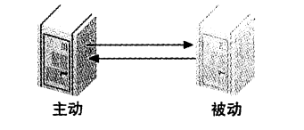
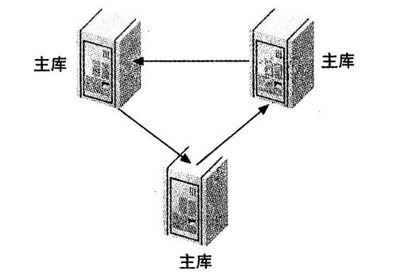

# centos7安装

参考地址 https://www.mysqltutorial.org/install-mysql-centos/

```sh
# 下载repository
rpm -Uvh https://repo.mysql.com/mysql80-community-release-el7-3.noarch.rpm
# disable all repositories in mysql repo file
sed -i 's/enabled=1/enabled=0/' /etc/yum.repos.d/mysql-community.repo
# install MySQL 8
yum --enablerepo=mysql80-community install mysql-community-server
# start mysql service
service mysqld start
# Show the default password for root user
grep "A temporary password" /var/log/mysqld.log
```

分析慢查询的工具

**pt-query-digest** - Analyze MySQL queries from logs, processlist, and tcpdump.

## 使用kubernets部署单节点

```yaml
apiVersion: apps/v1
kind: Deployment
metadata:
  name: mysql
  labels:
    app: mysql
spec:
  replicas: 1
  selector:
    matchLabels:
      app: mysql
  template:
    metadata:
      labels:
        app: mysql
    spec:
      containers:
      - name: mysql
        image: mysql:8.0.19
        imagePullPolicy: IfNotPresent
        env:
        - name: MYSQL_ROOT_PASSWORD
          value: pwd@123!
        volumeMounts:
        - name: mysql-data
          mountPath: /var/lib/mysql
        - name: mysql-conf
          mountPath: /etc/mysql/conf.d
      volumes:
      - name: mysql-data
        hostPath: 
          path: /data/mysql/data
          type: DirectoryOrCreate
      - name: mysql-conf
        hostPath:
          path: /data/mysql/conf
          type: DirectoryOrCreate
```

## 使用profile

首先得开启 `set profiling=1` 之后，所有的查询语句都会测量它的耗费时间。在语句执行期间剖析服务器的具体工作。比如：使用`show profile`查询得到的结果：


使用`show profiles`可以查看概览信息：


包括查询消耗的时间等。

我们可以具体查看某一个查询 比如 `show profile for query 2` 就可以得到第一张图的详细信息。

## 查询 `INFORMATION_SCHEMA`表查询耗时

```sql
select state, sum(duration) from information_schema.profiling where query_id=1 group by state
```

这个表的表结构为：

`show fields from information_schema.profiling;`

```bash
QUERY_ID	int	NO			
SEQ	int	NO			
STATE	varchar(30)	NO			
DURATION	decimal(905,0)	NO			
CPU_USER	decimal(905,0)	YES			
CPU_SYSTEM	decimal(905,0)	YES			
CONTEXT_VOLUNTARY	int	YES			
CONTEXT_INVOLUNTARY	int	YES			
BLOCK_OPS_IN	int	YES			
BLOCK_OPS_OUT	int	YES			
MESSAGES_SENT	int	YES			
MESSAGES_RECEIVED	int	YES			
PAGE_FAULTS_MAJOR	int	YES
PAGE_FAULTS_MINOR	int	YES			
SWAPS	int	YES			
SOURCE_FUNCTION	varchar(30)	YES			
SOURCE_FILE	varchar(20)	YES			
SOURCE_LINE	int	YES			
```

我们就可以进行排序，来分析究竟哪个过程慢。

## show status 计数统计

> 它返回一些计数器，有全局的`global` 也有会话级别的，它可以显示某些索引读取的频繁程度。

show status创建临时表，会导致统计结果的偏差。此命令可以查看实际的测量结果，比如，临时表使用的内存临时表还是磁盘临时表。

比如：`show status where Variable_name like 'Created%';`


我们可以看到，创建临时表的次数，创建磁盘临时表的次数。

## 使用慢日志


# 数据类型优化

## 数值类型

int, flot, double, decimal 这些都是数值类型。他们都有自己的内部长度定义，`int(20)` 这种定义方法并不会影响字段的存储类型，只是对某些console客户端给出列宽的建议。

mysql内部进行数值运算的时候（sum, avg, max）是转换为double进行的。如果需要高精度的计算，请将字段设置为decimal类型.

**优化技巧**

尽量使用整数来表示小数，比如对于财务数据精确到分，我们可以在元数据的基础上乘以100来存储，这样既不丢失精度，而且减少存储空间。

## 字符串类型

### char类型末尾空格被截断

首先我们定义schema


发现char类型被截断末尾空格，而varchar没有截取


**这是在mysql服务层处理的，跟存储引擎无关。**

## 建议和注意

* 每个字符串列可以定义自己的字符集和比较规则
* varchar可用于存储可变长字符串，`varchar(20)` 这种定义规定了最大的存储限制。它是需要多少就用多少存储空间，但是需要以为额外的字节表示字符串的长度。小于255，使用一个字节表示长度，大于255，使用2个字节表示长度。对于InnoDB 存储引擎，`varchar(1000)` 这种会自动的转换成blob类型。
* varchar由于是变长的，在进行数据更新的时候，可能会带来数据页存储不小，页分裂的问题。产生许多的碎片。
* char是存储固定长度的字符串，末尾空格会被截断。它在存储效率和比较上比varchar要好。对于经常变更的字段，char也比varchar好。因为char不易产生碎片。
* char(1)比varchar(1)更少一个字节（varchar需要一个字节表四字符串长度）

## BLOB和TEXT类型

都是为存储很大数据而设计的字符串数据类型，分别采用二进制和字符方式存储。

* TEXT家族 可有排序规则和字符集

  TINYTEXT, smalltext, text, mediumtext, longtext

* BLOB家族

  tinyblob, smallblob, blob, mediumblob, longblob

在存储的时候，行内使用1-4个字节存储一个指针，然后在外部一个单独的空间存储实际的值。

### 排序的处理

每个列的最前 max_sort_length，而不是整个字符串，或者使用`order by substring(column, length)`

### 磁盘临时表和文件排序

​        Memory引擎不支持Blob和Text类型，所以在对Blob和Text类型的表创建临时表的时候，不得不使用MyISAM临时磁盘表，这会导致严重的性能开销。一个技巧是在所有用到BLOB字段的地方，使用`substring(column, length)`将列值转换为字符串。但是要确保截取的字符串不要超过 `max_heap_table_size` 或 `tmp_table_size`的大小。

如果使用`explain` 检查执行计划时候 `extra` 列出现 `using temporary` 就需要注意了。

### 使用`enum`代替字符串

```sql
ALTER TABLE `test`.`student` 
ADD COLUMN `enum_type` ENUM('fish', 'dog') NULL AFTER `varchar_code`;
```

存储的时候


实际上存储的是数字，比如我们使用 `select enum_type + 0, enum_type from test.student` 结果如下

	

**问题**

* 使用枚举进行排序的时候，使用的是枚举代表的整数，而不是字符串值

* 可以使用`field(enum_column, 'fish', 'dog')`来解决排序的问题。但是这样用不到索引。

  ```sql
  explain select `enum_type` from student order by enum_type;
  ```

  

  ```sql
  explain select `enum_type` from student order by field(enum_type, 'dog', 'fish');
  ```

  

  解决这种问题的办法，就是在定义枚举的时候就按照我们想要的顺序先后定义

* 添加字符串最好在末尾添加，如果插入方式添加，mysql会重构整个表。因为是用`alter`的方式修改表结构。

* mysql保存的是整数，所以在进行关联查询的时候特别是` varchar/char`与`枚举`进行关联，要进行转化，浪费性能。还没有直接`varchar/char`与`varchar/char`关联性能高。

## 日期和时间类型

> mysql还不支持微秒级别的粒度，maridb支持。两种格式都只支持秒级别的粒度。

* datetime

  能保存较大范围的时间，从`1001年到9999年`，精度为秒。内部存储为`YYYYMMDDHHMMSS` 格式的整数。与时区无关，使用 8 个字节存储。

* timestamp

  时间范围是 `1970-01-01 00:00:00 ~ 2038`年之间的范围。使用4个字节存储，有时区，默认行为是：如果插入时没有指定第一个timestamp列的值，mysql则设置这个列的值为当前时间。timestamp默认不能为空。

mysql提供了 `from_unixtime`将timestamp转换为日期类型，`unix_timestamp`将日期转换为timestamp

**技巧**

如果mysql提供的时间粒度不够，比如我们想要使用微秒级别的数据，可以存储为bigint。或者使用mariadb

## 位数据类型

mysql都当字符串来处理

* bit

  最多bit(64)，它的实际存储因存储引擎而异，MyISAM会打包存储，而Memory和InnoDB为每个bit位使用一个足够小的整数来存放。

  mysql在检索bit数据类型是有些歧义。当参与数值运算的时候，它将位转换为数字所以建议不要使用这种数据类型。

  比如：

  ```sql
  UPDATE `test`.`student` SET `bit1_column` = b'1', `bit8_column` = b'00111001' WHERE (`id` = '1');
  ```

  

* set

  需要保存很多true/false的时候。它使用有点像枚举，需要定义每个位代表的含义。典型的用法是保存ACL。

  ```sql
  ALTER TABLE `test`.`student` 
  ADD COLUMN `set_column` SET('w', 'r', 'wr', 'd') NULL AFTER `bit8_column`;
  ```

  ```sql
  UPDATE `test`.`student` SET `set_column` = 'w' WHERE (`id` = '1');
  UPDATE `test`.`student` SET `set_column` = 'wr' WHERE (`id` = '2');
  ```

  

  也会有枚举一样的更新问题。

## 选择标识列-主键

  不同类型的列在做比较的时候可能带来隐式转换，导致性能问题。所以在关联表中要使用同样的类型。

  **技巧**

  * 尽量使用整数类型作为主键，避免使用字符串和枚举类型。

    **为什么不能使用字符串作为主键？**
    
    * 存储空间大，会使得主键索引和普通索引变大
    * 某些存储引擎对字符串进行压缩处理，导致性能下降
    * 一些随机性很强的比如散列值(md5, sha1, uuid)，会导致分布空间跨度大，磁盘不能顺序读写。碎片多。也让缓存的局部性原理失效，缓存命中率低。
    * uuid不同于哪些散列函数，uuid还是具有一定的顺序可以使用`unhex`函数将uuid转换位16字节的数字，这样作为主键标识列要好一点，但是还是没有整数好。

## 特殊数据类型

对于IPV4这种数据实际上是整数，mysql内部提供`INET_ATON()`和`INET_NTPA`转换两种格式，比如。

```sql
select inet_aton('192.168.211.130'), inet_ntoa('3232289666')
```


# schema设计陷阱

* mysql在服务器层将存储引擎的行缓存进行解码转换，转换成列。这个代价非常的高，MyISAM的定长表结构和mysql服务器层的行结构正好匹配不需要转换，但是边长表结构是需要转换的。转换的代价同比列的数量。所以要避免表**太多的列**。
* mysql限制了关联操作最多61个表，建议单次查询的关联次数12个以内。
* 避免晦涩的枚举设计。
* 用特殊值替代NULL值有时候也不见得是一个好的设计。mysql会索引null值，oracle不会。

# 范式和反范式

* 范式的有点和缺点

  **优点**

  * 更新操作比反范式快，因为数据冗余少，需要更新的数据少。
  * 表更小，可以放在内存里。
  * 因为冗余少，不需要做distinct等去重操作。

  **缺点**

  * 需要关联表，性能耗损大
  * 不好使用索引，不好优化，还有可能让已有的索引无效。

* 反范式的优点和缺点

  **优点**

  * 不需要关联表，好设计索引

```
全表扫描是顺序IO
```

**技巧**

混用范式和反范式，比如处于排序的需要，缓存衍生值等

# 缓存表和汇总表

保存衍生数据或者汇集几张表的数据到另外一张表有时候会对性能有很大的提高，并且可以减少对原始表的锁占用，提高索引利用率。

**`缓存表`** 可以比较简单，代价很小的从其他表获取数据的表

**`汇总表`** 使用 `groupby` , `sum`, `max` 等聚合数据的表

TIPS

> 可以使用 left(now(), 14) 来获取当前时间最近的小时

* 获取当前时间前10个小时 `concat(left(now(), 14), "00:00") - interval 10 hour`

  

要创建主表中部分列的缓存表，我们可以使用如下技巧：

* 可以使用不同的存储引擎，充分利用各个存储引擎的优点

  比如：主表使用innodb，缓存表使用myisam(更小的索引占用空间，并且可以做全文索引)

* 可以使用不同的数据库

  比如：主表mysql， 缓存表 elasticsearch

> 使用缓存表时可以选择是**定期重建**还是**实时维护**， 定期重建可以保持数据的有序性，减少数据的碎片。可以使用下面的方法进行定期重建表。

* 先创建一个新表 `create table my_table_new like my_table`
* 重命名 `rename table my_table to my_table_old, my_table_new to my_table`进行新旧表切换

## 物化视图

物化视图实际上是预先计算并且存储在磁盘上的表，可以通过各种策略刷新和更新维护视图表。mysql可以通过flexview工具来支持，它可以抓取binlog的变更数据，效率很高。

flexview可以将sql转换成自己的API调用，监控数据的变更，并且物化更新视图的表。应用只需要查询物化视图表就可减少对原表的计算。

## 计数器表

应用中有统计计数的地方，最好单独创建一张表，同时为了提高读写性能（因为，大量的并发更新，因为锁的存在，会串行执行）。可以将同一个计数器分成多行，每次随机更新一行，需要统计结果的时候，进行求和。

```sql
create table number_count (
	slot tinyint unsigned not null primary key,
    cnt int unsigned not null default 0
) engine=InnoDB;

insert into number_count(slot, cnt) values (
	rand() * 100, 1
) on duplicate key update cnt = cnt+1;

# 统计的时候
select sum(cnt) from number_count
```

* 缺点 开发难度

# 加快Alter表的速度

大部分`modify column`的操作会用新的表结构创建以个空表，然后从旧表复制数据到新表，然后删除旧表，这对大表操作来说是个问题。Alter table会导致Mysql服务中断。怎样保证减少服务中断影响。技巧如下：

1. 先在一台不提供服务的机器上执行alter table操作，然后主备互换。
2. `影子拷贝`用新结构创建一个新表，然后通过重命名和删除来交换两张表

不是所有的修改表结构都需要重建，使用alter column而不是modify column操作可以对哪些修改默认值的操作只修改.frm文件，而加快表的修改。

只需要通过修改frm文件就可以达到更新的目的的修改操作有：

* 移除（不是增加）一个列的auto_increment属性
* 增加，移除，添加（末尾）set或者enum厂里。

执行步骤如下：

1. 创建一个相同的表结构，然后修改需要的列
2. 执行flush table with read lock，关闭所有正在使用的表。
3. 交换.frm文件 `frm文件在 /var/mysql/schema里`
4. unlock tables

必要的时候需要 repair以下表 `repair table`

## 怎么快速重建MyISAM表

将重建索引的操作放到表数据加载之后，这样可以通过排序结构创建索引，让索引更加紧凑。碎片更少。但是这种方法只对**非唯一性索引**有效。

步骤：

1. 新结构创建新表，不包括索引

   ```sql
   alter table xxx disable keys
   ```

2. 载入数据

3. 启用索引

   ```sql
   alter table xxx enable keys
   ```

# 索引优化

索引是在存储引擎层实现的，跟引擎相关。

## 索引的类型

### B-Tree索引

**知识点散列**

* NDB集群存储引擎使用的T-Tree这种数据结果，而InnoDB使用的是B+Tree
* MyISAM使用前缀压缩技术使索引很小，InnoDB原格式存储。MyISAM通过数据的物理位置引用索引的行，而InnoDB使用主键引用索引的行。
* B-Tree是一种顺序存储结构，每个叶子节点到根的距离相同。子节点决定每次向下搜索的范围，叶子节点指针指向被索引的数据。
* 树的深度跟表的大小直接相关
* b-tree索引适合 全键值，键前缀，键值范围查找
  * 全值匹配
  * 匹配最左前缀
  * 匹配列前缀（某一列的开头部分）
  * 范围（索引的第一列）
  * 精确匹配某一列和范围匹配另一列
  * 只访问索引的数据 **覆盖索引**

* b-tree支持排序

**B-tree的限制**

* 不能跳过索引中的列
* 如果查询中有个列是范围查询，后边的列都无法使用索引

### Hash索引

* 精确匹配所有列查询才有效

* 选择合适的hash函数
* Memory支持非唯一性hash索引，也支持b-tree索引

**hash索引的限制**

* 索引存储的是hash值，所以它不能避免读取行
* 不是按照索引值排序，所以不支持排序
* 不支持范围查找
* 不支持部分查找
* hash冲突过大的话，维护索引代价比较高

> innodb支持 **自适应性hash索引**。
>
> --- 当innodb发现某些索引值被使用的非常的频繁，它会在内存中基于b-tree之上再创建一个hash索引，用以加快查找速度。可以自己关闭这个功能，运行期间对用户来说是完全透明的。

**hash函数**

* md5() sha1()这些是强加密函数，防止多的hash冲突，但是计算量大
* crc32 计算快，但是hash冲突严重，特别是数据量大的时候

> hash查找的时候注意要把具体的值也要带上，避免hash冲突发生.要这么来查找数据
>
> `select url from table where crccode=crc32('http://wwwbaidu.com') and url='http://www.baidu.com'`

### 空间数据索引（R-tree）

mysql的MyISAM引擎支持空间索引，mbrcontains()函数维护，但是对gis的支持不完整，建议使用es，postgis

### 全文索引

停用词，词干，复数，分词，bool搜索

## 索引的优点

* 减少服务器需要扫描的数据量
* 帮助服务器避免排序和临时表
* 将随机IO变成顺序IO

**三星系统**

1. 将相关的记录放到一起获得一星
2. 索引中的数据顺序和查找中排列顺序一致则获得二星
3. 索引的列包含了查询需要的全部列则活得三星

**使用索引的建议**

1. 小表全表扫描比索引更有效
2. 中表和大表需要建立适当的索引，并且要仔细推敲。
3. 特大型表通过建立数据分区，使用 **`元数据`** 表来记录数据的块，避免一行一行的去匹配。

## 高性能索引策略

* 独立的列

  > 索引列不能是表达式的一部分，也不能是函数的参数

* 前缀索引和索引的选择性

  索引开始部分字符，但是要注意保持索引的**选择性** 不重复的索引值和数据表的记录总数的比值越高选择性越好。对于blob, text或者很长的varchar类型，必须使用前缀索引，mysql不允许索引这些列的完整长度。

  如何决定索引的前缀长度？

  1) 先计算整体字段的选择性

  ```sql
  select count(distinct column)/count(*) from table_name
  ```

  2) 尝试各个前缀长度，直到这个值跟第一步非常接近

  ```sql
  select 
  	count(distinct left(column, 4))/count(*) as sel4,
  	count(distinct left(column, 6))/count(*) as sel6,
  	count(distinct left(column, 5))/count(*) as sel5,
  	...
  from table_name
  ```

  但是这样计算的平均选择性不一定代表实际场景

  5）创建前缀索引

  ```sql
  alter table table_name add key idx_name (column(7))
  ```

  **记住**：mysql无法使用前缀索引做 `order by` 和 `group by`, 也无法做覆盖索引

  **技巧**：有时候正序的前缀索引没有很好的选择性，可以试试逆序，比如身份号码或者手机号码

* 多列索引

  把所有的where字段都建立索引是一种很糟糕的设计，可能造成索引合并，或者使用不上索引。

  比如：student表的 code1和code2都建立了索引，但是下面的查询索引就失效

  ```sql
  explain select code1, code2 from student where code1='c1' or code2='c2'
  ```

  

  当出现这种情况时：

  1）意味着需要一个全覆盖索引

  ```sql
  alter table student add key idx_code12 (code1, code2);
  explain select code1, code2 from student where code1='c1' or code2='c2' ;
  ```

  

  2）需要耗费资源在排序和合并上

  如果出现了走索引还不如全表扫描时候，或者某个索引很低效时候，就可以诱导执行计划优化器不要走某些特定的索引。ignore index

* 选择合适的索引顺序

  将选择性高的索引列放到最前面

  怎么计算某些特定的值的选择性的简便sql写法 `select sum(score>0) from student;`统计出哪些score大于0的记录有多少条。

  ## 聚簇索引

聚簇索引不是一种新索引，而是一种存储方式，它的叶子节点保存了索引和数据行。因为无法将数据行放到两个地方，所以一个表只能有一个聚簇索引。其他的索引需要保存它索引列本身外还要保存主键。因为需要到主键索引才能找到数据。这个也叫回表操作。

**优点**：

* 把相关数据保存在一起，提高磁盘IO效率。不需要逐条再去查找数据行。
* 数据访问快。索引和数据保存在同一个btree中
* 使用覆盖索引扫描的查询可以直接使用叶节点的主键值。

**缺点**:

* 最大限度提高了IO密集型应用的性能
* 插入速度依赖插入顺序。按主键顺序插入加载数据到innodb是最快的方式。否则的话，加载完后需要用optimize table
* 更新代价高。因为需要移动行到新的位置
* 插入和修改数据容易页分裂，占用更多的磁盘空间。
* 全表扫描可能速度变慢（尤其是行比较稀疏的时候）
* 二级索引需要回表，而且需要存储主键，所以占用磁盘空间更大。

聚簇索引的叶子节点保存了主键值，事物ID，用以事务和MVCC的回滚指针，和剩余的所有列。但是，聚簇索引的行更新，不需要对二级索引进行维护。innodb叶子节点的

最佳实践：

> 主键要求最好是顺序单调递增的，避免uuid那种很随机的分布。随机分布的主键会让索引的插入完全随机。

### 顺序主键性能问题情况

高并发的工作负载顺序插入会造成明显争用， auto_increment锁机制也会引发并发性能。可以更改innodb_autoincr_lock_mode的配置。

# MySQL高级特性

## 分区表

分区表是一个独立的逻辑表，但是底层由许多物理表组成。它的实现代码实际上是对底层表的句柄对象的一层封装。它对应用是完全透明的。

* 索引按照分区子表的定义，没有全局索引。
* `partition by` 子句定义分区，查询的时候，优化器会根据这个定义过滤掉哪些数据不存在的分区。
* 分区的作用
  * 表非常大，表由明显的热点数据。
  * 数据更容易维护，可以对独立的区域进行优化，检查，和修复。
  * 分布在不同的物理机器上，高效利用物理资源。
  * 避免某些特殊的系统竞争。比如ext3文件系统的`inode`锁竞争。
* 降低单表互斥锁的竞争
  
* 分区表的限制
  * 最多建立`1024`个分区
  * 分区表达式 `partition by`后面的子句，必须返回整数
  * 分区字段必须包含在主键列里。
  * 无法使用外键约束

### 分区表原理

存储引擎管理各个分区表跟普通表没什么差别。对于 s`elect， insert,  delete,  update` 操作，都是先要锁住所有的分区表，然后由MySQL判断在那个分区，最后对底层表进行相应的操作。

> 如果where条件恰好和分区表达式匹配，就可以将所有不包含这条记录的分区过滤掉。但是如果存储引擎有自己的锁实现，比如innodb有自己的行锁，则会在分区层释放对应的表锁。

### 分区表的类型

#### 范围分区

```sql
create table sales (
	`id` bigint not null auto_increment,
	`year` int not null default 0,
    `sales_amount` double not null default 0,
    primary key (id, `year`)
) engine=InnoDB auto_increment=1 partition by range(`year`) (
	partition p_0 values less than (2000),
    partition p_1 values less than (2019),
    partition p_2 values less than (2020),
    partition p_3 values less than (2050)
);
```

* 注意`year`字段为分区字段，它包含在主键列里。
* 范围分区必须定义每一个分区

然后我们插入数据

```sql
insert into sales (`year`, `sales_amount`) values (1999, 1000);
insert into sales (`year`, `sales_amount`) values (2000, 2000);
insert into sales (`year`, `sales_amount`) values (2019, 2000);
insert into sales (`year`, `sales_amount`) values (2020,3000);
insert into sales (`year`, `sales_amount`) values (2022, 0);
```

查看执行计划 `explain select * from sales;`


再查看执行计划 `explain select * from sales where year=2020;`


范围分区，我们可以使用的函数有 `year()`获取时间字段的年 `to_days()` 转换为天数。

#### hash分区

`hash(column div 10000)`

#### 键值分区

#### 列表分区

### 如何使用分区表

分区的表，肯定数据量巨大，不能每次使用都全表扫描，索引空间浪费也不建议使用索引，而且会有大量的碎片产生。导致大量的随机IO。而且多数情况下，索引是不会有任何作用。

> 最佳实践：让所有的查询都只是数据表上做顺序扫描，或者将数据表和索引全部放到内存里。全量扫描，不要任何索引，索引数据，分离热点数据。

使用分区常会出现的问题

* **NULL值使分区过滤无效**。分区表达式的值可以是null值或者非法值，这些数据就会被默认存放到第一个分区里。这可能会使第一个分区特别的大，而且分区过滤每次都要扫第一个分区，解决办法就是创建一个特殊的0分区，里边不存放有意义的数据。在新版本里，可以使用列直接分区 `partition by range columns(xxx)`.
* **分区列和索引列不匹配**。导致查询无法进行分区过滤。而且关联查询的时候特别注意。关联的列最好是分区的列，并且建立了索引。不然会扫描分区表的所有子表。
* **选择分区的成本很高**。分区表达式很复杂，每次插入一行都会进行大量的运算，当写入大量数据的时候，非常影响性能。解决办法就是限制分区的数量和表达式的复杂度。
* **锁住所有底层表的成本很高**。这一点对本身操作很快的比如主键查找会带来性能开销。
* **维护分区表成本很高**。 重组分区，需要一个子表一个子表的去重组。
* 超过文件描述符限制，所有表都必须使用相同的存储引擎。

### 查询优化

要做`where`条件上带入分区列。使用分区函数的列本身进行比较的时候才能过滤分区，而不能根据表达式的值去过滤。所以即便在创建分区时可以使用表达式，但在查询时却只能根据列来过滤分区。

### 合并表

合并表相当于一个容器放了多个真实的表，用户不透明，用户可以单独的操作这些表。是一种被淘汰了的技术。

合并表的限制：它里边的每一个子表行为和表的定义都是相同，但是合并表在全局上并不受这些条件限制。

## 视图

视图和表是在同一个命名空间，mysql中大多数都同等对待。视图有两种实现算法，合并算法和临时表算法。

**合并算法**：就是将视图定义和查询语句进行合并，查询的时候还是去原始表查询。`select_type为merge`.

**临时表算法**：就是将视图定义生成一个临时表，下次查询从临时表查询。`select_type为 derived`.


如果视图包含group by , distinct, 任何聚合函数，union，子查询等在原始表无法一一映射的场景，都将使用临时算法来实现视图。

可以在创建视图的时候指定使用算法 `create algorithm=temptable view v1 as xxxx`

### 可更新视图

可以通过更新这个视图来更新视图涉及的表。但是视图定义中包含了group by , distinct, 任何聚合函数，union，子查询就不能被更新了。

mysql不支持在视图上创建触发器。

### 视图的用途

* 不改变原表权限的情况下，创建一个视图指定所需要的权限。

  ```sql
  create view public.my_view as
      select first_name, last_name from user where type='public'
  grant select on public.* on public_user
  ```

### 视图的限制

* 临时表算法实现的算法，性能有时候很糟糕
* 导致应用开发者不理解视图的底层定义的复杂读，错误的使用视图。比如循环中调用一个比较耗时的简单视图。
* mysql不保存视图的定义。`show create table_name` 是一堆显示很糟糕的代码。

## 外键约束

mysql目前只有innodb支持外键约束

优点：

* 使用外键检查约束性比应用程序要高效
* 删除相关的数据更高效

缺点：

* 修改数据需要在另一张表中执行一次查询
* 修改子表数据会同时锁住父表和子表
* 强制外键建立索引，会让一些选择性低的字段创建大量的低效的索引。
* 批量删除，更新性能很低

用触发器代替外键，或者在应用程序中检查约束。

## 存储代码

存储过程，存储函数，事件（定时任务），触发器。都称为存储代码，他们的不同在于执行上下文。存储过程和函数可以传递参数，其他不行。

优点：

* 离数据近，节省网络延迟和带宽
* 可重用代码，并且业务规则的安全性，不用暴露在应用程序中。
* 更细粒度的权限控制。
* 缓存执行计划，反复调用可提高性能
* 数据库开发人员和应用程序开发人员更好分工

缺点：

* 没开发，调试工具，调试困难
* 编写效率低，功能实现简单，没有复杂的库函数使用，以及高级的语法。
* 给应用程序部署带来负担，不仅要部署应用程序，还需要部署存储代码。
* 安全泄露风险，如果将密码算法放在存储代码中，就相当于将鸡蛋放在一个篮子里。
* 扩展性差。
* 每个连接都会缓存存储过程的执行计划，导致缓存太多的相同计划。
* 优化器无法评估存储过程的执行成本
* 很多....

什么时候用？

> 当一个存储过程调用可以代替很多小查询的时候

### 触发器

* 基于行触发，而不是整个SQL语句。指定是在sql语句之前还是之后，触发器不返回数据，但是可以修改sql语句影响的数据。
* 可以用于更新汇总表
* 每一个表，每一个事件（after insert, before insert ...)只能定义一个触发器。
* 可能带来死锁，而且触发器执行失败或者异常，不会回滚原来的SQL语句，但是ｓｑｌ语句的整个执行会失败.

可以利用 `row_count的函数,在处理非第一条记录的时候,总是返回1`的特性,模拟sql语句只触发一次.比如下面代码.

```sql
create trigger trigger_name
before insert on sometable
for each row
begin
  declare v_rouw_count int default row_count();
  if v_row_cont <> 1 then
    //some code
  end if;
end;
```

### 事件

类似于linux的定时任务,事件在独立的事件调度线程中初始化,这个线程和处理连接 的线程没有任何关系.他没有返回值,也不接受任何参数.可以通过日志查看执行日志,或者查看`information_schema.events`中查看事件的各种状态.

典型应用: 定期维护任务, 重建缓存, 构建汇总表模拟物化视图. 

```sql
create event evt_name on schedule every 1 week
do 
  --- some code
```

`set global event_schedule:=1`设置好后,  该线程就会执行计划. 事件的线程在执行完毕后就会被销毁, 所以状态值`Threads_created`不会增加.

## 游标

mysql服务器端提供只读，单向的基于临时表实现的游标，因为是临时表实现的，所以游标的打开和就会带来一次完整的查询扫描。而且，如果返回的字段有`blob`或者`text`这种类型，或者超出 `tmp_table_size` 的时候，都会使用磁盘临时文件，带来大量的性能损耗。

mysql不支持客户端游标。

## 绑定变量

客户端像服务器发送一个SQL语句原型，服务器端收到这个原型，解析并存储这个SQL语句的部分执行计划，返回给客户端一个SQL语句处理句柄，以后每次执行这类查询，客户端都指定使用这个句柄并将参数以特殊的协议格式传递给服务器。

绑定变量的sql语句

```sql
insert into xxx (col1, col2) values (?, ?)
```

* 服务器端只需要解析一次
* 某些优化器只需要执行一次
* 以二进制方式只发送参数，效率更高，并且可以分块传输。
* 更安全，防止sql注入。

### 容易混淆的几种方式

1. 客户端模拟的绑定变量

   客户端程序接受一个完整的带参数的sql语句，再将参数值带入其中，然后在吧整个语句发送到服务器执行。确切的说并不是MySQL所支持的绑定变量。

2. 服务器端绑定变量

   客户端使用特殊的二进制协议将带参数的字符串发动到服务器，然后再用二进制协议将具体的参数值发送到服务器执行

3. sql接口绑定变量

   客户端先发送一个带参数的sql语句到服务器，类似于使用`prepare` 的sql语句，然后发送设置参数的sql, 最后使用execute执行sql. 使用普通文本协议传输。

## UDF用户自定义函数

用支持C语言调用约定的任何编程语言来编写，需要事先编译好动态链接到服务器上，速度很快，可以访问大量系统接口，网络。常用来实现一些特定的功能，比如mysql不支持的聚合函数等。但是UDF不能访问数据表，它只能做和外界打交道的事情，并且每次mysql版本升级的时候，它也需要重新编译。

http://www.mysqludf.org

## 插件

## 字符集校对

字符集：二进制码到某类字符符号的映射

校对：某个字符集的排序规则

mysql支持各种字符集

字符集的默认阶梯顺序：

* 创建数据库的时候根据服务器的  character_set_server 设置该数据库的默认字符集
* 创建表根据数据库的字符集
* 创建列的时候根据表的字符集

服务器和客户端通信可能使用不同的字符集。处理顺序和字符集转换关系如图所示


如果字符集不同需要通过`convert`函数将其中一个字符串转换成兼容的字符集，mysql经常做这种隐式转换。如果字符串不兼容回抛出 `illegal mixof collations` .

mysql在加载数据的时候，总是以同样的字符集处理所有的数据，而不管表中的列是否有不同的字符设置。

`show charset和 `show collation` 可以查看mysql支持的字符集和校对规则。

* `_ci`, `_cs` 和 `_bin` 分别对应校对规则为，大小写敏感和以字符串的二进制比较

* 只有排序查询要求的字符集于服务器数据的字符集相同的时候，才能使用索引进行排序。

  ```sql
  explain select id from cm_sales_task order by id ;
  ```

  

  如果我们使用了另一种字符集查询

  ```sql
  explain select id from cm_sales_task order by id collate armscii8_bin ;
  ```

  

  可以看到mysql使用了文件排序

* mysql在关联两个不同字符集的列时候，会隐式的使用字符集转换函数，导致无法使用这个列的索引。

* 多字节字符集（比如utf-8) 使用 `char_length()`来计算长度。

  ```sql
  select length("123大"), char_length("123大");
  ```

  

* utf8的索引最长限制只有原来的三分之一，因为一个字符占三个字节。

  ```sql
  create table tmp (str varchar(3072), key(str)) charset=utf8; # 失败
  ```

  

  ```sql
  create table tmp (str varchar(1024), key(str)) charset=utf8; # 成功
  ```

  

* 根据存储的内容来选择字符集，utf8很站空间，导致页分裂，碎片。

## 全文索引

mysql支持全文索引，myisam支持，innodb也支持，但是功能有所限制。mysql会将全部的索引列拼接成一个字符串，然后索引。

myisam的全文索引是一个特殊的b-tree，第一层是所有关键字，第二层是对应的文档指针。

`ft_stopword_file`指定一个外部文件作为停用词的外部输入。mysql不能指定某一个列的权重，所以它的全文索引很受限制。在全文索引优化排名上。相比es来说弱很多。

### 布尔全文索引

只有myisam支持

### 全文索引的限制和替代方案
**限制**

* 一种判断相关性的方法，就是词频，词在字符串中的位置无法用在相关性上。

* 只有全文索引和数据都在内存中才会有更好的性能。

* insert , update, delete 代价很高，比如修改100个单次要索引100次，而不是1次。

* 列的长度影响性能，并且会带来更多的碎片和更多的`optimize table`操作。

* 影响查询器的优化工作，如果查询中的`match against`用到的列有全文索引，那么优化器就会优先使用这个全文索引，而会忽略所有其他更高效的索引选择。而且，where的条件比较必须要在全文索引返回结果后进行。

* 因为全文索引不存储实际值，所以不能使用覆盖索引。

* 除了相关性排序，全文索引不能用作其他排序。

**替代方案**

* 边框搜索可以交替存储 
* 使用部分列（需要做全文索引的列）垂直分裂到myisam存储，其他的用Innodb存储。或者全文索引用其他luncen等其他存储。

## 分布式事务XA

让存储引擎级别的ACID扩展到数据库层面，甚至是多个数据库之间。通过两阶段协议实现，XA事务协议需要一个事务协调器来保证所有的参与者都完成了准备工作（**第一阶段**），如果协调器收到所有的参与者都准备好的消息，就通知可以进行提交了（**第二阶段**）。

mysql 两种XA事务：

* 参与到外部的分布式事务中。

* 通过XA事务来协调存储引擎和二进制日志。

  存储引擎提交的同时需要将提交信息写入二进制日志，然后写入到数据文件中。这本身就是一次分布式事务控制。

## 查询缓存

缓存完整的查询结果和相关元数据，查询缓存系统会跟踪查询中涉及的每个表，如果又改动那么跟这个表相关的查询缓存都会失效。

查询缓存对用户是透明的，查询缓存一定要确保资源的消耗收益小于带来的性能提升，大多数时候，我们应该禁用查询缓存或者将查询缓存的空间设置成一个很小的值，让应用程序做缓存。

### 如何判断缓存命中

缓存存放在一个应用表中，通过一个hash值进行引用，hash值包含了（查询本身，参数，要查询的数据库，客户端协议）。任何字符上的不同都会导致查询缓存无效。并且当查询中包含了不确定函数（now(), current_user(),自定义函数，存储函数，变量，临时表）mysql都不会缓存这类查询。

检查查询是否可以缓存是发生在第一次执行之后，因为检查查询缓存的时候，查询语句并没有被解析，所以并不知道查询中包含了不确定函数。所以，只有在第一次执行后，才能知道该查询是否可以缓存。

打开查询缓存对读写性能会带来损耗，因为，每次查询你都需要先检查是否命中缓存，如果没命中，执行真正的查询后还要将结果进行缓存写入。最后缓存的任何失效都会导致缓存重新加载。

查询缓存可能带来大量的碎片，因为，mysql 是在可以返回结果的时候就开始做缓存，结果没有全部返回完之前，是不知道需要分配多少缓存存储空间的，所以，mysql会提前申请最大的内存空间（`query_cache_min_res_unit`）,如果实际上没用到，就会释放剩余的没用完的空间，但是这些没用完的空间又达不到`query_cache_min_res_unit`的要求，那么这部分内存就永远不会再利用起来，需要执行进行空间整理。通过`flush query cache`强制完成碎片整理，会使系统僵死一会儿。


检查缓存是否命中是一个互斥操作，受全局锁的保护，所以大量的请求会排队处理，缓存失效的时候会让系统假死。

### 缓存什么时候可以发挥作用

通过查询**命中率** `qcache_hits/qcache_hits+com_select`来计算。但是单纯依靠命中率也不能完全说明问题，命中率很低的，但是查询资源消耗很多的查询，缓存也是又意义的。

**命中和写入的比例**可以用来判断查询失效的情况, 计算公式为（`qcache_hits/qcache_inserts`）

### 维护查询缓存

* query_cache_type
  * off 关闭缓存
  * on 开启自动查询缓存
  * demand 用户自己控制，如果sql语句中包含`sql_cache`的就表示要使用查询缓存，`sql_no_cache`不适用查询缓存。
* query_cache_size 查询缓存的空间
* query_cache_min_res_unit 缓存分配内存的最小空间
* query_cache_limit 能够缓存的最大结果，超过这个值就不缓存了。
* query_cache_wlock_invalidate 控制如果数据表被锁住是否还从缓存中返回数据。

### 减少碎片

`qcache_free_blocks`观察碎片数，如果达到了 `qcache_total_blocks/2`就表示有严重的碎片问题。`qcache_lowmem_prunes`表示缓存因为空间不够，而强制驱逐一部分数据的次数。

`reset query cache` 清空缓存命令。

下图是分析配置查询缓存的流程图。


### 查询缓存优化

* 小表代替大表
* 批量写入。 因为批量写入只会一次缓存失效，多次会对此进行缓存失效的动作。
* 对于写和读密集的应用建议关闭查询缓存

### 替代方案

应用程序自己维护查询缓存

# 优化服务器设置

服务器的配置应该符合它的工作负载，数据，以及应用的需求，mysql有大量可调的参数，但是不应该随便去修改，而应该将更多的时间花在schema的优化，索引以及查询上。某些特定的条件下，可能某些特殊的配置会显著的提高性能，但这些配置不应该成为基本配置文件的一部分。节省时间和避免麻烦的好办法就是使用**默认配置**。

## 配置工作的原理

mysql在类unix系统中从 `/etc/my.cnf`或者`/etc/mysql/my.cnf`中获取配置信息。任何打算长期使用的设置都应该放到全局配置文件里，而不是在命令行特别指定。

如果不清楚mysql的配置文件当前用的是哪一个，可以通过下面的方法获取。

```bash
root@mysql-6f9cd7648f-phv22:/# which mysql
/usr/bin/mysql
root@mysql-6f9cd7648f-phv22:/# /usr/bin/mysql --verbose --help | grep -A 1 'Default options'
Default options are read from the following files in the given order:
/etc/my.cnf /etc/mysql/my.cnf ~/.my.cnf
```

配置文件可分为多个部分，每个部分用一个方括号括起来一个分段，并记录分段名称，MySQL程序通常读取跟它同名的分段部分。许多客户端程序读取`[client]`分段，服务器读取`[mysqld]`分段。配置项一定要放到正确的分段里，否则配置不会生效。

### 语法，作用域和动态性

下面的配置项是等效的

```bash
auto-increment-offset=5
auto_increment-offset=5
```

但是建议统一格式，配置项的作用域有全局的，会话的和对象级别的。许多会话级别的配置项跟全局的相等，只是可以在会话里进行覆盖。MySQL允许在运行时动态修改的配置项叫做动态配置变量。

**配置变量注意事项**：

* 全局会话的`show global variables` 来展示，使用`set gloabl variable=xxx`来设置。
* 注意配置项的单位，而且可以在配置文件里或者命令行参数里使用`1M,1G`这样的单位，但是使用set命令的时候必须使用换算后的bytes。
* `default`可以通过set命令赋值给配置项，表示使用全局默认。

### 设置变量的副作用

* key_buffer_size

  用来为键缓存区域一次性分配所指定的空间，但是操作系统不会立即分配，只有到使用的时候才会分配。为一个不存在的键缓存设置此值，将会创建新的键缓存。对一个已经存在的键缓存设置非零值，会导致刷新该键缓存的内容。

  ```bash
  mysql> show global variables like 'key_buffer%';
  +-----------------+---------+
  | Variable_name   | Value   |
  +-----------------+---------+
  | key_buffer_size | 8388608 |
  +-----------------+---------+
  ```

* table_cache_size

  mysql 缓存表的数量，配置该选项不会立即生效，要延迟到下一次打开表的时候才有效果。

* thread_cache_size

  mysql连接线程空闲线程数量，当下一次连接关闭时候生效。

  ```bash
  mysql> show global variables where Variable_name='thread_cache_size';
  +-------------------+-------+
  | Variable_name     | Value |
  +-------------------+-------+
  | thread_cache_size | 9     |
  +-------------------+-------+
  ```

* query_cache_size

  mysql查询缓存大小，会在MySQL启动的时候一次性分配好，修改这个值会立即删除查询缓存，可能需要花费时间导致服务器无法提供服务。

* read_buffer_size

  查询需要使用的时候一次性分配全部内存

* sort_buffer_size

  查询排序分配内存。并且一次性分配所有指定内存。所以对于一些非常小的排序操作，排序缓存也会分配全部大小。通常如果确实需要调大这个值，可以在会话里临时修改。使用完后，然后还原。

  ```bash
  set @@session.sort_buffer_size:=20480
  xxx
  set @@session.sort_buffer_size:=default
  ```

### 配置入门

设置变量的时候值大了，可能会导致内存不足服务器内存交换。

通过基准测试迭代优化，把时间花在检查备份，监控执行计划的变动之类的事情上，调优到足够好就可以停下来了。不要吹毛求疵。一次修改一两个变量，每次一点点修改，改完后运行基准测试，确保基准测试运行足够长的时间来确认性能是否稳定。

## 什么不该做

* 不要使用调优脚本
* 不要使用公式化，不要根据一些比率来调优。因为像命中比率这些参数会因工作负载而变化。
* 不要依赖互联网上的一些搜索建议。

## 创建配置文件

我的默认文件

```cnf
# Copyright (c) 2017, Oracle and/or its affiliates. All rights reserved.
#
# This program is free software; you can redistribute it and/or modify
# it under the terms of the GNU General Public License as published by
# the Free Software Foundation; version 2 of the License.
#
# This program is distributed in the hope that it will be useful,
# but WITHOUT ANY WARRANTY; without even the implied warranty of
# MERCHANTABILITY or FITNESS FOR A PARTICULAR PURPOSE.  See the
# GNU General Public License for more details.
#
# You should have received a copy of the GNU General Public License
# along with this program; if not, write to the Free Software
# Foundation, Inc., 51 Franklin St, Fifth Floor, Boston, MA  02110-1301 USA

#
# The MySQL  Server configuration file.
#
# For explanations see
# http://dev.mysql.com/doc/mysql/en/server-system-variables.html

[mysqld]
pid-file        = /var/run/mysqld/mysqld.pid
socket          = /var/run/mysqld/mysqld.sock
datadir         = /var/lib/mysql
secure-file-priv= NULL
# Disabling symbolic-links is recommended to prevent assorted security risks
symbolic-links=0

# Custom config should go here
!includedir /etc/mysql/conf.d/
```

看一个比较完整的


* 可以指定数据目录，pid和socket文件，运行mysql的操作系统用户，端口等。
* 默认存储引擎，如果希望存储持久化表用innodb，而创建临时表的时候使用myisam引擎，需要在create table的时候明确指定。

* innodb如果在大多数情况下如果要运行的很好，配置大小合适的缓冲池(buffer pool)和日志文件(log file)是必须的。默认值都太小了。
* innodb配置缓冲池内存的大小的顺序方法
  1. 服务器的总内存 - 操作系统内存占用 - Mysql服务程序自身占用的内存 - 操作系统缓存innodb日志文件的内存 - mysql其他缓存配置的内存比如键缓存，查询缓存等。
  2. 将上述得到的差值 除以 105%，然后四舍五入向下取整，就得到了innodb需要配置的缓冲池大小。
* 适合所有场景的配置是不可能存在的。mysql的内存利用率是不可测的，它依赖于很多因素，比如查询的复杂性和并发性。如果缓冲池配置的过大，会导致内存交换，磁盘抖动，甚至内存耗尽和硬件死机等严重问题。

* 在linux系统中如果出现`open too many files`就需要将`open_files_limit`设置得足够到才可以。

* 可以使用`mysqladmin`工具来监控状态随时间的一个变化

## 配置内存使用

正确使用内存对高性能至关重要，mysql内存消耗可以分为两类：

1. 可以控制的内存

   mysql服务，解析查询，内部管理消耗

2. 不可控制的内存

   特定目的

决定内存的多少需要考虑操作系统活架构限制，MySQL是单进程多线程的运行模式，有些操作系统对单进程使用的内存有限制。

### 每个连接需要的内存

MySQL保持一个连接需要少量的内存，它还要去一个基本的内存执行查询时候使用。需要为高峰时期的查询预留足够的内存。

### 为操作系统保留足够的内存

至少保留2G，如果机器上还有其他的任务，要适当的多分配点

### 为缓存分配内存

* InnoDB缓存池

  innodb缓存池比任何其他的东西更需要内存，它不仅缓存了索引，还会缓存行的数据，自适应哈希索引，插入缓冲，锁，以及其他内部数据结构。还需要缓冲池来帮助延迟写入，合并多个写入操作，然后一起顺序写回。

  很大的缓存池会带来预热和关闭花费时间长的挑战，可以在运行时候将`innodb_max_dirty_pages_pct`数量调小，待刷新线程清理缓冲池差不多的时候在关闭。预热的问题，可以在数据库重启后立刻进行全表扫描或者索引扫描，可以通过init_file设置这个功能，它在msql重启后自动调用。

* innodb日志文件和myisam数据的操做系统缓存

* myisam键缓存

  key_buffer_size，myisam只缓存索引，不缓存数据（依赖操作系统缓存数据）。可以通过下面的方法计算myisam索引实际占用多大的磁盘空间。

  ```sql
  mysql> select sum(index_length) from information_schema.tables where engine='myisam';
  +-------------------+
  | sum(index_length) |
  +-------------------+
  |              NULL |
  +-------------------+
  1 row in set (0.03 sec)
  ```

  不要超过这个值

  可以为myiasm指定多个键缓存，myisam默认将所有索引都放入默认键缓存里。

  ```bash
  key1_buffer.key_buffer_size=10M
  key2_buffer.key_buffer_size=10M
  create index t1 in key1_buffer;
  create index t2 in key2_buffer;
  ```

  myisam_block_size控制索引块的大小，如果这个大小跟操作系统的页大小不一致就可能发生**写时读取**（myisam请求读取1kb的数据库，操作系统读入4kb的数据，然后发送1kb的数据给myisam, 操作系统丢弃掉此数据块腾出空间，myisam修改1kb的数据，然后写回，因为操作系统不清楚修改的地方，就会读取之前的4kb，然后应用修改，然后保存。如果都是1kb的话，就可以直接写回。）

* 查询缓存

* 线程缓存

  保存那些当前没有连接关联但是准备为后面新的连接服务的线程。可以迅速的相应请求。`thread_cache_size`指定了可以保存在缓存中的线程数。可以查看`Treads_created`和`Threads_connected`状态变量来决定这个值的设置参考。

  ```sql
  mysql> show status where Variable_name in ('Threads_connected', 'Threads_created');
  +-------------------+-------+
  | Variable_name     | Value |
  +-------------------+-------+
  | Threads_connected | 118   |
  | Threads_created   | 828   |
  +-------------------+-------+
  ```

  ```sql
  mysql> show variables where Variable_name='thread_cache_size';
  +-------------------+-------+
  | Variable_name     | Value |
  +-------------------+-------+
  | thread_cache_size | 100   |
  +-------------------+-------+
  ```

* 无法手工配置的缓存。

* 表缓存

  和线程缓存类似，但是存储的是表，包含相关表的.frm文件的解析结果，加上其他一些数据。表缓存的真正好处是可以让服务器避免修改myisam文件头来标记 “正在使用中”。表缓存分离成两部分：一个是打开的表 的缓存，一个是表定义缓存。可以通过`table_open_cache`和`table_definition_cache`来配置。这样表定义的缓存就可以共享，被其他的线程使用。可以查看`Opened_tables`状态变量，查看当前打开表的数量。

* InnoDB数据字典

  innodb有自己的表缓存，可以称为表定义缓存或者数据字典。因为没有对数据字典设置缓存过期的策略，导致随着时间的推移，数据字典的元素不断增长。另一个性能问题是第一次打开表回计算统计信息需要很多IO操作，innodb没有把统计信息持久话，而是每次打开表的时候重新计算。每隔一段时间进行触发重新计算（更改表结构，内容或者查询status等）。关闭`innodb_stats_on_metada`避免耗时的表统计信息刷新。最好把`innodb_open_files`设置足够大，以让服务器保持所有的.bibd文件同时打开。

  ```sql
  mysql> show variables where Variable_name='innodb_open_files';
  +-------------------+-------+
  | Variable_name     | Value |
  +-------------------+-------+
  | innodb_open_files | 4000  |
  +-------------------+-------+
  ```

## 配置Mysql的IO行为

innodb允许控制怎么打开和刷新数据，对恢复和整体性能产生影响，innodb的恢复流程是自动的。下图是innodb的缓存和文件架构。


### innodb事务日志

innodb使用日志减少提交事务的开销，因为日志中以及记录了事物，就没必要在每个事务提交时吧缓冲池的数据脏块刷新到磁盘中。因为事务修改的数据和索引通常会映射到表空间的随机位置，这样刷盘会产生大量的随机IO，拖垮事务执行的效率。而且innodb的日志是顺序写入，事务一旦写入到日志就算事务提交成功了。innodb写日志是环形写入的，写到日志尾部会再覆盖头部的数据，但是不会覆盖还没有刷新到数据文件的日志数据。

innodb使用一个后台线程将日志文件的变更刷新到数据磁盘文件中。

* innodb_log_file_size和innodb_log_files_in_group两个参数控制日志文件的大小，日志总大小等于每个文件之和。要修改日志文件的大小必须要完全关闭MYsql，重新配置参数，然后重启。日志文件不能配置太大，因为MySQL在重启后会从头到尾扫描日志文件，检查数据文件，将还没有应用的变更，应用到数据文件中。

* innodb_log_buffer_size控制日志缓冲区的大小

  innodb变更数据，先写入到日志缓冲区，在缓冲区满或者每1秒钟将缓冲区的内容同步到日志文件中去。不要把这个缓冲区的值设置的过大，通常1m-8m

### innodb表空间

innodb表空间不仅存放表和索引，它还保存了回滚日志，插入缓冲，双写缓冲。可以通过`innodb_data_file_path`变量定制多个表空间文件，mysql依次写入，写满一个接着写下一个。可以允许最后一个文件当超过大小时，可以自动增长(`autoextend`)。并且可以设置增长上限(`max:2g`)。

```bash
innodb_data_file_path=ibdata1:1G,ibdata2:2G,ibdata2:1G:autoextend:max:2G
```

回收表空间需要导出数据-关闭mysql-删除空间文件-修改配置-重启-导入数据。

* `innodb_file_per_table` 为每个表生产单独的表空间文件，方便管理回收。但是在某些文件系统drop table可能会很慢，甚至会让服务器阻塞。
* 如果事务打开很久，innodb的事务隔离级别设置为`repeat read` 级别，innodb吧老的数据版本放到表空间里，导致表空间增长迅速。

### 双写缓冲

避免页没有写完整所导致的数据损坏，它是表空间一个特殊的保留区域，本质上是一个最近写回的页面的备份拷贝。innodb从缓冲池刷新到磁盘时候，首先将页面写到双缓冲，然后再把它们写入到所属的数据区域。双写缓冲是顺序的，所以对性能影响比较小，而且这个策略（使用双写缓冲）对日志文件更加高效。

怎么保证数据也不会损坏？

> 当一个不完整的页写入到双写缓冲，原始的页依然在原来的位置，innodb恢复的时候，用原始的页覆盖双写缓冲损坏的页。当从双写缓冲写到真实的位置失败了，innodb在恢复的时候就用双写缓冲的拷贝来替换。

通过校验值来判断数据页是否损坏。

有些文件系统自己做了同样的事情，就没必要开启双写缓冲，另外，备库也没必要开启双写缓冲。设置`innodb_doublewrite=0`来关闭。

## 配置并发

* `innodb_thread_concurrency` 限制一次性可以有多少线程可以进入内核，0表示不限制。理论上 `并发值 = cpu数量 * 磁盘数量 * 2` innodb使用两段策略来减少因为操作系统调度引起的上下文切换带来的开销。如果一个线程不能进入内核，它第一次会休眠 `innodb_thread_sleep_delay` 然后再重试，如果再失败就交给操作系统调度。默认值10s，对于大量的小线程而言这个默认值设置的就太大了。一旦进入内核的线程，它就有一定数量的票据，可以让它免费的再次返回内核，不需要做并发检查。`innodb_concurrency_tickets`就是配置这个票据的数量。`innodb_commit_concurrency`控制多少个线程可以在同一时间提交，对于IO密集型的任务需要留意这个配置。

## 基本配置

* tmp_table_size 和 max_heap_table_size

  控制memory引擎的内存临时表使用多大的内存，如果隐式临时表的大小超过这两个设置的值就会被转化成一个磁盘myisam表。`Created_tmp_disk_tables` 和 `Created_tmp_tables` 两个变量可以了解临时表的创建频繁度。

* max_connections

  应用程序连接，设置足够高以容纳正常可能达到的负载。观察`Max_used_connections`状态变量来配合调整这个值。

  ```bash
  mysql> show status where Variable_name='Created_tmp_tables';
  +--------------------+-------+
  | Variable_name      | Value |
  +--------------------+-------+
  | Created_tmp_tables | 1     |
  +--------------------+-------+
  1 row in set (0.00 sec)
  mysql> show variables where Variable_name='max_connections';
  +-----------------+-------+
  | Variable_name   | Value |
  +-----------------+-------+
  | max_connections | 151   |
  +-----------------+-------+
  1 row in set (0.00 sec)
  ```

* thread_cache_size

  配置线程缓存，可以通过观察 `Threads_connected` 变量，找到它的最大值和最小值，然后配置它们差值的2-3倍就可以了。

* table_cache_size

  表缓存大小，应该设置得足够大以避免总是需要重新打开和重新解析表定义。可以通过观察 Opened_tables变量的一段时间变化。如果表非常多，并且都是均衡的使用，配置这个缓存就需要很大。如果缓存命中很低，那就干脆关了缓存，因为缓存不命中肯定比缓存检查然后再不命中代价小点。

# 复制

> 复制功能是构建基于MySQL的大规模，高性能应用的基础，为服务器配置一个或多个备库的方式来进行数据同步。是高性能，高可用，可扩展性，灾难恢复，备份以及数据仓库的基础。

## 概述

复制是要解决让一台服务器的数据与其他服务器保持同步。一台主库可以同步到多台备库，备库也可以配置成为另一台服务器的主库。

mysql支持基于行的复制和基于语句的复制。它们都是通过在主库上记录二进制日志，然后在备库上重放日志的方式。所以会产生延迟。

新版本可以从老版本库中复制数据，反过来不行。对于大的版本升级需要预先进行复制测试，对于小版本号的升级一般是兼容的。复制不会增加主库的开销，它的开销主要在于启用二进制日志，和网络IO开销。启用二进制日志对于备份和从崩溃中恢复是必要的。通过复制可以将读操作扩展到备库，但是写操作除非设计得当，否则是不适合扩展到备库的。涉及到一致性和性能问题的多个考量。

### 复制解决的问题

* 数据可以按照需求进行分布
* 负载均衡可以将读操作扩展到多个服务器
* 复制对于备份来说是很有意义的补充，虽然两者通常不能直接画等号
* 高可用和故障切换，避免mysql单点故障。
* mysql升级测试，可以先将一个备库升级到新版本，然后测试查询是否能够按照预期执行。

### 复制步骤

1. 主库吧数据更改记录到二进制日志(binary log)

   mysql按照事务提交的顺序而不是语句执行的顺序写入二进制日志

2. 备库把主库的日志复制到自己的中继日志上(relay log)

3. 备库读取中继日志并重放


这种复制架构的优缺点：

**优点**：

1. IO线程独立于SQL线程

**缺点**：

1. 主库并发执行任务在备库上只能串行执行，因为只有一个SQL线程来重放中继日志事件。

## 配置复制

1. 在服务器上创建复制账号

   此账号mysql会赋予特殊的权限

   ```mysql
   grant replication slave, replication client on *.* to repl@192.168.0.% identified by 'pwd'
   ```

2. 配置主库和备库

   2.1 **主库配置**

   主库需要打开二进制日志并制定一个独一无二的服务器ID

   **my.cnf**

   ```conf
   log_bin=mysql-bin
   server_id=10
   ```

   ```bash
   mysql> show master status;
   +---------------+-----------+--------------+------------------+-------------------+
   | File          | Position  | Binlog_Do_DB | Binlog_Ignore_DB | Executed_Gtid_Set |
   +---------------+-----------+--------------+------------------+-------------------+
   | binlog.000003 | 244803479 |              |                  |                   |
   +---------------+-----------+--------------+------------------+-------------------+
   ```

   使用此命令可以检查二进制日志文件是否已经打开并在主库上创建

   2.2 **备库配置**

   ```bash
   log_bin = mysql-bin
   server_id = 11
   relay_log = /var/lib/mysql/mysql-relay-bin
   log_slave_updates = 1
   read_only = 1
   ```

   * log_salve_updates

     允许备库将重放的事件也记录到自身的二进制日志中。

3. 通知备库连接到主库并从主库复制数据

   ```sql
   change master to master_host='server1',
   master_user='repl',
   master_password='pwd',
   master_log_file='mysql-bin.000001',
   master_log_pos=0
   ```

   * master_log_pos=0

     从日志的开头读取

   通过`show slave status` 查看备库的情况

   然后执行 `start slave` 开始复制

### 从另一个服务器开始复制

初始化备库的方法

1. 从主库复制数据
2. 从另外一台备库克隆数据
3. 使用最近一次备份来启动备库

让主库和备库保持数据同步的条件：

1. 某个时间点的主库的数据快照
2. 主库的二进制日志文件，以及获取数据快照时候二进制文件的偏移量
3. 从快照时间到现在的二进制日志

克隆备库的方法：

1. 冷备份 关闭主库，数据复制到备库，重启主库后悔使用新的二进制日志文件， 在备库上使用`change master to `到这个心的二进制文件的位置。
2. 使用mysqldump
3. 使用快照备份，要知道对应二进制的日志坐标，使用主库的快照或备份来初始化备库。
4. 使用另外的备库 此时需要使用 `show slave status` 来获取二进制日志位置。

### 推荐复制配置

* 主库

  * syn_binlog=1 

    开启该选项，MySQL每次提交事务前会将二进制日志同步到磁盘上，保证服务崩溃的时候不会丢失数据。

  * 推荐自定义log_bin的名字，防止因为主机名变化而带来问题。

* 备库

  * 明确中继日志的名字 和位置`relay_log`

  * skip_slave_start

    组织备库在崩溃后自动启动复制，因为可能带来更多的损坏。

  * read_only

  * relay_log_space_limit

    限制中继日志的大小，防止因为SQL线程执行速度赶不上IO线程，导致中继日志的累积，文件过大的问题。当配置了这个选项，当中继日志超过这个值，就会让IO线程阻塞，让SQL线程执行释放磁盘空间。

## 复制的原理

+ 基于语句的复制

  主库记录那些造成数据更改的语句，备库重放这些事件的时候，实际上只是把主库上执行过的SQL再执行一遍。

  * 优点

    实现简单，二进制日志更加紧凑，不会使用太多的带宽。可在多种情况下工作。比如shema升级，减少停机时间

  * 缺点

    主库和备库执行相同的语句可能执行的结果不一样，比如使用了`now`函数。还有存储过程也不能正确的重放。

    更新也必须是串行的

+ 基于行的复制

  实际数据记录在二进制日志中

  * 优点

    能正确的复制每一行，可以更加有效的复制。减少锁的使用。可以完整的记录数据的变更记录，有利于数据的恢复。比基于语句的复制占用更少的CPU（无需解析SQL和执行计划）。

  * 缺点

    有些语句比如 `update xxx_table set col1=0` 全表更新，基于语句的复制只需要发这个指令既可以了，而基于行的复制，需要记录全部所有的行到二进制日志里，这是非常庞大的。

    不清楚具体执行了哪些SQL。很难定位问题。

### 复制使用的文件

* mysql-bin.index

  跟二进制日志同名的index文件，用于记录磁盘上的二进制日志文件。这个文件的每一行包含了二进制文件的文件名

* mysql-relay-bin.index

  类似于mysql-bin.index，它是针对中继日志的

*   master.info

  保存备库连接到主库所需要的的信息

* relay-log.info

  记录当前备库复制的二进制日志和中继日志的坐标。

`log_slave_updates`选项可以让备库变成其他服务器的主库。默认是打开的。


为什么服务ID必须要唯一？

> MySQL在复制过程中，当SQL线程读取中继日志的时候，会丢弃事件记录的服务ID和该服务器本身ID相同的事件，从而打破复制过程中的无限循环。

### 复制过滤器

允许只复制服务器上的一部分数据

1. 在主库上过滤记录到二进制日志中的事件
2. 在备库上过滤记录到中继日志的事件

相关的配置选项和流程如图


> *_do_db 过滤的是当前默认的数据库

复制过滤可能会发生问题，一般都不这样配置。它很容易中断复制产生问题。

## 复制拓扑

基本原则：

* 每一个备库只能有一个主库
* 每个备库必须要有一个唯一的ID
* 一个主库可以有多个备库
* 如果开启了`log_slave_updates`选项，一个备库可以把其主库上的数据变化传播到其它备库。

### 一主多备

备库之间没有交互，少量写大量读的时候，这种配置非常适合。这种的限制就是，备库给主库的负担和IO成了瓶颈为止。

* 不同角色可以使用不同的备库，可以在备库上添加不同的索引使用不同的存储引擎。
* 把一台备库当成主库的failover库。
* 使用一个备库作为开发，测试用的服务器。

### 主动-主动模式和主-主复制模式

* 主动-主动模式也叫双主模式


场景：两个处于不同地理位置的办公室，并且都需要一份科协的数据拷贝，这种配置最大的问题就是如何解决冲突。

解决冲突和问题的方法：

1. 配置 `auto_increment_increment 和 auto_increment_offset` 让不同的库使用互不冲突的值，可以避免同时向自增主键的表插入数据时的冲突。

这种模式很难设计，也很难保证数据的正确和复制的正确。

---

* 主-主复制



因为服务器配置是对称的，使得故障转移和故障恢复容易，可以在不关闭服务的情况下进行维护。比如，想alter一个大表，这往往会锁表并且阻塞查询线程，我们可以先先在主库上停止复制线程，然后在备库上执行alter，然后交换角色，让备库成为主库，在先前的主库上启动复制线程。

配置步骤：

1. 确保两台服务器上有相同的数据
2. 启动二进制日志，选择唯一的服务器ID，并创建复制账号。
3. 启用备库更新日志记录
4. 把被动服务器的配置成只读。
5. 启动每个服务器的MySQL实例
6. 将每个主库设置为对方的备库，使用新创建的二进制日志文件开始工作。

### 拥有备库的主-主模式


增加了冗余，消除站点单点失效的问题

### 环形复制



每个服务器都是它之前服务器的备库，又是它之后服务器的主库。

### 分发主库

为了解决因为备库的增多导致主库的负载增加。


可以配置`slave_compressed_protocol` 来节约一些主库带宽。分发主库也可以配置多个，可以在分发主库上配置过滤和重写规则。使用blackhole引擎可以支持更多的备库。缺点是无法使用任何一个备库来代替原始库。

### 金字塔结构

