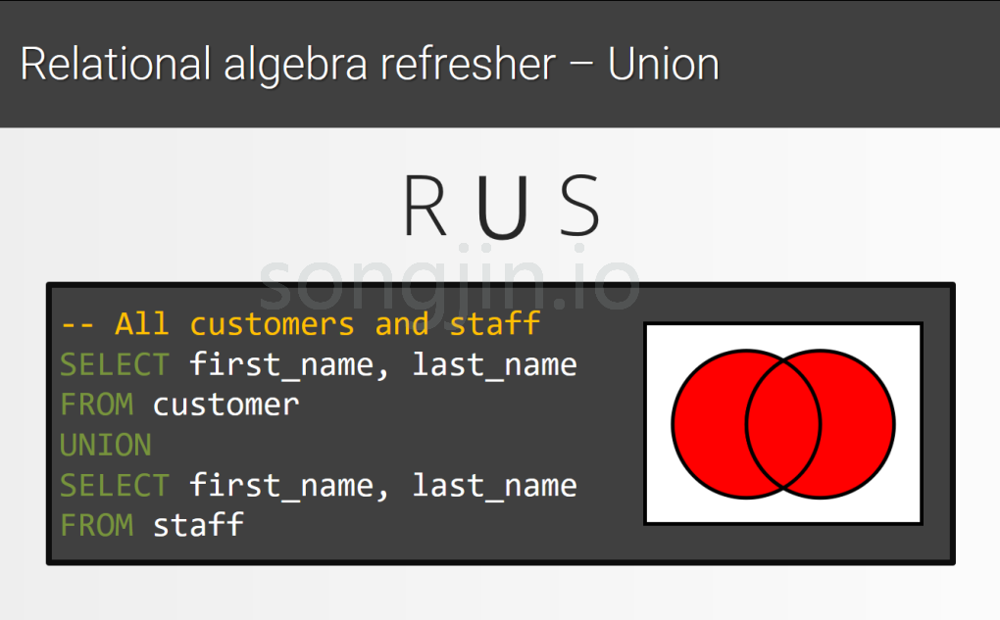
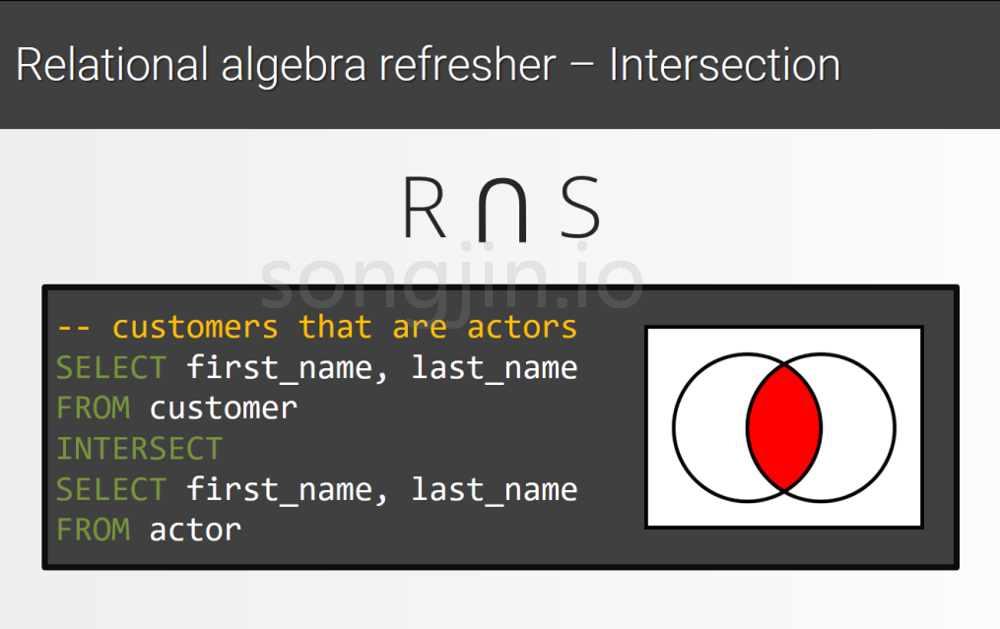
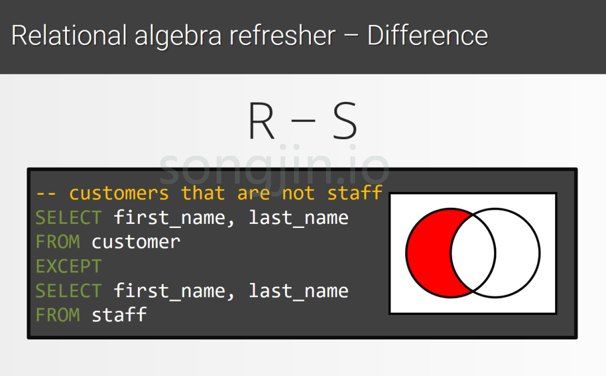
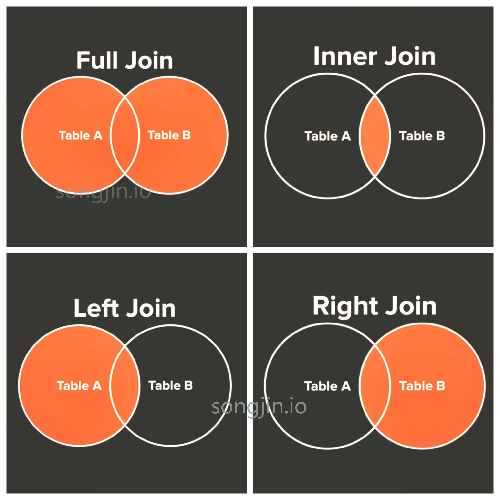

<!-- TOC -->

- [1. 并集](#1-并集)
- [2. 交集](#2-交集)
- [3. 差集](#3-差集)
- [4. JOIN关系](#4-join关系)
- [5. 加深理解的参考网站](#5-加深理解的参考网站)
- [6. 经典图](#6-经典图)

<!-- /TOC -->

# 1. 并集
> 使用 union 关键字连接两张表，就是求的并集（笛卡尔积）

  

# 2. 交集
> 使用 intersect 连接两张表

# 3. 差集
> 使用 except 连接两张表

# 4. JOIN关系

# 5. 加深理解的参考网站

[可视化join关系](http://joins.spathon.com/)

[SQL写法-推荐](https://www.codeproject.com/Articles/33052/Visual-Representation-of-SQL-Joins)

# 6. 经典图

