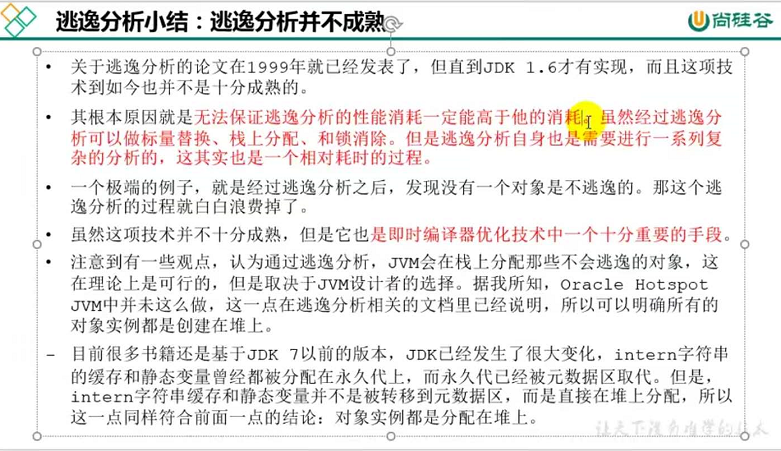
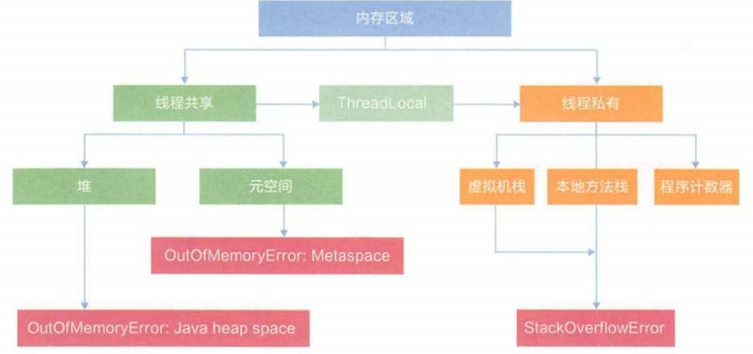
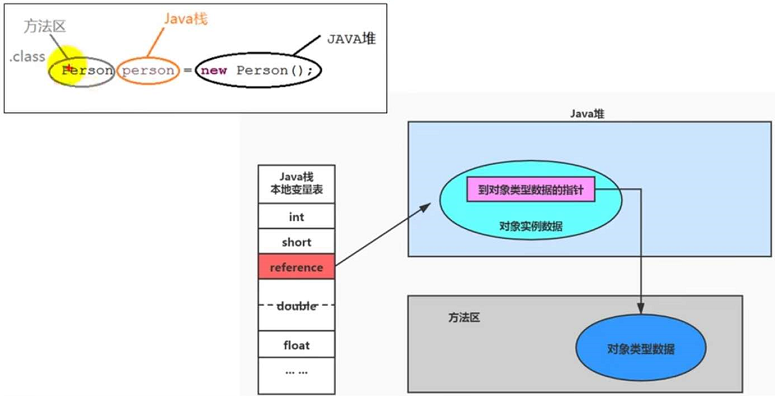
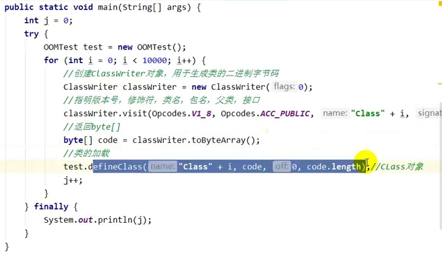
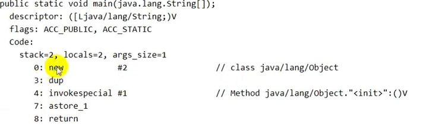
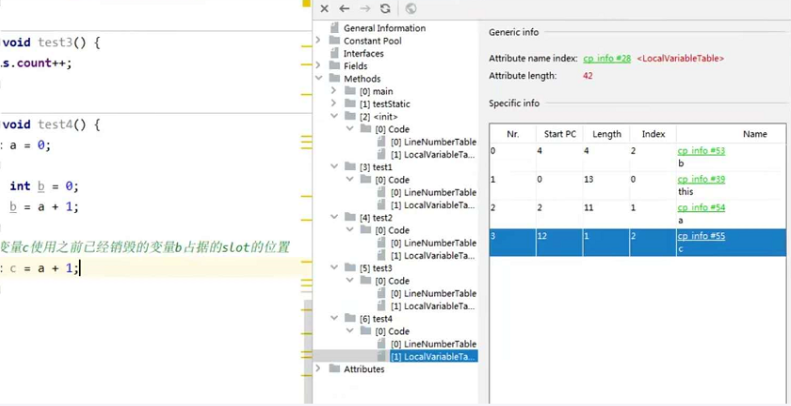
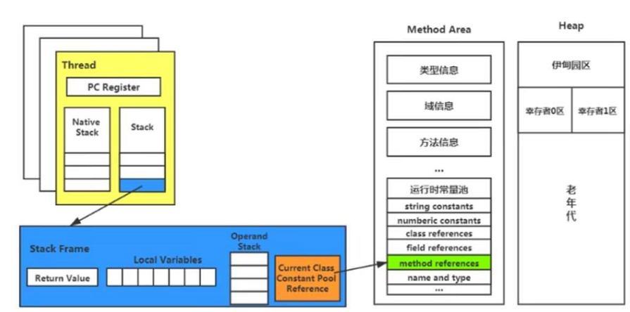

# JVM

一个进程就对应一个jvm实例
一个jvm实例就对应一个运行数据区

## JMM内存结构

### Java堆

是java内存管理的核心区域，jvm启动的时候就创建，大小也就确定了。堆内存大小可调节。
堆是所有线程共享的，但还可以划分线程私有的缓冲区（TLAB) thread local allocation buffer
堆从逻辑上是连续的，但是从物理上没有规定必须是连续的

- 新生代 1/3

	- eden 8/10

		- GC经常光顾的地方，minorGC

		  eden区域满了之后，会做一次minorGC，将存活的对象放到s区（s0,s1)，当s区域满了之后，也会做一次GC，将还存活的对象复制到另一个区域，然后将gc存活次数在对象头里+1，当存活次数（jdk1.8)达到15次后，会将此对象复制到到老年代，当老年代满了之后，会触发一次fullgc，它会STW，影响程序的响应。

	- s0 1/10
	- s1 1/10

- 老年代 2/3

- -Xms10m -Xmx10m来配置堆内存

	- jvisualvm查看

- 核心概述

	- 堆空间的算法：分代

		- 新生区
		- 养老区
		- 元空间

			- 1.8是元空间，1.7之前是永久代

		- -XX:+PrintGCDetails

	- -Xmx -Xms

		- 通常 Xms和Xmx设置相同的值
目的是为了能够在java垃圾收集机制清理完对区域后不需要重新分割计算堆区的大小，从而提高性能
		- 默认 Xms=物理内存/64 Xmx=物理内存/4
		- 实际上程序可用的内存，只能算一个s+eden+parold

	- -XX:NewRatio=2 默认值是这个，表示新生代栈1，老年代占2。这个值是 老年代/新生代
	- 默认情况下，eden和s1，s2的比例是 8:1:1
-XX:SurvivorRatio=8 来控制

		- 但是实际去查看并不是811的分配，因为开启了自适应内存分配，关了就好了
-XX:-UseAdaptiveSizePolicy

	- -Xmn设置新生代最大内存大小，一般使用默认值
	- 对象分配过程

		- 不仅要考虑如何分配内存的问题，还因为内存分配与内存回收算法密切相关，所以需要考虑GC执行完内存回收后是否会在内存空间中产生碎片
		- new出来的对象首先在eden区找空间
		- 如果eden区空间占满后，需要进行一次minorGC，也叫ygc
		- 回收掉垃圾，把存活的放到s1去，并将年龄计数器+1
		- 下一次gc也要判断s1区的对象是否是垃圾，如果仍然存活，就继续+1，并放到s2区
		- 在s1-s2交换的过程中，如果有对象年龄达到15，就放到tenure区域

			- 可以通过 -XX:MaxTenuringThreshold=<N>来设置
			- 在年龄没有达到阈值，也会因为s区域空间容纳不下，而直接放到老年代tensured区

	- 对象分配过程-生命周期图解

		- 一个例子

- 调优工具

  调优的目的就是让垃圾回收的次数少，快，减少full gc的次数，减少stw对用户线程的影响。重点调优的是major gc和full gc

	- jdk命令行
	- eclipse memory analyzer tool
	- jconsole
	- visualvm
	- jprofiler

		- ideal可以装这个插件

			- https://www.ej-technologies.com/download/jprofiler/files

		- 收费

	- java flight recorder
	- gcviewer
	- gc easy

- gc

  - minor gc

    > 针对新生代的垃圾回收，也叫ygc 

    ```text
    发生minor gc之前，虚拟机会检查老年代最大可用的连续空间是否大于新生代所有对象的总空间，如果大于，则此次minor gc 是安全的。如果小于会查看是否允许空间担保失败即（-XX:HandlePromotionFailure是否设置为True）。如果允许检查老年代的最大可用连续空间是否大于以往历次晋升到老年代对象的平均大小，如果大于则尝试一次minor gc, 如果小于则进行full gc. 
    如果不允许担保失败，则直接进行full gc.
    ```

    - 当年轻代空间不足（Eden）的时候会触发
    s区域满了是不会触发gc
    - minor gc 会引发stw, 暂停用户线程，等垃圾回收结束

  - major gc
  针对老年代的gc

  	- 老年代空间不足，经常会伴随至少一次minor gc 
  (但是 paraller scavenge 直接触发major gc 不会再触发minor gc)
  	- 速度比minor gc 慢10倍以上，stw时间更长，如果major gc后空间还是不足，就触发OOM

  - full gc

  	- 触发条件

  		- 调用 system.gc()

  			- 调用后 系统建议触发full gc 但是不一定真正触发

  		- 老年代空间不足
  		- 方法区空间不足
  		- 通过minor gc后进入老年代的平均大小大于老年代可用的内存
  		- 当s1,s2互转的过程中，内存不足需要移动到老年代，切老年代的可用内存也小于移动过来的对象大小

  - 概念

  	- hotspot vm 的gc按照回收区域分为两大类型

  		- 整堆收集
  full gc

  			- 收集整个java堆和方法区的垃圾收集

  		- 部分收集
  partial gc

  			- 新生代收集
  			- 老年代收集
  major gc

  				- cms垃圾收集器有单独的老年代收集
  				- 有时候major gc会和full gc混淆使用，需要分辨是老年代回收还是整堆回收

  			- 混合收集
  mixed gc 

  				- 收集整个新生代和部分老年代 目前只有G1有这种行为

  	- 为什么要把java堆进行分代管理？

  		- 分代的目的是优化gc性能，如果没有分代，所有的对象在一起，gc的时候要找到那些对象是否是垃圾就需要对所有 的对象进行扫描，而大部分的对象都是朝生夕死的，所以每次垃圾回收就会移动大量的内存。分代的话，把新创建的对象放到一起，方便gc回收，并且能够一下腾出很大的空间

- 内存分配策略
对象提升规则

	- 优先分配到eden区
	- 大对象直接分配到老年代

		- 避免程序开发中出现过多的大对象
因为大部分的大对象也可能是朝生夕死的

	- 长期存活的对象放到老年代
	- 动态对象年龄判断

		- 如果survivor区域中相同年龄的对象总和大于survivor空间的一般，那么年龄大于等于该年龄的对象直接进入老年代

	- 空间分配担保

		- -XX:HandlePromotionFailure
		- 大量的对象在gc后还是存活的，把survivor无法容纳的对象直接放到老年代

- TLAB
Thread Local Allocation Buffer

	- 为什么会有TLAB？

		- 堆是线程共享的，但是对堆数据的访问会存在线程安全的问题，为了防止这个问题，就需要加锁，但是这样极大的影响性能。
		- jvm在eden区域为每个线程分配了一个私有的缓存区域，这样在内存分配的时候可避免线程安全问题，提高分配的吞吐量。称为快速分配策略。
		- TLAB只占整个Eden空间的1%，并不是所有的对象实例都在TLAB里分配。通过 -XX:UseTLAB确实开启TLAB，通过-XX:TLABWasteTargetPercent设置TLAB占Eden空间的比率
		- 有TLAB内存分配的流程

- 堆空间的参数设置小结

  - 常用的参数
  - jinfo -flag SurvivorRatio 进程号
  可以查看某jvm的某个参数的配置信息

- 堆是分配对象存储的唯一选择吗？

  > 随着JIT编译和逃逸分析技术的成熟，栈上分配对象和标量替换优化技术，使所有的对象在堆上分配也渐渐边得不那么绝对了。如果一个对象经过逃逸分析后，并没有逃逸，那么这个对象就有可能在栈上进行分配。这样就不需要进行垃圾回收了。
  
  【逃逸分析】
  
  ```text
  将堆上的对象分配到栈
  通过逃逸分析，java hotspot 编译器能够分析出一个新的对象的引用的使用范围，从而决定是否将这个对象分配到栈上。
  逃逸分析是一种全局的跨函数的数据流分析算法。
  
  逃逸分析的基本行为就是分析对象的动态作用域。
  1. 当一个对象在方法中被定义后，对象只在方法内部使用，没有发生逃逸。
  2. 当一个对象在方法中被定义后，他被外部方法所引用，则认为发生逃逸。
  ```
  
  没有发生逃逸的对象，可以直接在栈上分配，随着方法结束被移除。
  
  逃逸分析，可以对代码做如下优化：
  
  1. 栈上分配
  
     只在方法内使用，没有被方法外引用
  
     ```java
     void method(){
         User u = new User();
         ...
     }
     ```
  
  2. 同步省略，如果一个对象被发现只能从一个线程访问，那么这个对象就不用考虑同步
  
  3. 分离对象和标量替换
  
     标量是一个无法再分解更小数据的数据，原始数据类型都是标量，还有一个就是聚合量，java中的对象就是聚合量，它可以被分解成其他聚合量+标量。如果一个聚合量经过逃逸分析后，它没发生逃逸，就把它分解成标量进行替换。比如：
  
     ```java
     class Point(){
         int x, int y;
     }
     void method(){
         Point p = new Point();
     }
     //jit编译后替换为
     void method(){
         int x = , int y = .
     }
     ```
  
     通过 `-XX:+EliminateAllocations` 开启标量替换，默认也是打开的。但是jvm只有在server模式下才可启用逃逸分析。`-server`就可以开启。
  
  开启逃逸分析 `-XX:DoEscapeAnalysis`
  
  

### 方法区

- 也叫元数据区

	- 存放代码（字节码）
	- 堆外内存

		- 它不在虚拟机内存里，是外部物理空间
- 存放Java的运行时常量池，静态变量和类信息

#### 栈、堆和方法区三者之间的交互关系

方法区也存在垃圾回收和压缩，但是虚拟机规范没有强制要求。方法区也会有OOM。方法区可以设置为固定的大小，也可以动态扩展或收缩。逻辑上方法区堆的一部分，在具体是现实上是看成两部分，在Hotspot上名称上叫非堆，在设置堆大小的时候也不包含方法区。



三者之间的关系



如果系统定义了太多的类，就会导致方法区溢出，抛出OOM。

```java
java.lang.OutOfMemoryError: Metaspace
```

在1.7的时候，是 PermGen space. 方法区发生OOM的场景：加载太多的第三方jar包，和tomcat部署了太多的工程。

【方法区的演进过程】

jdk7以前把方法区称为 永久代， jdk8之后取代为元空间。使用永久代导致程序容易OOM。XX:MaxPermSize设置上限。因为永久代使用java虚拟机内存，而元空间是使用**本地内存**实现元空间。

#### 设置方法区的大小

+ 1.7 设置是 -XX:PermSize设置永久代默认分配空间。默认20.75M，-XX:MaxPermSize设置最大，32位机器默认是64M，64位默认是82M。

* 1.8之后 -XX:MetaspaceSize 和 -XX:MaxMetaspaceSize 设置

元空间是怎么动态扩展的呢？

对于服务器来说，默认元空间设置为21MB，这个是初始的高水位线，如果触及这个水位线，就会触发full gc，卸载那些没有使用的类，根据回收释放了的空间大小，适当的提高或者降低该值。

#### 方法区内存溢出的例子



#### 如何解决OOM

+ 首先通过内存映像分析工具比如（eclipse memeory analyzer，visualvm) dump出来的堆快照进行分析. 确认内存的对象是否是必要的，也就是分清楚到底是出现了内存泄露还是内存溢出。
+ 如果是内存泄露，可查看泄露对象到GC Roots的引用链，找到无法垃圾回收的原因。找到泄露的代码位置。
+ 如果是内存溢出，检查-xmx和-xms的设置，看是否可以调大，或者从代码维度来分析是否存在某些对象生命周期过长。持有状态时间过长的情况，减少程序运行期的内存消耗。

#### 方法区的内存结构

+ 类型信息

  完整有效名称，直接父类的完整有效名，类型的修饰符（public, abstract, final).直接接口列表。

+ 运行常量池，静态变量，JIT代码即时编译缓存，域（字段属性）信息，方法信息。异常表。

#### Non-final变量

```java
class Order {
    public static String label = "";
}
public void main(String[] args){
    Order order = null;
    System.out.println(order.label);
}
```

上述代码不会出现空指针异常。

被声明为 final 的变量是全局常量，在编译的时候就分配了。而static没有final修饰的变量，在初始化阶段才会初始化。

#### 运行时常量池和常量池

字节码文件内部包含了常量池，方法区内部包含了运行时常量池。字节码文件的常量池加载到方法区就成了运行时常量池。

常量池表：包含各种字面量和对类型，域，方法的符号引用。

【为什么需要常量池？】

> java源文件需要各种类，接口，编译后存储到一个字节码文件里，而这些引用的类信息或者数据可能会很大，不能直接存放到字节码文件里，此时就会存放到另一个地方-常量池，这个字节码文件只包含了指向常量池的引用。

String.intern() 方法，如果常量池没有，就在常量池里放一个。这个体现了运行常量池的特性。

#### 方法区的演进细节

1.8 无永久代，累心信息，字段，方法，常量保存在本地内存的元空间，但字符串常量池，静态变量仍然放在堆中。

【为什么要用元空间替代永久代？】

+ 为永久代设置空间大小是很难确定的。某些场合类加载很多，就容易出现OOM。元空间划分到堆外内存，大小只受系统内存大小限制。
+ 对永久代进行调优是很困难的

#### 方法区的垃圾收集

方法区的垃圾回收虚拟机规范里比较宽松，可以不要求在方法区中实现垃圾收集。一般情况下，这个区域的垃圾收集效果比较难以令人满意，尤其对于类型卸载的条件是相当苛刻的。但这部分区域的垃圾收集有时候又是很必要的。

方法区的垃圾收集主要回收两部分内容：常量池中废弃的常量（字面量和符号引用）和不再使用的类型。

判断一个类型是否属于不再被使用的类，条件比较苛刻。需要同时满足三个条件：

+ 该类的所有实例都已经被回收，不存在该类及其该类的所有派生类的所有实例。
+ 加载该类的类加载器已经被回收。
+ 该类对应的java.lang.Class对象已经没有任何地方被引用。

在大量使用java发射，动态代理，CGLIB 等字节码框架，或者JSP这些频繁自定义类加载器的场景中，需要JVM的方法区垃圾收集能力。否则对方法区造成过大的内存压力。

### 对象的实例化

* 对象创建的方式

  * new

  * Class的newInstance()

    > 调用的是无参构造器，权限必须是public的

  * Constructor的newInstance(xxx)

    > 可以调用空参和带参数的构造器，权限没有要求

  * 使用clone()

    > 需要当前类实现Cloneable接口，实现clone()方法

  * 使用反序列化

    > 从网络或者文件中获取一个对象的二进制流

  * 第三方库Objenesis

* 创建对象的步骤

  

  * 判断对象的类是否加载，链接，初始化

    > 虚拟机遇到new指令，首先检查这个指令的参数能否在metaspace元空间找到一个类的符号引用，并且检查这个符号引用对应的类是否已经加载，解析和初始化。如果没有，需要在双亲委派的模式下，使用当前类加载器以 `classLoader + 类名` 为key进行查找对应的class文件。如果没找到就报 `classnotfoundexception`异常，找到就加载该类。并生成对应的Class对象存放到元数据区里。

  * 为对象分配内存

    > 计算对象占用的空间大小，在堆中划分一块内存给新对象，如果是引用变量，就只分配运用变量的空间（4字节）就可以了。

    * 如果内存规整-指针碰撞

      > bump the pointer (指针碰撞), 所有用过的内存在一边，没有用过的在另一边，中间放着一个指针作为分界点指示器，分配内存就仅仅把指针向空闲的那边挪动对象大小相等的距离就行了。如果垃圾收集器采用的是Serial，ParNew这种基于压缩算法的，虚拟机采用的就是这种分配方式。使用compact过程的收集器时，就会使用指针碰撞。

    * 如果内存不规整 虚拟机要维护一个列表，空闲列表分配

      > 已使用的和未使用的内存相互交错，虚拟机维护一个列表，记录那些内存块是可用的，在分配的时候，从列表中找到一块足够大小的空间划分给对象实例，并更新列表上的内容。

  * 处理并发安全问题

    * 采用CAS配上失败重试，区域加锁保证更新的原子性

    * 每个线程预先分配一块TLAB。

      > 通过 -XX:+/-UseTLAB来进行开关控制 （thread local allocation buffer)

  * 初始化分配到的空间 

    > 所有属性设置默认值（0值初始化），保证对象实例字段在不赋值时可以直接使用

  * 设置对象头

    > 对象所属类，对象的hashcode，对象的gc信息，锁信息

  * 执行init方法进行初始化

    > 类的构造器的调用

### 对象的内存布局

### 对象的访问定位


### Java栈

- 栈帧

	- 局部变量表
	- 程序返回出口
	- 操作数栈
	- 动态链接

- 异常

	- StackOverflowError

		- 栈的深度大于虚拟机允许的深度

	- OutOfMemeoryError

		- 虚拟机栈可动带扩展的话，无申请到足够的内存空间

			- 使用-Xms和-Xms指定

### 本地方法栈

- 本地方法

	- 什么是本地方法？

		- 非java代码，native
		- native关键字与abstract不能同用，因为native是有方法体的，只是不是java代码实现，abstract方法是没有方法体的

	- 为什么要使用本地方法

		- 对效率在意
		- 实现难度
		- 与外界环境交互
		- 底层环境交互

	- 现阶段用的越来越少，因为可以通过调用服务接口来完成扩展
	- 当一个线程调用了本地方法，那么久进入了一个不再受虚拟机限制的世界
	- jvm规范并没有明确要求本地方法需要使用的语言，所以并不是所有的jvm产品都支持本地方法，所以，也并不是所有的JVM都有本地方法栈

- 栈

	- 线程私有
	- 可设置成固定大小和可扩展内存大小

		- 固定大小，如果申请的超过设置的固定大小跑出StackOverflowError
		- 扩展大小，如果没有内存可扩展，跑出OutOfMemoryError

	- hostspot虚拟机，将本地方法栈跟虚拟机栈合二为一了

### 程序计数寄存器

- 存放每个线程当前代码执行的指令序号
- 下一条指令的地址
- 很小的内存空间，运行速度快
- 但是它只记录java代码的地址，如果执行本地方法，计数器为undefined
- 程序控制流指示器，分支，循环，跳转，异常处理
- 唯一一个在虚拟机规范中没有规定OutOfMemoryError的区域
- 问题

	- 使用PC寄存器存储字节码指令地址有什么作用？
为什么使用PC寄存器记录当前线程的执行地址？

		- CPU需要不停的切换各个线程，这个时候切换回来以后，就需要知道接着从当前线程的哪里开始继续执行，JVM字节码解释器就是通过改变PC寄存器的值来明确表示下一条指令的地址

## Runtime

### 一个runtime实例对应一个java应用程序，允许应用程序同它的运行环境进行交互，可以通过getRuntime方法获取

## 垃圾回收算法

### 标记清除

### 复制算法

### 标记-整理

### 分代收集算法

## 垃圾收集器

### G1

### Seria

### ParNew

### ParallelScavenge

### Serial Old

### CMS

## jvm调优

### 目的

- 调高内存利用率，减少GC次数特别是fullGC，调高程序响应速度

## 线程

### 运行单元，Hotspot虚拟机每个线程与操作系统的线程一一映射

### 本地线程初始化成功后，就会调用java线程的run方法

所谓，准备好是指：线程需要的数据结构（栈帧）创建完成

### jconsole看不到main方法线程以及main方法创建的子线程

### hostspot后台系统线程

- 虚拟机线程

	- jvm需要达到安全点才会出现，此时，堆不再发生变化。这种线程的执行类型包括STW的垃圾收集，线程栈收集，线程挂起，偏向锁撤销

- 周期任务线程

	- 周期性时间中断任务

- GC线程

	- 各个种类的垃圾收集提供支持

- 编译线程

	- 编译成本地代码

- 信号调度线程

	- 接受信号并发送给JVM

## 类加载过程

### 加载

将字节码加载到内存，转换为元数据结构，存储到方法区里

- ClassLoader

	- BootstrapClassLoader

	  加载rt.jar，里边包含了java运行时的类库，包括java.lang, java.nio, java.util等
	  sun.misc.Launcher是java虚拟机的入口应用

		- 启动类加载器，c++, jvm内部

	- ExtClassLoader

	  java.ext.dirs指定目录的类库，或者从jre/lib/ext目录

	- AppClassLoader
	- 自定义

		- 继承ClassLoader

			- loadClass(String)
resolveClass(Class<?>)
findClass(String)
defineClass(byte[],int,int)
			- 加载字节码的逻辑写在findClass里
			- 调用父类defineClass将byte[]流转换成Class<?>对象

		- 继承类图

		- 作用和意义

			- 隔离加载类
			- 修改类的加载方式
			- 扩展加载源
			- 防止源码泄露

		- 例子

			- tomcat 隔离不同应用war包不冲突

	- 怎么获取ClassLoader

		- 当前类的clz.getClassLoader()
		- 当前线程的
Thread.currentThread().getContextClassLoader()
		- 系统的ClassLoader.getSystemClassLoader()
		- 调用者的
DriveManager.getClassLoader()

	- 问题

		- jvm表示两个Class对象为同一个类：
完整类名必须一致，加载它的ClassLoader
必须相同
		- 类的使用方式

			- 主动使用

			  触发类加载

				- 创建类的实例
				- 访问类或接口的静态变量，或者对静态变量赋值
				- 访问类的静态方法
				- 反射（Class.forName())
				- 初始化一个类的子类
				- 虚拟机启动时被标记为启动类的类

			- 被动使用

			  不会触发类初始化

- 双亲委派机制

	- 重复加载
	- 非法系统自定义的类路径
	- 沙箱安全

		- 保证对java源代码的保护

### 链接

- 验证

  确保class文件的字节流包含信息符合当前虚拟机要求（cafebabe），不危害虚拟机的安全
  文件格式验证
  元数据验证
  字节码验证
  符号引用验证

- 准备

	- 0值初始化

	  不包含final static 修饰的变量，它们在编译阶段就分配了

- 解析

	- 符号引用转换为直接引用

### 初始化

可以使用jclasslib来查看生产的clinit和init方法的结构

- clinit

  收集初始化语句到这个_clinit方法里，注意下面的场景：
  public class InitTest {
      static {
          //这里没有问题， 0值初始化的时候就已经有number了
          number = 20;
          //这里就有问题，不能前向引用
          System.out.println(age);
      }
      static int number = 10;
      static int age = 10;
  
      public static void main(String[] args) {
          //number = 10 而不是 20, 遵循复制先后顺序
          System.out.println(InitTest.age);
      }
  }

	- 如果有父类，jvm保证在执行自雷的clinit之前，父类的clinit已经执行完毕

	  public class InitTest {
	      static class Father {
	          static int A = 1;
	          static {
	              A = 2;
	          }
	      }
	      static class Son extends  Father {
	          static int B = A;
	      }
	  
	      public static void main(String[] args) {
	          // = 2
	          System.out.println(Son.B);
	      }
	  }

	- 一个类的clinit方法在多线程下被同步加锁

- 执行用户构造器 init

## 虚拟机栈

### 出现背景

- 跨平台设计，指令集小，编译容易实现，性能下降

### 栈堆区别

- 栈解决程序运行时的问题，即程序如何执行，如何处理数据
- 堆解决数据存储问题，数据怎么放，放哪儿

### 基本内容

- 每个线程在创建的时候都会创建一个虚拟机栈，也叫java栈，内部保存一个个栈帧，对应一次次的java方法调用
- 生命周期与线程一致
- 主管java程序的运行，保存方法的局部变量，部分结果，参与方法的调用和返回

	- 局部变量和成员变量区别
	- 基本数据变量和引用类型变量区别

- 栈不存在垃圾回收问题，分配速度快

### 栈中可能出现的异常以及原因

- StackOverflowError

	- 栈的大小是固定的，如果线程请求分配的栈容量超过允许的最大容量

- OutOfMemoryError

	- 栈的容量可以动态调整，但是尝试申请的容量系统无法满足的时候，没有足够的内存给它的时候

- -Xss 设置栈的空间

	- -Xss1024k

### 栈的存储单位

- 栈帧为基本单位存储
线程中一个方法执行对应一个栈帧

	- 局部变量表

	  在局部变量表中，32位类型的占1个slot，64位的占2个slot, 线程私有，没有线程安全的问题

	  - 方法参数
	  - 局部变量
	  - 对象的引用
	  - 基本数据类型
	  - 案例分析

	  	- 成员方法 this 占第一个槽位，然后局部变量按照定义顺序分配槽位，如果方法里边有局部方法块，也称匿名方法块，里边定义的变量也会在局部变量表中分配槽位，但是，接下来会在方法块结束后进行回收，例如变量b和变量c占的是同一个槽位
	  	
	  	  
	  	
  	- 局部变量在使用之前必须赋值，因为没有赋值的局部变量在局部变量表中不存在
	  	
  	- 虚拟机使用局部变量表来完成方法的传递
	  	
	  	- 局部变量表也是重要的垃圾收集的根节点
	
- 操作数栈
	
	- 在方法的执行过程中，根据字节码指令，存数据，存中间结果，取数据等操作，Java的解释引擎是基于栈的执行引擎，保存中间结果，随着方法调用和执行而变化，方法刚开始执行的时候操作数栈是空的，操作数栈的最大深度在编译的时候就已经确定了，保存在Code属性的max_stack值
		
		- 栈中可存放任何数据类型，根据长度决定需要多少位来存储，如果调用方法有返回值，返回值也会压入操作数栈，并更新PC寄存器下一条指令的位置
	- i++ 与 ++i的区别 从操作数栈来分析
	
		- 可以看出，i++是先赋值，再自增，++i是先自增，再赋值
	
	- 栈顶缓存TOS
	
			- 因为基于栈的虚拟机不使用带地址的指令，这使得指令更加紧凑，但是完成同一个操作需要许多条出栈入栈操作，而且操作数栈是存放在内存的，频繁的存取势必影响性能。所以jvm使用了栈顶缓存技术 top of stack caching
			- 将栈顶元素全部缓存到物理CPU的寄存器里，以此降低内存的读取
	
	- 动态链接-指向运行时常量池的方法引用
	
	- java源码编译成字节码文件的时候，会把所有的变量和方法引用都作为符号引用保存在class的常量池里
		
	- invokevirtual指令
		
	- void返回值的都指向一个 ()v 
		
	- 动态链接的作用就是讲这些符号引用转换为直接引用
		
		  
	- 方法返回地址 - 方法正常退出 和异常退出的定义
	
	- 方法结束有两种方式
	
		- 正常执行完成
	
			- 存放该方法pc寄存器的值，作为下一条指令执行的位置
	
					- ireturn
				- lreturn [Long]
					- freturn [Float]
					- dreturn [Double]
					- areturn
	
			- 发生异常
	
				- 地址通过异常表来确定
	
	- 附加信息
	
		- 主要看java虚拟机具体的实现
		- 提供一些比如支持调试的信息

### 方法调用

- 静态链接

	- 如果调用的目标方法在编译期间就可知，并且 在运行期保持不变，这种转换为直接引用 的过程就叫做静态链接
	- 早期绑定

- 动态链接

	- 在编译期间无法确定，比如多态，泛型，只能够在程序运行期间将调用方法的符号引用转换为直接引用，这种转换的过程是动态的。
	- 晚期绑定

- invokevirtual

	- java中任何一个普通方法其实都具备虚函数的特性，相当于c++的虚函数，如果在java中不希望某个方法拥有虚函数的特性时，可以使用关键字final来标记这个方法
	- 虚方法
	- 非虚方法

		- 在编译期间就确定了具体的调用版本，静态方法，私有方法，final方法，实例构造器，父类方法

- invokestatic

	- 静态方法调用

- invokespecial

	- 调用init方法，私有和父类方法

- invokeinterface

	- 调用接口方法

- invokedynamic

	- 动态调用，主要是为了实现【动态类型语言】
	- 使用lambda表达式可以生产这个指令
这个是java7引入的，但是java7不能直接通过java代码产生，需要ASM这些字节码操作才可生成，java8通过lambda表达式产生
	- 值决定类型-动态编程语言
变量决定类型-静态编程

- 方法重写的本质
- 虚方法表

	- 为了提高性能，避免每次方法的动态分派都要去类的元数据区寻找匹配的方法影响到执行效率。jvm会在类的方法区创建一个虚方法表。虚方法表在类加载的链接阶段就完成初始化。

### 面试题目

- 举例栈溢出的情况？

	- 递归 -Xss

- 调整栈的大小，就能保证不出现溢出么？

	- 不能，只能缓解，治标不治本

- 分配的栈内存越大越好吗？

	- 在资源足够的情况下，可以这么说，但是现实中，资源有限，栈空间大对性能提升会有一定的瓶颈，造成空间浪费。并且栈空间设置过大堆空间就会受到挤压。

- 垃圾回收是否会涉及到虚拟机栈？

	- 不会

- 方法中定义的局部变量是否线程安全？

	- 不一定

		- 在内部产生，内部消亡的就是线程安全的
		- 如果内部产生，作为返回值外部引用，就不是线程安全的
*XMind: ZEN - Trial Version*