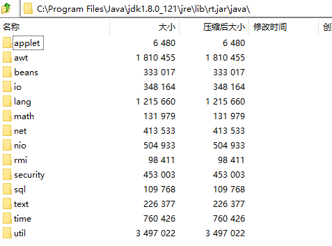
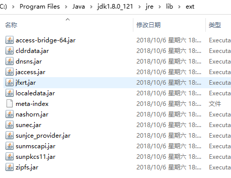
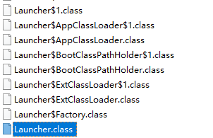

## 参考书
> optimizing java techniques app performance

* 内存结构 方法，堆，虚拟机栈，程序计数器，本地方法栈

* 类加载过程（双亲委派，加载，验证，链接，初始化）转为方法区的数据结构存入方法区

* 类加载器，常见那些（BootstrapClassLoader, ExtClassLoader, AppClassLoader(加载类路径下所有的)）

  rt.jar(runtime) String Object util等等由Boostrap加载

​	ext下面的由Extention加载

sun.misc.Launcher是入口

自定义 继承 ClassLoader

* 双亲委派和沙箱安全机制
* 