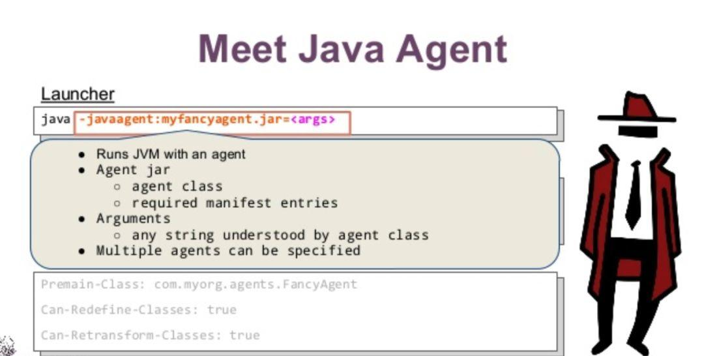
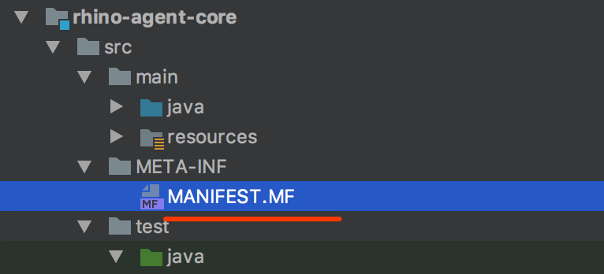
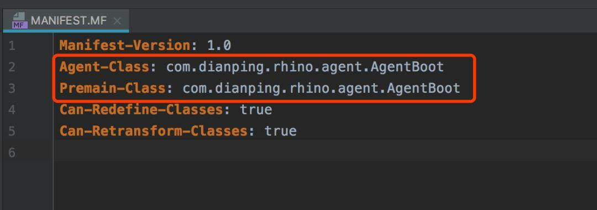

> 原文出处 https://www.javazhiyin.com/27630.html



Java Agent这个技术，对于大多数同学来说都比较陌生，像个黑盒子。但是多多少少又接触过，实际上，我们平时用的很多工具，都是基于Java Agent实现的，例如常见的热部署JRebel，各种线上诊断工具（btrace, greys），还有阿里最近开源的arthas。

其实Java Agent一点都不神秘，也是一个Jar包，只是启动方式和普通Jar包有所不同，对于普通的Jar包，通过指定类的main函数进行启动，但是Java Agent并不能单独启动，必须依附在一个Java应用程序运行，有点像寄生虫的感觉。

## 如何动手写一个Java Agent

因为Java Agent的特殊性，需要一些特殊的配置，在META-INF目录下创建`MANIFEST`文件.



在`MANIFEST`文件中指定Agent的启动类



```yaml
Manifest-Version: 1.0
Agent-Class: com.xie.learn.agent.AgentBoot
Premain-Class: com.xie.learn.agent.AgentBoot
Can-Redefine-Classes: true
Can-Retransform-Classes: true
```

这里需要解释下为什么要指定 `Agent-Class`和 `Premain-Class`，在加载Java Agent之后，会找到 `Agent-Class`或者 `Premain-Class`指定的类，并运行对应的 `agentmain`或者 `premain`方法。

```java
/**
* 以vm参数的方式载入，在Java程序的main方法执行之前执行
*/
public static void premain(String agentArgs, Instrumentation inst);
/**
* 以Attach的方式载入，在Java程序启动后执行
*/
public static void agentmain(String agentArgs, Instrumentation inst);
```

如果不想手动创建MANIFEST文件，也可以通过Maven配置，在打包的时候自动生成，具体配置可以参数下面。

```xml
<plugin>
   <artifactId>maven-assembly-plugin</artifactId>
   <configuration>
       <archive>
           <manifestEntries>
               <Premain-Class>com.dianping.rhino.agent.AgentBoot</Premain-Class>
               <Agent-Class>com.dianping.rhino.agent.AgentBoot</Agent-Class>
               <Can-Redefine-Classes>true</Can-Redefine-Classes>
               <Can-Retransform-Classes>true</Can-Retransform-Classes>
           </manifestEntries>
       </archive>
   </configuration>
</plugin>
```

所以，我们需要在 `agentmain`或者 `premain`方法中实现具体的Agent逻辑，这里是你大显身手的地方，读取JVM的各种数据，修改类的字节码，只要你能想到的，一般都可以实现。

## 如何加载 Java Agent

前面说了，一个Java Agent既可以在程序运行前加载，也可以在程序运行后加载，两者有什么区别呢？

### 程序运行前加载

通过JVM参数 `-javaagent:**.jar`启动，程序启动的时候，会优先加载Java Agent，并执行其 `premain`方法，这个时候，其实大部分的类都还没有被加载，这个时候可以实现对新加载的类进行字节码修改，但是如果 `premain`方法执行失败或抛出异常，那么JVM会被中止，这是很致命的问题。

### 程序运行后加载

程序启动之后，通过某种特定的手段加载Java Agent，这个特定的手段就是 `VirtualMachine`的 `attach api`，这个api其实是JVM进程之间的的沟通桥梁，底层通过socket进行通信，JVM A可以发送一些指令给JVM B，B收到指令之后，可以执行对应的逻辑，比如在命令行中经常使用的jstack、jcmd、jps等，很多都是基于这种机制实现的。

因为是进程间通信，所以使用 `attach api`的也是一个独立的Java进程，下面是一个简单的实现。

```java
// 15186表示目标进程的PID
VirtualMachine vm = VirtualMachine.attach("15186");  
try {
  // 指定Java Agent的jar包路径
   vm.loadAgent(".../agent.jar");    
} finally {
   vm.detach();
}
```

首先，我们得知道目标进程的PID，这个可以通过jps指令方便得到，也可以通过 `VirtualMachine`的list方法拿到本机所有Java进程的PID。通过 `attach`连接上目标PID之后，可以获得表示目标进程的vm对象，执行 `loadAgent`方法，对应的Java Agent会被加载，然后会找到指定的入口类，并执行agentmain方法，如果执行出现普通异常（除了oom和其它致命异常），目标JVM并不会受到影响。

通过这种方式，可以实现动态的加载Java Agent，而不需要修改JVM启动参数。