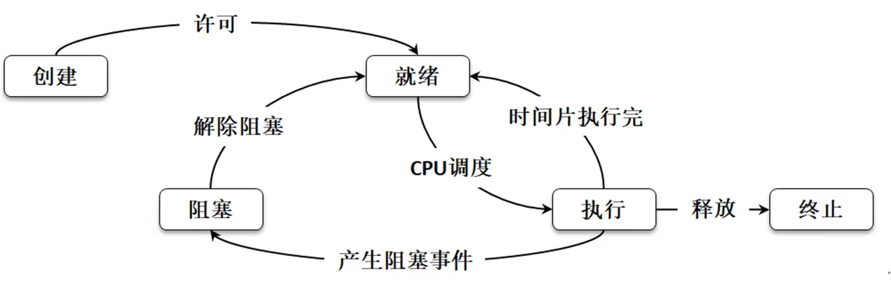

* 获取CPU的数量

  ```python
  import multiprocessing
  print("CPU的数量 %s"%multiprocessing.cpu_count())
  ```

* 进程的生命周期

  

  * **创建状态**：系统已经为其分配了PCB（进程信息数据结构），但是需要执行的进程上下文环境并未分配，这个时候进程还无法被调度。
  * **就绪状态**：进程已经分配到了除CPU以外的全部资源，并等待CPU的调度。
  * **执行状态**：进程已经获得CPU资源，正常执行程序。
  * **阻塞状态**：CPU是共享资源，每一个进程运行完自己的时间片段后，就会释放CPU，给其他进程使用，自己的状态被挂起。
  * **终止状态**：某一个进程正常退出，工作完成，或者进行了强制性的停止，进程将进入终止状态，不再执行。

# Process类

`multiprocessing` 模块进行多进程程序的编写，这个模块提供一个Process类，利用这个类可以进行多进程的定义。

```python
# coding: UTF-8
import multiprocessing
import random, time
# 进程的处理函数
def handle(sec):
    time.sleep(sec)
    print("当前进程名称=%s, 进程Id=%s"%(multiprocessing.current_process().name,
          multiprocessing.current_process().pid))

def main():
    for i in range(3):
        # 创建一个进程
        process = multiprocessing.Process(target=handle, args=(random.randint(2, 5),), name="测试进程-%s"%i)
        #启动进程
        process.start()

if __name__ == "__main__":
    main()
```

```bash
当前进程名称=测试进程-1, 进程Id=12404
当前进程名称=测试进程-0, 进程Id=1564
当前进程名称=测试进程-2, 进程Id=7096
```

## 获取python启动的主进程信息

```python
def main():
    print("当前进程名称=%s, 进程Id=%s" % (multiprocessing.current_process().name,
                                  multiprocessing.current_process().pid))

if __name__ == "__main__":
    main()
```

```bash
当前进程名称=MainProcess, 进程Id=6576
```

## 通过继承定义进程处理类

```python
class MyPrcess(multiprocessing.Process):
    def __init__(self, name, sec):
        super().__init__(name = name)
        self._sec = sec

    def run(self):
        time.sleep(self._sec)
        print("当前进程名称=%s, 进程Id=%s" % (multiprocessing.current_process().name,
                                      multiprocessing.current_process().pid))

def main():
    for i in range(3):
        process = MyPrcess("my-process-%s"%i, random.randint(2, 5))
        process.start()

if __name__ == "__main__":
    main()
```

```bash
当前进程名称=my-process-1, 进程Id=6264
当前进程名称=my-process-0, 进程Id=11236
当前进程名称=my-process-2, 进程Id=16068
```

## 进程控制

* terminate 关闭终止进程
* is_alive 检查是否存活
* join 强制执行

```python
def handler():
    time.sleep(2)
    print("子进程运行")

def main():
    process = multiprocessing.Process(target=handler)
    process.start()
    process.join()
    print("主进程运行")

if __name__ == "__main__":
    main()
```

> join的进程，必须要start就绪

中断

```python
process = multiprocessing.Process(target=handler)
process.start()
time.sleep(2)
if process.is_alive():
  process.terminate()
```

## 守护进程

> 后台进程，随着创建它的进程存在而存在，同时主进程结束，它也结束

```python
def worker():
    # 创建守护进程
    daemon_process = multiprocessing.Process(target=daemon, daemon=True)
    daemon_process.start()
    time.sleep(5)
    print("子进程运行")

def daemon():
    item = 1
    while True:
        item += 1
        time.sleep(1)
        print("守护进程持续运行")

def main():
    work_process = multiprocessing.Process(target=worker)
    work_process.start()

if __name__ == "__main__":
    main()
```

```bash
守护进程持续运行
守护进程持续运行
守护进程持续运行
守护进程持续运行
子进程运行
```

> 可以看到守护进程在worker进程结束之后，自己也就结束了

## fork创建子进程

os.fork

> 这种方式创建的子进程并不跨平台，<0 子进程创建失败，=0 子进程可以获取数据， >0 父进程获取数据

```python
# coding: UTF-8
import multiprocessing, os
import random, time

def child():
    print("子进程ID=%s"%os.getpid())
    time.sleep(2)

def main():
    print("父进程ID=%s"%multiprocessing.current_process().pid)
    pid = os.fork()
    if pid == 0:
        child()
    else:
        print("父进程ID=%s"%os.getpid())

if __name__ == "__main__":
    main()
```

在windows平台上执行

```python
AttributeError: module 'os' has no attribute 'fork'
```

在linux平台上执行

```bash
父进程ID=34778
父进程ID=34778
子进程ID=34779
```

## psutil模块

进程管理第三方模块，该模块可以跨平台(linux, unix, windows )的进程管理。

需要安装

```python
# coding: UTF-8
import psutil, time

def main():
    for process in psutil.process_iter(): # 获取全部进程信息
        print("进程编号:%s, 进程名称：%s, 创建时间：%s"
              %(
                process.pid,
                process.name(),
                time.strftime("%Y-%m-%d %H:%M:%S", time.localtime(process.create_time()))
              ))
        if process.name() == "notepad.exe": #强制杀死某一个进程
            process.terminate()

if __name__ == "__main__":
    main()
```

```bash
进程编号:0, 进程名称：System Idle Process, 创建时间：2020-02-13 12:36:02
进程编号:4, 进程名称：System, 创建时间：2020-02-13 12:36:02
进程编号:108, 进程名称：svchost.exe, 创建时间：2020-02-13 12:36:14
进程编号:144, 进程名称：Registry, 创建时间：2020-02-13 12:36:01
进程编号:320, 进程名称：fontdrvhost.exe, 创建时间：2020-02-13 12:36:14
进程编号:440, 进程名称：smss.exe, 创建时间：2020-02-13 12:36:06
```

### 获取CPU信息和磁盘情况

```python
# coding: UTF-8
import psutil, time

def main():
    print("物理CPU %d"%psutil.cpu_count(logical=False))
    print("逻辑CPU %d"%psutil.cpu_count(logical=True))
    print("用户CPU使用时间：%d，系统CPU使用时间：%d, CPU空闲时间：%d"%(
        psutil.cpu_times().user,
        psutil.cpu_times().system,
        psutil.cpu_times().idle
    ))
    for i in range(10):
        print("CPU使用率: %s"%psutil.cpu_percent(interval=1, percpu=True)) # 每个CPU的使用情况

    print("获取全部磁盘分区%s"%psutil.disk_partitions())
    print("获取磁盘的使用率%s"%str(psutil.disk_usage("c:")))
    print("获取磁盘的IO使用率%s"%psutil.disk_io_counters())

if __name__ == "__main__":
    main()
```

```bash
物理CPU 6
逻辑CPU 12
用户CPU使用时间：104996，系统CPU使用时间：107669, CPU空闲时间：3033067
CPU使用率: [32.9, 13.4, 10.9, 15.6, 17.2, 15.6, 12.5, 10.9, 15.6, 12.5, 9.4, 7.8]
CPU使用率: [27.5, 7.7, 14.1, 3.1, 16.9, 12.5, 12.3, 3.1, 12.5, 6.2, 6.2, 1.6]
获取全部磁盘分区[sdiskpart(device='C:\\', mountpoint='C:\\', fstype='NTFS', opts='rw,fixed'), sdiskpart(device='D:\\', mountpoint='D:\\', fstype='NTFS', opts='rw,fixed')]
获取磁盘的使用率sdiskusage(total=107374178304, used=81954893824, free=25419284480, percent=76.3)
```

### 网络接口信息

```python
print("所有接口%s"%str(psutil.net_if_stats()))
print(psutil.net_if_addrs())
```

```bash
所有接口{'以太网': snicstats(isup=False, duplex=<NicDuplex.NIC_DUPLEX_FULL: 2>, speed=0, mtu=1500), '蓝牙网络连接': snicstats(isup=False, duplex=<NicDuplex.NIC_DUPLEX_FULL: 2>, speed=3, mtu=1500), 'VMware Network Adapter VMnet1': snicstats(isup=True, duplex=<NicDuplex.NIC_DUPLEX_FULL: 2>, speed=100, mtu=1500), 'VMware Network Adapter VMnet8': snicstats(isup=True, duplex=<NicDuplex.NIC_DUPLEX_FULL: 2>, speed=100, mtu=1500), '以太...
{'以太网': [snicaddr(family=<AddressFamily.AF_LINK: -1>, address='98-FA-9B-71-09-C1', netmask=None, broadcast=None, ptp=None), snicaddr(family=<AddressFamily.AF_INET: 2>, address='169.254.90.4', netmask='255.255.0.0', broadcast=None, ptp=None), snicaddr(family=<AddressFamily.AF_INET6: 23>, address='fe80::f0f2:c79f:e401:5a04', netmask=None, broadcast=None, ptp=None)]...

```

## 进程池

```python
import multiprocessing, time
def worker():
    time.sleep(1)
    pid = multiprocessing.current_process().pid
    print("子进程运行")
    return pid

def main():
    pool = multiprocessing.Pool(5)
    for i in range(10):
        retn = pool.apply_async(worker)
        print(retn.get())
    pool.close()
    pool.join() # 所有进程池里的进程执行完毕后结束

if __name__ == "__main__":
    main()
```

## 进程间通讯

### 管道

```python
import multiprocessing, time
def send_data(con, data):
    con.send(data)
def receive_data(con):
    while True:
        time.sleep(1)
        data = con.recv()
        if data:
            print(data)
            break
def main():
    #一个接收管道，一个发送管道
    con_send, con_recv = multiprocessing.Pipe()
    process_send = multiprocessing.Process(target=send_data, args=(con_send, "你好"))
    process_recv = multiprocessing.Process(target=receive_data, args=(con_recv,))
    process_send.start()
    process_recv.start()
```

### 进程队列