# 概述

spring-gateway 构建于 springboot2.x， spring webflux 和 project reactor之上。

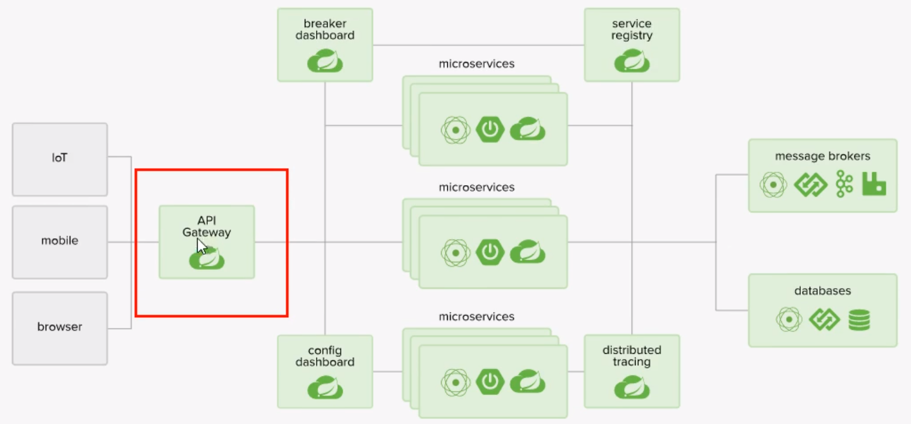

1.x版本 gateway一直使用zuul网关，但是zuul2.x一直没有出来，也无法投入生产，spring-cloud就自己研发了一个网关代替zuul.

spring-gateway旨在提供一种简单有效的方式来对API进行路又，以及提供一些强大的过滤器功能，比如：熔断，限流重试等。springcloud-gateway是基于webflux框架实现，webflux框架底层使用了高性能的Reactor模式通信框架Netty.

源码架构

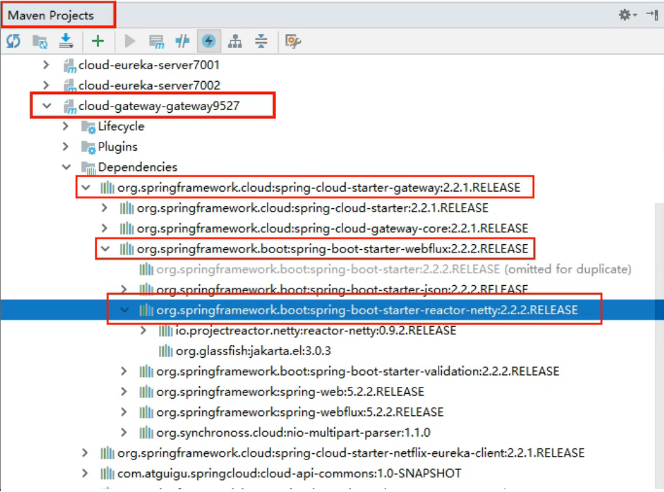

## spring-gateway能做什么？

spring-gateway提供如下特性：

+ 基于springframework5 , project reactor 和 spring-boot2.0构建
+ 动态路又，能匹配任何请求属性
+ 可以对路又指定断言(predicate) 和 过滤器 (Filter)
+ 集成Hystrix的断路器功能
+ 集成springcloud的服务发现功能
+ 易于编写的predicate和filter
+ 请求限流功能
+ 支持路径重写

与zuul的区别

> 在springcloud Finchley正式发布之前，推荐使用netfix的zuul网关。

+ zuul 1.x 是一个基于阻塞IO的gateway

+ 基于servlet2.5，不支持任何长连接如websocket的设计模式。每次IO操作都是从工作线程中选择一个执行，请求线程被阻塞到工作线程完成，跟nginx类似。一个请求一个线程是非常昂贵的开销。**spring-gateway使用reactor模式，用几个线程就可以完成高并发处理大量请求。**

  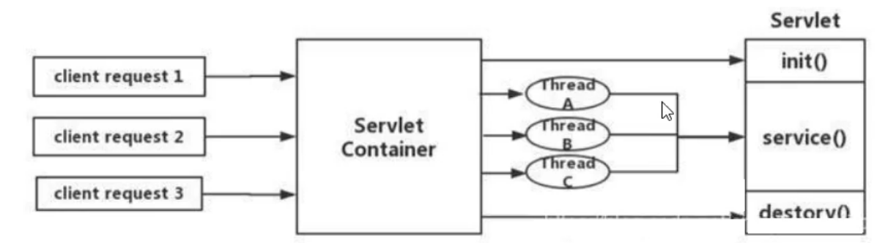
  * container启动时构造servlet对象，并调用servlet init() 进行初始化
  * container运行时接受请求，并为每一个请求分配一个线程，一般从线程池中获取空闲线程，然后调用service() 方法。
  * container关闭时调用servlet destroy()方法销毁servlet

+ zuul2.x想基于netty的非阻塞和支持长连接，但是spring-cloud没由整合的打算。

+ spring-cloud gateway支持websocket

## 三大核心概念

+ Route

  构建网关的基本模块，它由ID，目标URI，一系列的断言和过滤器组成，如果断言为true则匹配该路由。

+ Predicate

  参考Java8的 java.util.function.Precicate

+ Filter

  可以在请求被路由前或者后进行修改。

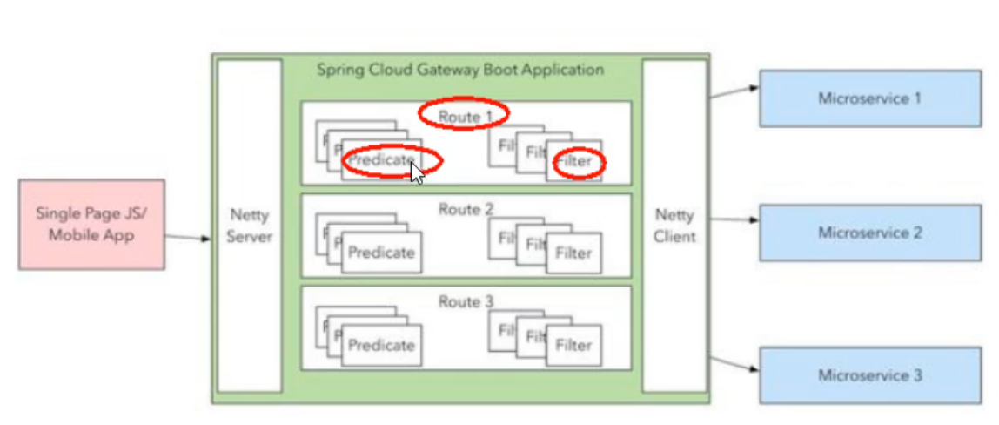

web请求通过一些匹配条件，定位到真正的服务节点。并在这个转发过程的前后，进行一些精细化的控制。predicate就是匹配条件，而filter就可以理解为一个无所不能的拦截器。

## 工作流程


客户端向spring-cloud-gateway发出请求，然后在gateway handler mapping中找到与请求相匹配的路由，将其发送到gateway的web-handler. handler再通过指定的过滤器链来将请求发动到我们实际的服务执行业务逻辑，然后返回。过滤器之间用虚线分开是一位内过滤器可能会在发送代理请求前(pre) (post)执行业务逻辑。

pre 可以做参数检验，权限校验，流量监控，日志输出，协议转换等，在post类型的过滤器中可以做响应内容，响应头修改，日志输出，流量监控。

# 配置网关

+ pom.xml 添加依赖

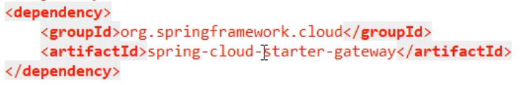

* yml配置

 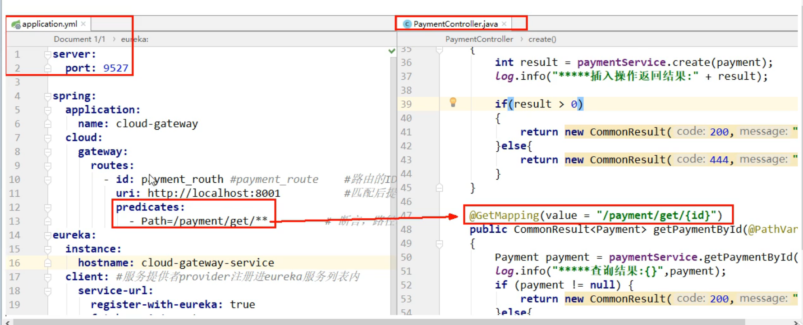

  ## 异常情况

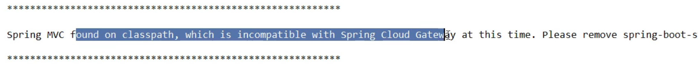


gateway是不需要spring-boot-starter-web依赖

### Java代码配置

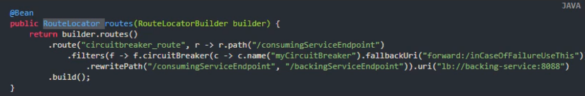

### 配置动态路由

默认情况gateway会根据注册中心注册服务列表，以注册中心上微服务名为路径创建动态路由进行转发，从而实现动态路由功能。

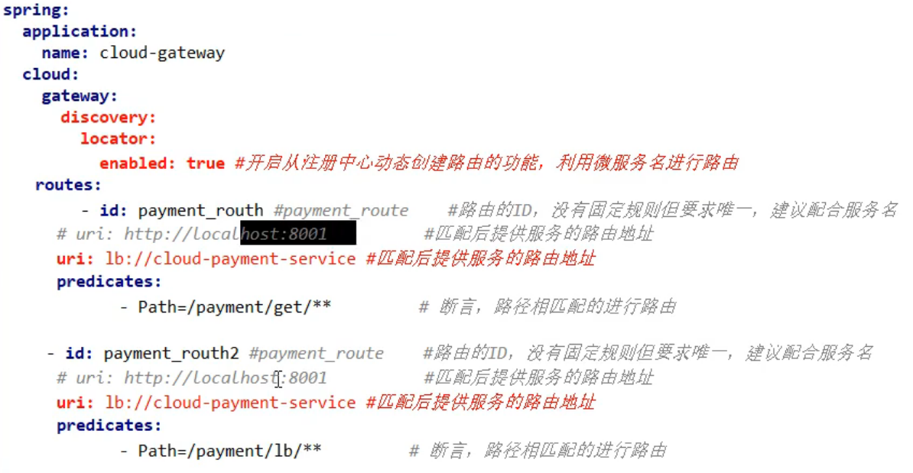

### Predicate的使用

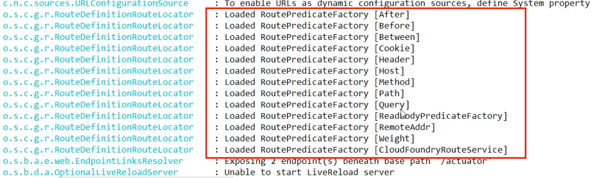

这么多种predicate，官方自带的`predicate factories`

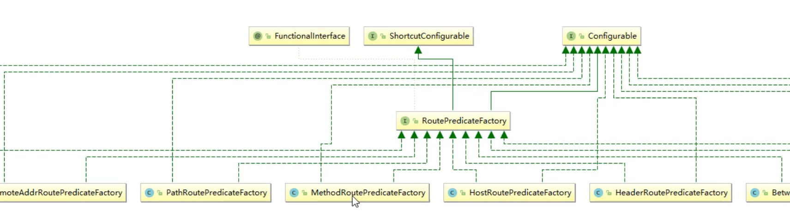

spring cloud gateway 将路由匹配作为 spring webflux handlerMapping基础框架的一部分。springcloud-gateway包含了许多内置的Route Predicate 工厂。所有这些Predicate斗鱼Http请求的不通属性皮皮额。多个Predicate工厂可以进行组合。

#### After

> 这个路由规则是，配置的某个路由规则在什么时间之后才起效

after的时间格式的获取

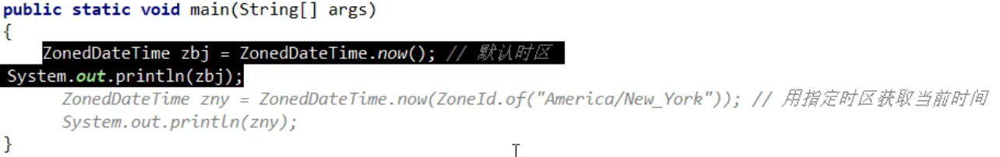

#### Cookie

> 可配置什么cookie可以访问，带不带cookie访问。它代两个参数，一个是cookie name，一个是正则表达式，路由规则会通过获取对应的cookiename的值和正则表达式进行皮皮额，如果匹配成功就执行路由。

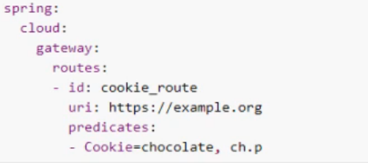

#### Header

#### Query

必须带某一个查询参数

### Filter

生命周期 pre 和 post

种类，两种： GatewayFilter 和 GlobalFilter。官方支持由31种多。

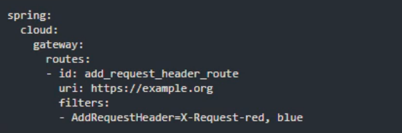

https://cloud.spring.io/spring-cloud-gateway/2.2.x/reference/html/#gatewayfilter-factories

### 自定义过滤器

实现 GlobalFilter 和 Ordered两个接口，用于全局日志记录和统一网关认证。

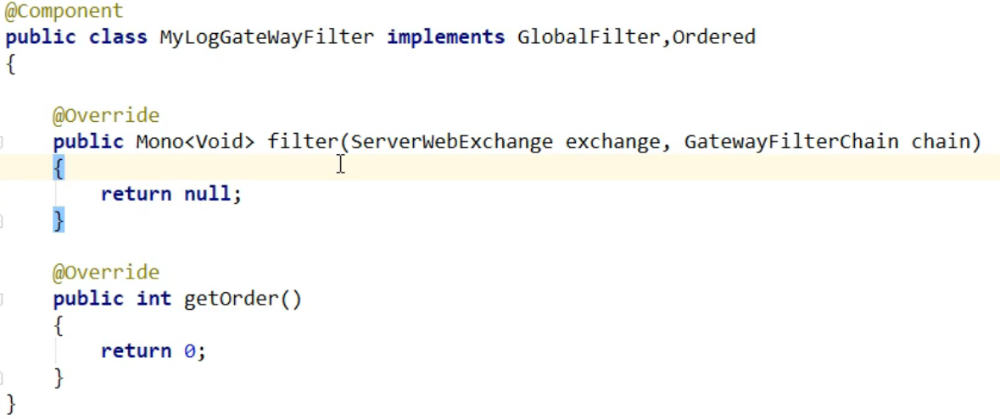

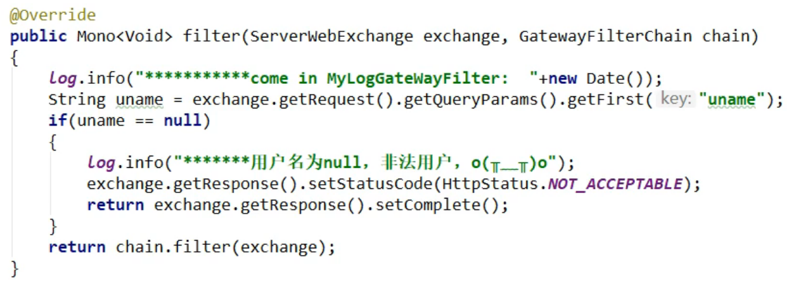

## 配置中心

作用：

+ 集中管理配置文件
+ 不通环境不通配置，动态化配置更新，分环境部署。
+ 运行期间动态调整配置，不再需要在每个服务部署的机器上编写配置文件，服务会向配置中心统一拉取配置自己的信息
+ 当配置发生变动时，服务不需要重启即可感知到配置的变化，并应用新的配置。
+ 将配置信息以REST接口的形式暴露

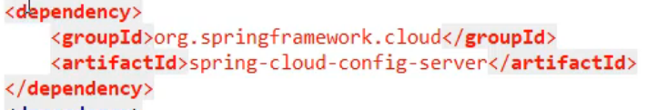

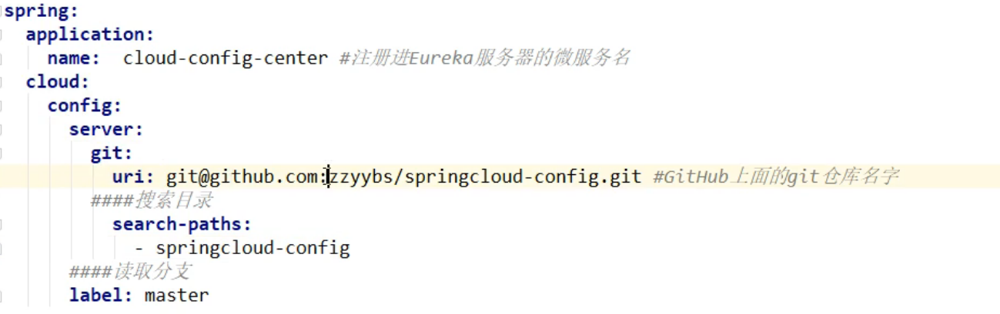

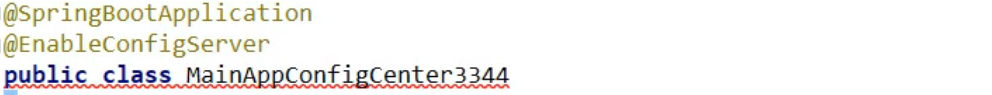

### 配置的读取规则

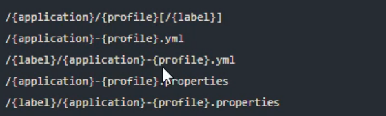

客户端

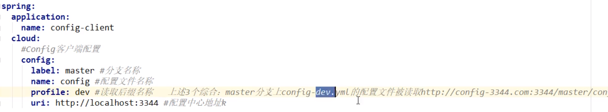

### BootstrapContext 与 ApplicationContext

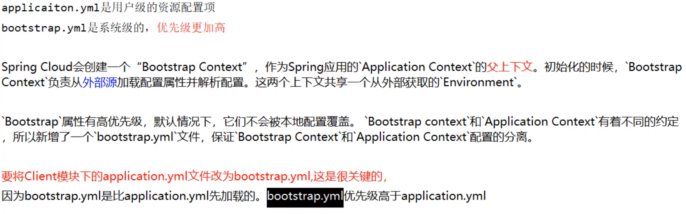

客户端缓存问题

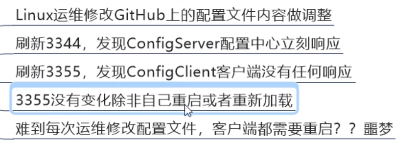

### 客户端配置动态刷新

避免每次配置都要重启客户端，怎么实现刷新功能

+ 引入acutator

+ 配置

  ```yml
  management:
    endpoints:
      web:
        exposure:
          include: "*"
  ```

+ @RefreshScope 在需要动态获取配置的地方标注这个注解

+ 运维刷新客户端 `客户端地址/actuator/refresh`

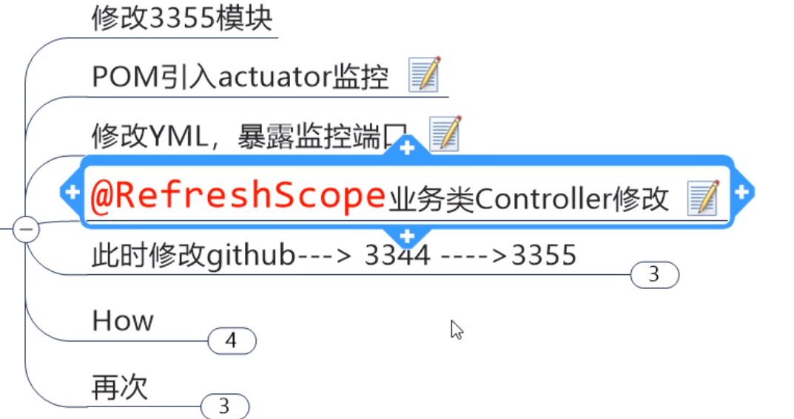

* 定点通知

  /actuator/bus-refresh/{destination} 比如 `curl -X POST "http://localhost:3344/actuator/bus-refresh/config-client:3355"`

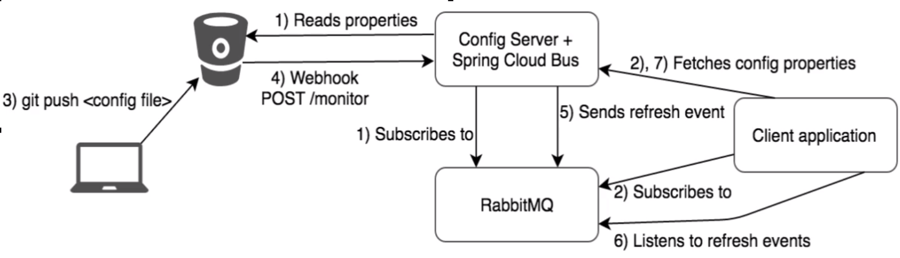

# spring cloud stream

解决的问题是？

> 整合 ActiveMQ, RabbitMQ, RocketMQ, Kafka。让我们不再关注具体的MQ细节，值需要用一种适配绑定的方式，自动的做各种MQ之间的切换。屏蔽了MQ底层的差异，统一消息编程模型。

官网 https://spring.io/projects/spring-cloud-stream 中文帮助手册 https://m.wang1314.com/doc/webapp/topic/20971999.html

什么是spring-cloud-stream?

> 它是一个构建消息驱动微服务的框架，应用通过inputs或者outputs来与spring-cloud-stream中的binder对象交互。通过我们配置来binding(绑定)，而spring-cloud-stream的binder对象负责与消息中间件交互。所以我们只需要搞清楚如何与spring-cloud-stream交互就可以方便使用消息驱动方式。
>
> 通过使用spring-integration来连接消息代理中间件以实现消息事件驱动。spring-cloud-stream为一些供应商的消息中间件产品提供了个性化的自动化配置实现。引用了发布-订阅，消息组，分区的三个核心概念。
>
> 目前只支持RabbitMQ和kafka

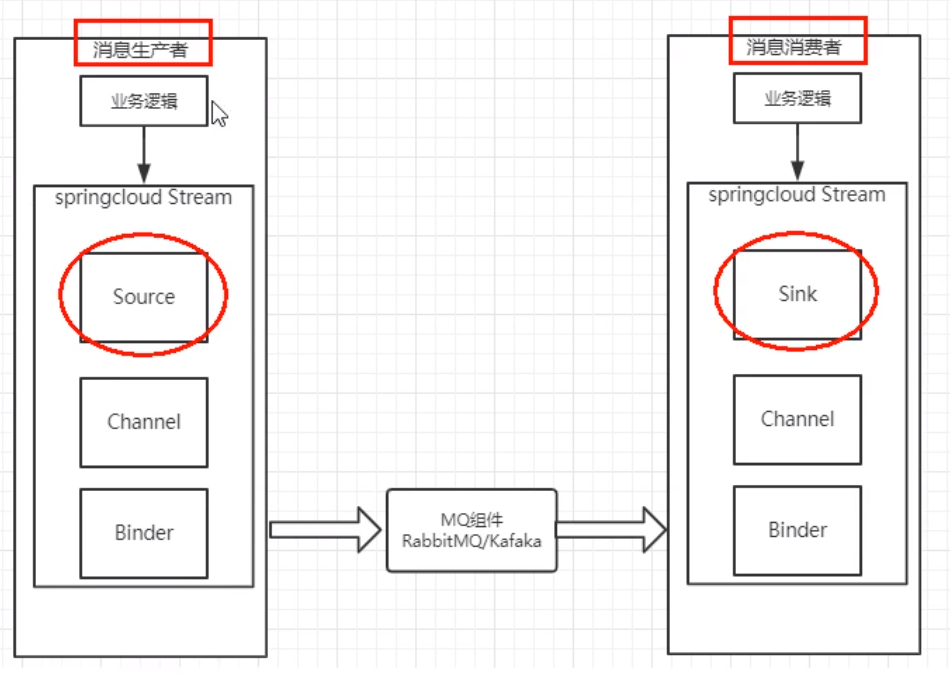

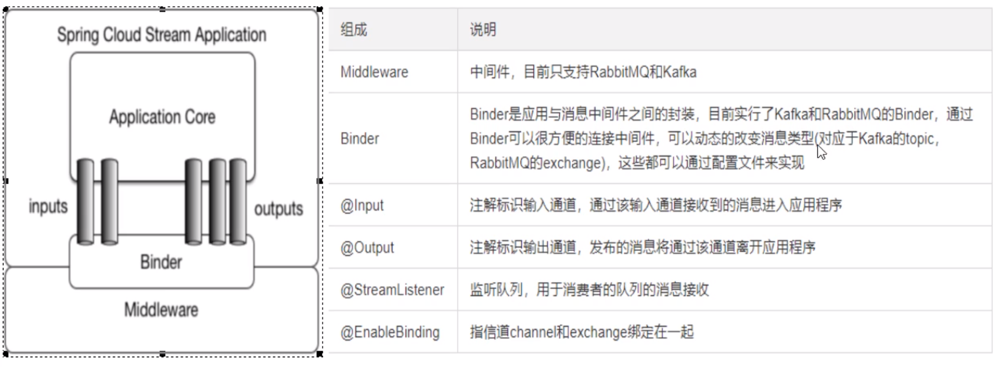

## 简单的消费和生产代码配置

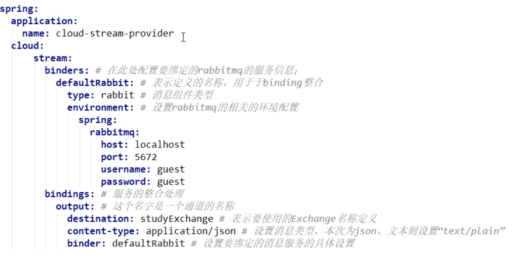

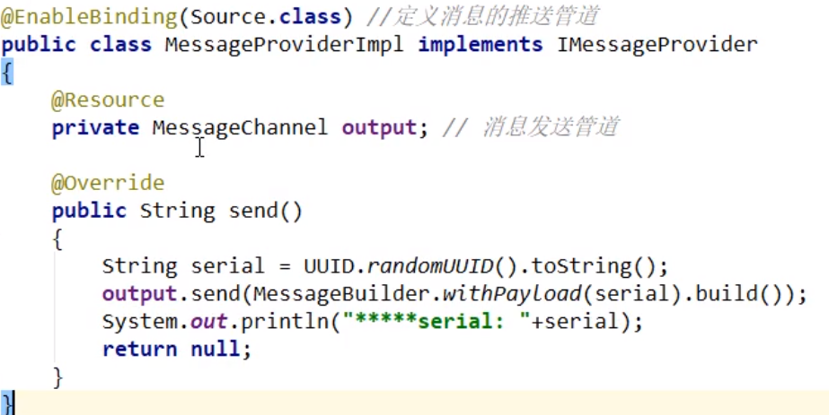

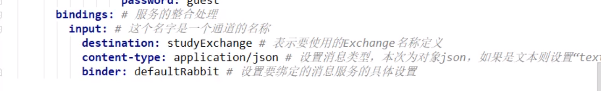

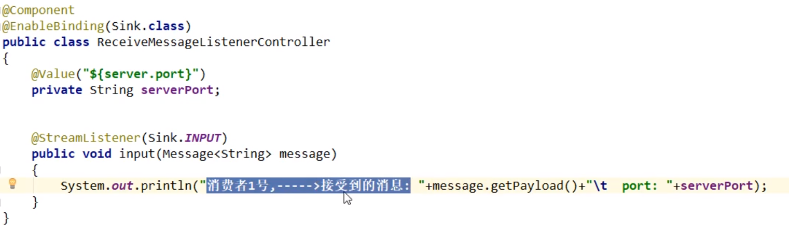

## 分组消费和持久化

默认的有重复消费的问题，要用分组消费啦解决，默认是不同的分组。同一个组只能协同消费。

在input和output设置一个group

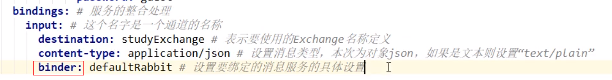

# spring-coud-sleuth

请求链路跟踪，zipkin负责展现。

+ zipkin server 从F版开始就不需自己大zipkinserver，下载zipkin-server.jar包

  `java -jar zipkin.jar`

+ `address:9411/zipkin/`

  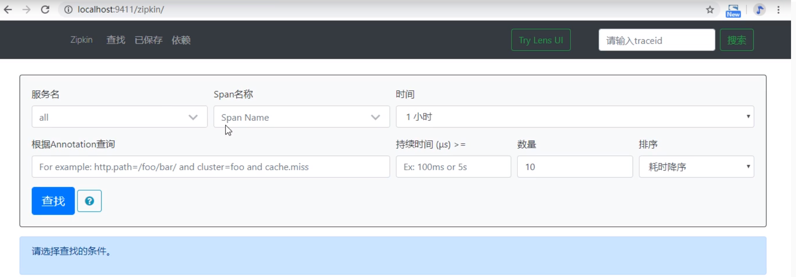

* traceid唯一标识

  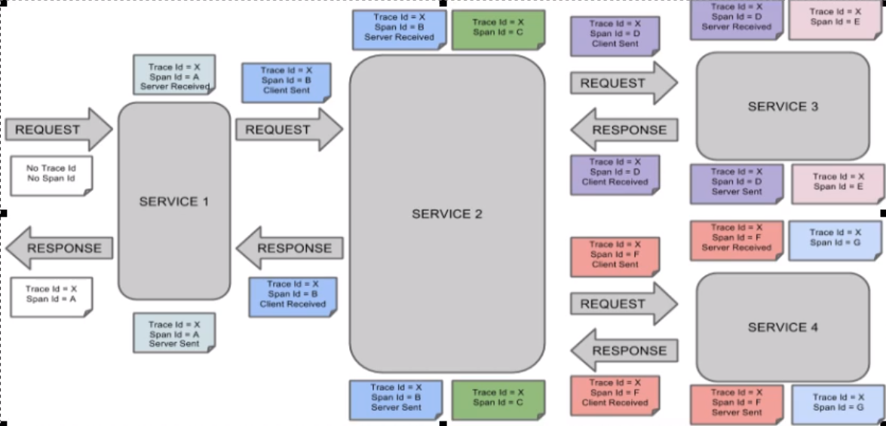

一条链路通过traceid唯一标识，span标识发起的请求信息，各span通过parent id关联起来。

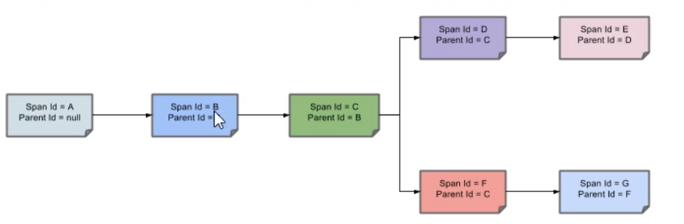

翻译成链路依赖关系：

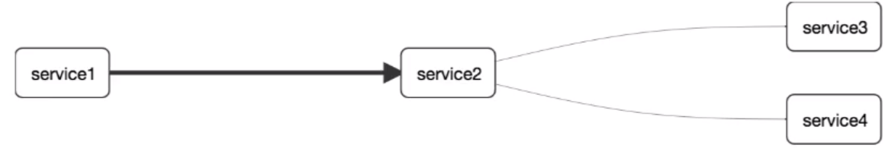

* 配置

  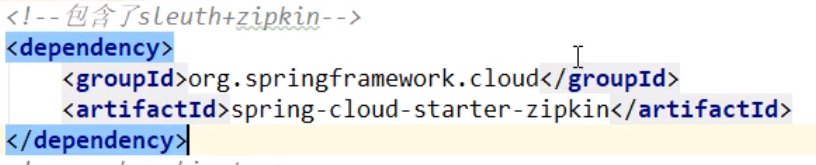

* 设置监控地址

  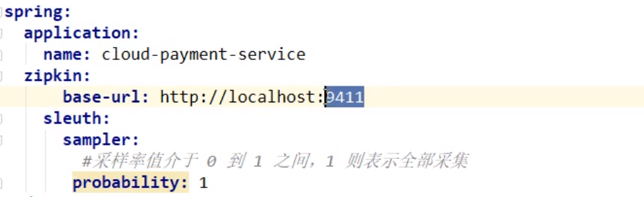

# spring-cloud-alibaba

# nacos

