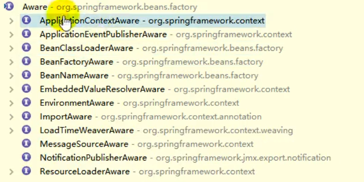

TomcatWebServerFactoryCustomizer
    tomcat.addContext("/", contextPath)

WebApplicationInitializer
    SpringBootServletInitializer

spring boot默认不支持jsp，需要加入 tomcat-embed-jasper依赖。因为tomcat.addContext("")是不会加载jasper的解析器
只有tomcat.addWebapp("/")才会。


在初始化前后，我们可以使用BeaPostProcessor.postProcessBeforeInitialization和BeaPostProcessor.postProcessAfterInitialization

到销毁 destroy

创建IOC容器，调用refresh方法 finishBeanFactoryInitialization(beanFactory)初始化所有剩余的单实例对象

populateBean()是为bean的属性进行复制
创建Bean的时候createBean()有一个initailizationBean里边有applyBeanPostProcessorBeforeInitialization()
invokeIntitMethod(methodName) 

看源代码顺序
```java
1 DefaultListableBeanFactory.createBean
    beanInstance = this.doCreateBean(beanName, mbdToUse, args);
        //初始化bean的属性
        this.populateBean(beanName, mbd, instanceWrapper);
        exposedObject = this.initializeBean(beanName, exposedObject, mbd);
            //BeaPostProcessor.postProcessBeforeInitialization
            wrappedBean = this.applyBeanPostProcessorsBeforeInitialization(bean, beanName);
            //调用bean的初始化方法，比如postConstruct呀，什么的指定init-method的方法呀
            this.invokeInitMethods(beanName, wrappedBean, mbd);
            //applyBeanPostProcessorBeforeInitialization()
            wrappedBean = this.applyBeanPostProcessorsAfterInitialization(wrappedBean, beanName);
2 
```

spring底层使用beanpostprocessor的使用
```java
WebApplicationContextServletContextAwareProcessor
BeanValidationPostProcessor
InitDestoryAnnotationBeanPostProcessor 处理@postConstruct和preDestory注解的
```

@PropertySource加载配置文件
```java
@PropertySource("classpath:/ddd.properties")
//然后使用${}符号获取，它可以同时加载多个配置文件
applicationContext.getEnvironment()也可以
```

## 自动装配原理
+ 实现XXXAware接口

