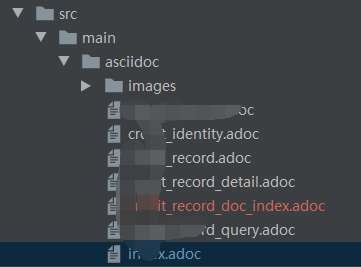

<!-- TOC -->

- [1. spring-rest-docs配置](#1-spring-rest-docs配置)
    - [1.1. 参考文档](#11-参考文档)
    - [1.2. 加入maven依赖](#12-加入maven依赖)
    - [1.3. 文档头部设置](#13-文档头部设置)
    - [1.4. docs目录结构](#14-docs目录结构)
    - [1.5. 访问url](#15-访问url)
    - [1.6. 问题FAQ](#16-问题faq)

<!-- /TOC -->

# 1. spring-rest-docs配置
spring-rest-docs 具有文档美观，文档内容与代码版本保持一致，有服务就有文档的优点，而且spring-rest-docs跟工作代码解耦，并且让开发人员养成编写单元测试的习惯，所以，对于spring-cloud体系来说
是非常吸引力的文档工具。

比如下面工作案例的一个截图：

![工作案例]](./imgs/2.png)

## 1.1. 参考文档
[spring-rest-doc官网ref](https://docs.spring.io/spring-restdocs/docs/2.0.3.RELEASE/reference/html5/)

[asciidoc语法参考](https://asciidoctor.org/docs/user-manual)

下面介绍spring-rest-docs的配置案例

## 1.2. 加入maven依赖
```xml
<?xml version="1.0" encoding="UTF-8"?>
<project xmlns="http://maven.apache.org/POM/4.0.0" xmlns:xsi="http://www.w3.org/2001/XMLSchema-instance"
	xsi:schemaLocation="http://maven.apache.org/POM/4.0.0 https://maven.apache.org/xsd/maven-4.0.0.xsd">
	<modelVersion>4.0.0</modelVersion>
	<parent>
		<groupId>org.springframework.boot</groupId>
		<artifactId>spring-boot-starter-parent</artifactId>
		<version>2.1.8.RELEASE</version>
		<relativePath/> <!-- lookup parent from repository -->
	</parent>
	<groupId>com.xfq.test</groupId>
	<artifactId>rest-docs-test</artifactId>
	<version>0.0.1-SNAPSHOT</version>

	<properties>
		<java.version>1.8</java.version>
	</properties>

	<dependencies>
		<dependency>
			<groupId>org.springframework.boot</groupId>
			<artifactId>spring-boot-starter-web</artifactId>
		</dependency>
	</dependencies>

	<build>
		<plugins>
			<plugin>
				<groupId>org.springframework.boot</groupId>
				<artifactId>spring-boot-maven-plugin</artifactId>
			</plugin>
			<plugin>
				<groupId>org.asciidoctor</groupId>
				<artifactId>asciidoctor-maven-plugin</artifactId>
				<version>1.5.3</version>
				<executions>
					<execution>
						<id>generate-docs</id>
						<phase>prepare-package</phase>
						<goals>
							<goal>process-asciidoc</goal>
						</goals>
						<configuration>
							<backend>html</backend>
							<doctype>book</doctype>
							<sourceHighlighter>highlightjs</sourceHighlighter>
						</configuration>
					</execution>
				</executions>
				<dependencies>
					<dependency>
						<groupId>org.springframework.restdocs</groupId>
						<artifactId>spring-restdocs-asciidoctor</artifactId>
						<version>2.0.3.RELEASE</version>
					</dependency>
				</dependencies>
			</plugin>
			<plugin>
				<artifactId>maven-resources-plugin</artifactId>
				<executions>
					<execution>
						<id>copy-resources</id>
						<phase>prepare-package</phase>
						<goals>
							<goal>copy-resources</goal>
						</goals>
						<configuration>
							<outputDirectory>${project.build.outputDirectory}/static/docs</outputDirectory>
							<resources>
								<resource>
									<directory>${project.build.directory}/generated-docs</directory>
								</resource>
							</resources>
						</configuration>
					</execution>
				</executions>
			</plugin>
		</plugins>
	</build>
</project>
```
## 1.3. 文档头部设置
```adoc
= 测试spring-rest-docs
一叶知秋;
:doctype: book
:icons: font
:source-highlighter: highlightjs
:toc: left
:toclevels: 4
:sectlinks:

```

## 1.4. docs目录结构


## 1.5. 访问url
http://xxxx:prot/docs/index.html //具体根据你的首页

## 1.6. 问题FAQ
如果遇到spring-boot-mvc配置spring-docs访问404 参考 [spring-boot-mvc映射静态文件](./spring-boot-mvc映射静态资源.md)