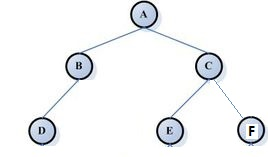

<!-- TOC -->

- [1. 后端考试题目](#1-后端考试题目)
- [2. 单选题](#2-单选题)
    - [2.1. java 基础部分](#21-java-基础部分)
    - [2.2. 专业基础部分](#22-专业基础部分)
    - [2.3. spring框架基础](#23-spring框架基础)
    - [2.4. SQL](#24-sql)
    - [2.5. 中间件](#25-中间件)

<!-- /TOC -->
# 1. 后端考试题目

# 2. 单选题
## 2.1. java 基础部分
1 Java的接口是否能够多继承？  
```
A 可以      B 不可以
```

2 接口的方法能否有方法体？
```
A 可以有       B 不可以
```

3 下列不能使用synchronized修饰的语句是？
```
A 静态代码块    B 静态方法      C 成员方法      D 构造函数
```

4 关于List，Map和Set下列说法错误的是？
```
A List和Set都实现Collection接口    B 都实现了Iterable接口   C TreeMap使用了红黑树思想构建      D Set种的元素不保证顺序性
```

5 关于Java的面向对象特性，下列说法正确的是？
```
A protected修饰的方法，不能被子类复写   
B 接口中可以定义私有方法
C 接口中可以定义常量
D 父类只提供有参构造方法，子类不可以定义无参构造方法
```

## 2.2. 专业基础部分
1 不属于原址排序的算法是？
```
A 快速排序  B 冒泡排序  C 堆排序  D 插入排序
```

2 关于算法复杂度，下列说法正确的是？
```
A O(n^2) > O(2^n) > O(nlgn) > O(lgn) > n > C
B o(n^2)的在任何情况下一定比O(nlgn)差
C 算法的复杂度需要考虑算法的输入规模，空间和时间等多方面的影响
D 复杂度高的代码在实际生产中没有使用价值
```

3 下列树结构的进行中序遍历的输出序列是什么？



```
A (D,B,A,E,C,F)     B (A,B,D,C,E,F)    C (D,B,E,F,C,A)    D (A,B,C,D,E,F)
```

4 下列RestFul规范中，不属于冥等的是哪一个？
```
A Get   B Post  C Put   D Delete
```

5 Http和Socket底层都是TCP协议，这句话准确么？
```
A 正确  B 错误
```

## 2.3. spring框架基础
1 @ResponseBody的作用是什么？在spring-boot中，达到同样目的注解是哪一个？

2 当前有一个学生表，表结构如下：

|字段| 说明
|:---:|:---:|
|id| 主键
|name| 名称
|age | 年龄

请使用spring-mvc，设计一套接口  
要求：  
   1）满足resutful协议  
   2）这套接口包含对学生的，添加，搜索，修改，删除的操作

3 spring-boot中怎样统一处理异常？

4 怎么配置校验器，自动校验前端的输入？

5 怎么配置来使用gson作为我们的序列化和反序列化工具？怎么自定义gson的序列化和反序列化行为？

## 2.4. SQL
1 SQL中，innerjoin是那一部分的数据？

A   
B   
C   
D   

2 SQL优化思路不包括？
```
A 尽量命中索引  B 将过滤最多的条件放到前边  C 使用存储过程  D 少做大表join
```

3 分表的思路有那些？（实际工作中根据什么规则做分表）

## 2.5. 中间件
1 redis哪一种类型可以设置超时？

2 rabbitmq中，怎么保证消息的可靠性传输？

3 rabbitmq中，如果使用组播功能，使用哪一种exchange?
```
A fanout    B topic     C header     D direct
```

4 关于kafka和rabbitmq，下列说法错误的是？
```
A rabbitmq和kafka都用于高并发的环境
B rabbitmq和kafka都可以重复消费消息
C 他们都提供可靠性传输的功能
D 他们的消息都有重启后自动恢复的功能
```

5 redis怎么使用redis分布式锁功能？


