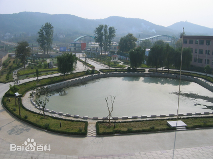
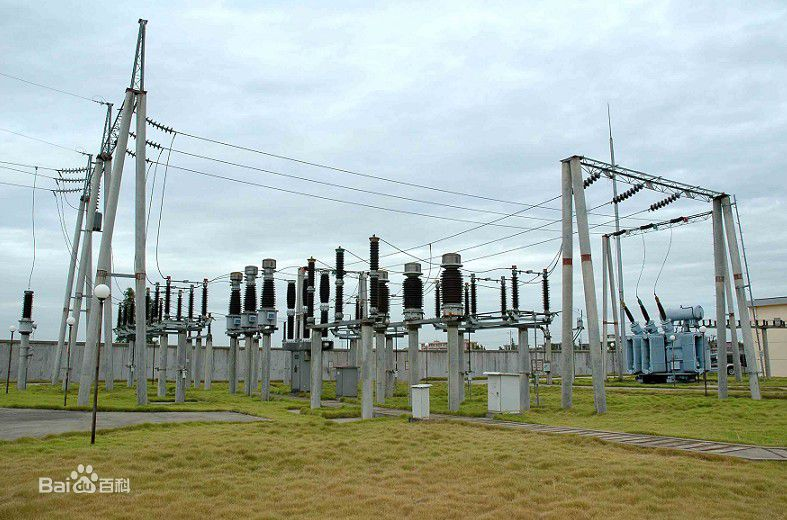
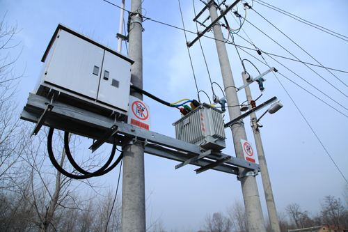
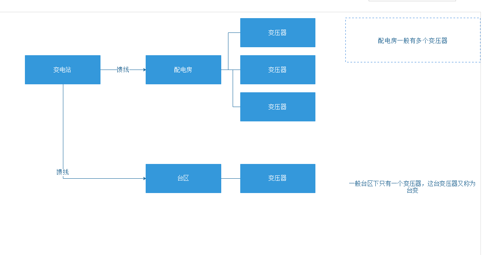

# 电力系统基本概念
+ 台区
> 【概念】  
1 指一台变压器的供电范围区域。它是电力经济运行管理的名词。  
2 台区营销管理考核范围为公变台区总表至其供电范围内的各电力客户侧电能表之间。  
3 台区营销管理的责任者可以是员工，也可以是台区管理组。  
【主要职责】  
1 负责责任台区的抄表、催缴电费、线损、均价的管理和供用电合同的执行工作。  
2 协助计量管理、表计新装、业扩报装、业务变更的外勤工作，但不得私自办理客户的新装、增容和变更用电等业务。  
3 负责为客户提供供用电咨询等服务，落实供用电优质服务承诺中的各项工作。  
4 负责责任台区的用电检查、发现问题及时处理。对客户违章、窃电的处理，必须坚持检查、处理分离原则，现场检查取证后交有关部门按照有关规定处理。   
5 负责责任台区内用电安全宣传与检查工作。  
6 了解用户实际用电情况，正确核定其用电类别及用电比例，保证用户用电档案信息准确。

  
*图：台区*

+ 变电站
> 【概念】  
对电压和电流进行变换，接受电能及分配电能的场所。在发电厂内的变电站是升压变电站，其作用是将发电机发出的电能升压后馈送到高压电网中。  
【分类】  
(1)一类变电站。是指交流特高压站，核电、大型能源基地（300万kw及以上）外送及跨大区（华北、华中、华东、东北、西北）联络750/500/330kV变电站。  
(2)二类变电站。是指除一类变电站以外的其他，750/500/330kV变电站，电厂外送变电站（100万kW及以上、300万kW以下）及跨省联络220kV变电站，主变压器或母线停运、开关拒动造成四级及以上电网事件的变电站。  
(3)三类变电站。是指除二类以外的220kV变电站，电厂外送变电站（30万kW及以上、100万kW以下），主变压器或母线停运、开关拒动造成五级电网事件的变电站，为一级及以上重要用户直接供电的变电站。  
(4)四类变电站。是指除一、二、三类以外的35kV及以上变电站。  
【设备】  
1、一次设备  
一次设备指直接生产、输送、分配和使用电能的设备，主要包括变压器、高压断路器、隔离开关、母线、避雷器、电容器、电抗器等。  
2、二次设备  
变电站的二次设备是指对一次设备和系统的运行工况进行测量、监视、控制和保护的设备，它主要由包括继电保护装置、自动装置、测控装置（电流互感器、电压互感器）、计量装置、自动化系统以及为二次设备提供电源的直流设备。

  
*图：变电站*

+ 配电变压器
> 配电变压器，简称“配变”，指配电系统中根据电磁感应定律变换交流电压和电流而传输交流电能的一种静止电器。有些地区将35千伏以下（大多数是10KV及以下）电压等级的电力变压器，称为“配电变压器”，简称“配变”。安装“配变”的场所与地方，既是变电所。配电变压器宜采用柱上安装或露天落地安装。详细介绍了其安装方式、安装注意事项、供配方式、容量选择、运行维护等。

  
*图：路边电线杆上就是配变*

+ 变电站，配变和台区
> 变电站属于输电网部分，一般都是35kv以上。配变是用户侧，都是低压部分。台区仅是营销管理层面的名词，三者的关系大致可以这样表达。

  
*变电站，配变和台区关系*