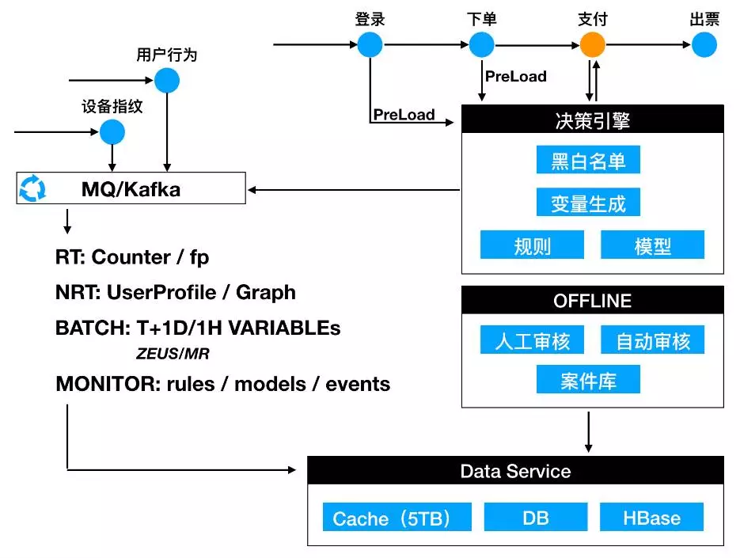
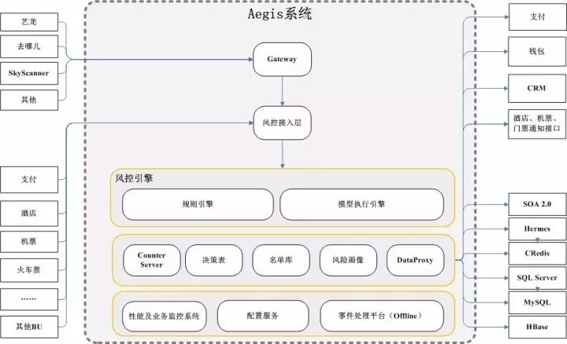
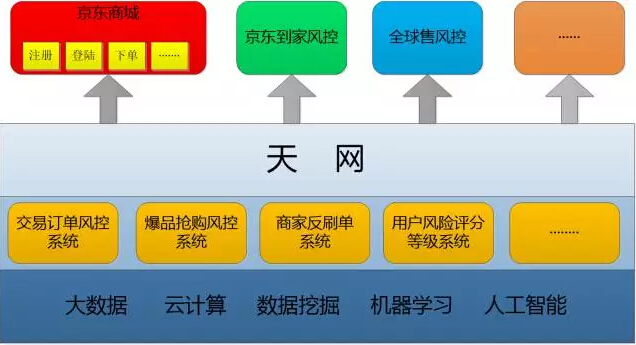
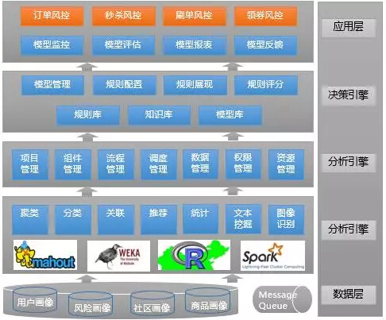

<!-- TOC -->

- [1. 风控系统参考](#1-风控系统参考)
    - [1.1. 携程在线风控系统架构](#11-携程在线风控系统架构)
        - [1.1.1. 目的](#111-目的)
        - [1.1.2. 总技术架构图](#112-总技术架构图)
        - [1.1.3. 总体业务架构图](#113-总体业务架构图)
    - [1.2. 京东基于 Spark 的风控系统架构实践和技术细节](#12-京东基于-spark-的风控系统架构实践和技术细节)
        - [1.2.1. 目的](#121-目的)
        - [1.2.2. 分析维度](#122-分析维度)
        - [1.2.3. 业务覆盖](#123-业务覆盖)
    - [1.3. 有赞风控规则引擎实践](#13-有赞风控规则引擎实践)
        - [1.3.1. 主要风险类型](#131-主要风险类型)

<!-- /TOC -->

# 1. 风控系统参考

## 1.1. 携程在线风控系统架构
[携程在线风控系统架构](https://juejin.im/entry/59e08cf2f265da430c10d58b)
### 1.1.1. 目的
+ 应对日益严重的支付欺诈
+ 业务风控 恶意抢占资源、黄牛抢购、商家刷单
+ 用户画像（用户等级、用户行为标签、订单资源标签等）
### 1.1.2. 总技术架构图

+ 风险事件怎么来？
+ 规则的快速上线和响应，及时止损。
+

### 1.1.3. 总体业务架构图

## 1.2. 京东基于 Spark 的风控系统架构实践和技术细节
[京东基于 Spark 的风控系统架构实践和技术细节](https://www.infoq.cn/article/jingdong-risk-control-system-architecture-based-on-spark)

### 1.2.1. 目的
+ 机器注册账号
+ 恶意下单
+ 黄牛抢购 
+ 商家刷单

### 1.2.2. 分析维度
+ 用户画像
+ 用户社交关系网络
+ 交易风险行为特性模型

### 1.2.3. 业务覆盖
+ 面向业务的交易订单风控系统
+ 爆品抢购风控系统
+ 商家反刷单系统
+ 存储用户风险信用信息
+ 风险信用中心（RCS）系统

> 无法精准判别的嫌疑订单，系统会自动将他们推送到后台风控运营团队进行人工审核

+ a) 基于用户生命周期的指标数据整理
+ b) 基于用户购买流程的风控指标数据整理
> 黄牛来说，他们目标明确，登录之后直奔主题，爽快支付
+ c) 基于用户社交网络的风控指标数据整理
> 不怀好意的用户总会在某些特征上有所聚集

## 1.3. 有赞风控规则引擎实践
[有赞风控规则引擎实践](https://tech.youzan.com/rules-engine/)

### 1.3.1. 主要风险类型
+ 盗卡。例：盗用用户银行卡，在有赞店铺上消费
+ 欺诈。例：通过发布低价商品，诱骗消费者购买
+ 套现。例：在自己创建的店铺里进行虚假交易用以套现信用卡
+ 垃圾信息。例：发布虚假消息、色情等违规商品、页面
+ 盗账户。例：黑客用其他平台获取的账户密码通过撞库来非法盗取用户在赞平台的账